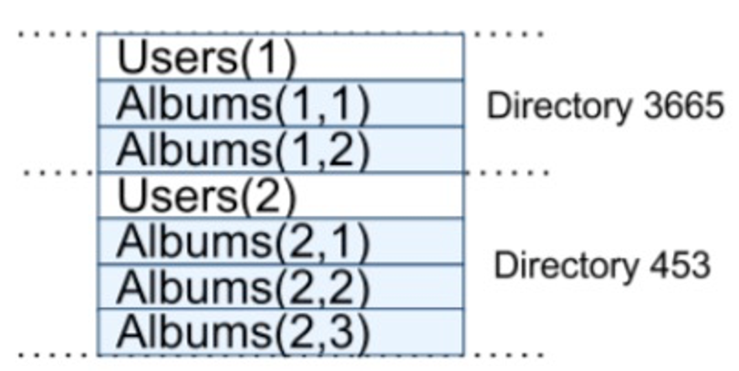

## Week 7 ARTS
------
### [A] - LC: 398. Random Pick Index
------
```java
package leetcode;

import java.util.*;

/**
 * 398. Random Pick Index
 *
 * Given an array of integers with possible duplicates, randomly output the index of a
 * given target number. You can assume that the given target number must exist in the array.
 *
 * Note:
 * The array size can be very large. Solution that uses too much extra space will not pass the judge.
 *
 * Example:
 *
 * int[] nums = new int[] {1,2,3,3,3};
 * Solution solution = new Solution(nums);
 *
 * // pick(3) should return either index 2, 3, or 4 randomly. Each index should have equal
 * probability of returning.
 * solution.pick(3);
 *
 * // pick(1) should return 0. Since in the array only nums[0] is equal to 1.
 * solution.pick(1);
 */

public class RandomPickIndex398 {
  private Map<Integer, List<Integer>> map;

  /**
   * Solution here is to use HashMap record all the indexes,
   * then get random from target number list
   */
  public RandomPickIndex398(int[] nums) {
    map = new HashMap<>();
    for (int i = 0; i < nums.length; i++) {
      List<Integer> curr = map.containsKey(nums[i]) ? map.get(nums[i]) : new ArrayList<>();
      curr.add(i);
      map.put(nums[i], curr);
    }
  }

  public int pick(int target) {
    Random random = new Random();
    List<Integer> idxs = map.get(target);
    return idxs.get(random.nextInt(idxs.size()));
  }
  public static void main(String[] args) {
    RandomPickIndex398 test = new RandomPickIndex398(new int[]{1, 2, 3, 4, 3, 3, 5, 6, 5, 4,3});
    System.out.println(test.pick(3));
    System.out.println(test.pick(3));
    System.out.println(test.pick(4));
    System.out.println(test.pick(5));
    System.out.println(test.pick(4));
  }
}

```
```java
package leetcode;

/**
 * 395. Longest Substring with At Least K Repeating Characters
 *
 * Find the length of the longest substring T of a given string (consists of lowercase
 * letters only) such that every character in T appears no less than k times.
 *
 * Example 1:
 *
 * Input:
 * s = "aaabb", k = 3
 *
 * Output:
 * 3
 *
 * The longest substring is "aaa", as 'a' is repeated 3 times.
 * Example 2:
 *
 * Input:
 * s = "ababbc", k = 2
 *
 * Output:
 * 5
 *
 * The longest substring is "ababb", as 'a' is repeated 2 times and 'b' is repeated 3 times.
 */


public class LongestSubstringwithAtLeastKRepeatingCharacters395 {
  /**
   * solution here is hinted by LC discussion Nakanu (using divide and conquer (recursive)
   * First find out the frequency less than k.
   * From that point, divide array into left and right two parts.
   * Calculate the longest substring, then compare left and right, return longest one.
   * Continue divide until it didn't find the frequency less than k or the frequency of
   * the substring characters are all less than k.
   */
  public int longestSubstring(String s, int k) {
    if (k == 1) return s.length();
    char[] str = s.toCharArray();
    return helper(str,0,s.length(),k);
  }
  private int helper(char[] str, int start, int end,  int k){
    //substring length shorter than k.
    if (end - start < k) return 0;
    int[] count = new int [26];
    // record each element frequency
    for (int i = start; i < end; i++) {
      count[str[i] - 'a']++;
    }
    for (int i = 0; i < 26; i++) {
      //count[i]=0 => i+'a' does not exist in the string, skip it.
      if (count[i] < k && count[i] > 0) {
        for (int j = start; j < end; j++) {
          // found frequency less than k and the position of the element, divide from this position
          if (str[j] - 'a' == i) {
            int left = helper(str, start, j, k);
            int right = helper(str, j + 1, end, k);
            // always return the longest one
            return Math.max(left, right);
          }
        }
      }
    }
    return end - start;
  }

  public static void main(String[] args) {
    LongestSubstringwithAtLeastKRepeatingCharacters395 test =
        new LongestSubstringwithAtLeastKRepeatingCharacters395();
    test.longestSubstring("ababbc", 2);
    test.longestSubstring("aaaaaaaa", 2);
    test.longestSubstring("aabdbccabbc", 2);
    test.longestSubstring("ababbcb", 3);
    test.longestSubstring("", 2);
    // this case, we can add the case to handle, return the original string length.
    test.longestSubstring("ababbc", 1);
  }
}

```

### [R] - Design a Shortening URL service (TinyURL)
------
understand why we need shortening URL

1. Gather requirements
- functional requirements
 1. Need an algorithm to generate a short URL for giving URL
 2. Service need to redicrect to the orinial URL when giving a short URL
 3. User can specify an expiration of the shorten URL when creating it
 4. Users can customize the short URL when creating it
 
 - Non functional requirements
1. This system must be highly available, meaning we cannot torelate the wrong answer, we must redirect user to original url or return error when users give a short url.
2. redirect to the original url should happen in real-time with minimum latency
3. shortened urls should not be guessable or predictable, meaning we need an algorithm to generate a unique short urls.

Estimate the capacity (using data to support your calculation)
QPS estimation
**dairy users**: 100M users per day 
****


This system will be read heavy. assuming that the reas:write ratio is 1000:1.


### [T] - Interview Tips 
------


### [S] - [Google Spanner: Google's Global-Distributed Database](https://static.googleusercontent.com/media/research.google.com/en//archive/spanner-osdi2012.pdf)
------ 


**Spanner structure:**

- universe
  - universemaster - displays status information about all the zones for inter- active debugging.
  - placement driver - handles auto- mated movement of data across zones on the timescale of minutes.
  - zones (can be roughly treated as a BigTable deployment)
    - One zonemaster - assign data to spanservers
    - 100-1000 spanservers - serve data to clients

**spanserver**:

![alt text(./images/spanner-software-stack.png)
Tablet:

similar to BigTable abstraction: `(key:string, timestamp:int64) -> string`

Unlike Bigtable, Spanner assigns timestamps to data

Paxos:

- Support replication. It implements a consistently replicated bag of mappings.
- Writes must initiate the Paxos protocol at the leader; reads access state directly from the underlying tablet at any replica that is sufficiently up-to-date.
- The set of replicas is collectively a *Paxos group*.
- Inside paxos leader each spanserver also implements ***transaction manager*** to support distributed transactions
- The transaction manager is used to imple- ment a ***participant leader***; ******the other replicas in the group will be referred to as ***participant slaves***.
If a transaction involves only one Paxos group (as is the case for most transactions), it can bypass the transaction manager, since the lock table and Paxos together provide transactionality.
If a transaction involves more than one Paxos group, those groups’ leaders coordinate to perform two-phase commit.
the participant leader of that group will be referred to as the ***coordinator leader***, and the slaves of that group as ***coordinator slaves***.

Lock Table:

- Implement concurrency control
- The lock table contains the state for two-phase lock- ing: it maps ranges of keys to lock states.
- Operations that require synchronization, such as transactional reads, acquire locks in the lock table; other operations bypass the lock table.

  Directories and Placement:

  - ***Directory***: a set of contiguous keys that share a common prefix


  - Difference between BigTable tablet and Spanner tablet:
  BigTable tablet is a lexicographically contiguous partition of the row space
  Spanner tablet is a container that may encap- sulate multiple partitions of the row space which enables it to colocate multiple directories that are frequently accessed together
  - ***Movedir*** is the background task used to move direc- tories between Paxos groups
  - It can also be used to add or remove replicas to Paxos Group
  Implemented to run in backend and transactionally

  Data Model:

  Spanner exposes the following set of data features to applications: a data model based on schematized semi-relational tables, a query language, and general- purpose transactions.

  - Semi-relational schema tables:
  - every table is required to have an ordered set of one or more primary-key columns.
  Client applications declare the hierarchies in database schemas via the *INTERLEAVE IN* declarations.
  ON *DELETE CASCADE* says that deleting a row in the directory table deletes any associated child rows.

      CREATE TABLE Users {
        uid INT64 NOT NULL, email STRING
      } PRIMARY KEY (uid), DIRECTORY;
      
      CREATE TABLE Albums {
        uid INT64 NOT NULL, aid INT64 NOT NULL,
        name STRING
      } PRIMARY KEY (uid, aid),
        INTERLEAVE IN PARENT Users ON DELETE CASCADE;


  table structure

  True Time


  TrueTime API

  - The table above lists the methods of ***TrueTime API***. The underlying time references of TrueTime are GPS and atomic clocks which give a guarantee time interval of *TT.now()*

  Concurrency Control:

  1. Timestamp Management


    - Read-only transaction:(must predeclared as no writes)
      - Reads in a read-only transaction execute at a system-chosen timestamp without locking, so that incoming writes are not blocked.

    - Snapshot read: A snapshot read is a read in the past that executes without locking.
    - Transactional Read-Write: two-phase locking
      - Assigned timestamps when all locks required and before any locks released
      - Depends on following invariant:
        - Spanner only assign monotonically increasing order of timestamps
      - Spanner also enforces following external consistency invariant:
        - Start(T2) > Strat(T1) => Commit(T2) > Commit(T1)
          - ***Start***: coordinator assigns Si(commit timestamp) to Ti, Si >= *TT.now().latest*
          - ***Commit Wait**:*  The coordinator leader ensures that clients cannot see any data committed by Ti until *TT.after*(si) is true. Commit wait ensures that si is less than the absolute commit time of Ti, or si < t(*commit*).

           

      - Serving Reads at a Timestamp:
        - each replica has t(safe) which satisfy read time stamp t ≤ t(safe)
          - t(safe) = min(t(Paxos_safe), t(TM_safe) ) — t(Paxos_safe) is the safe time of each paxos group which is the last write commited, t(TM_safe) is Transaction Manager safe time:

          $${T_{safe}}^{TM} = min{_i}(s{_{i,g}^{prepare}})$$

          *s* means every participant leader (for a group g) for a transaction Ti assigns a prepare timestamp

      - Assigning Timestamps to RO Transactions:

        A read-only transaction executes in two phases: assign a timestamp s(read), and then execute the transaction’s reads as snapshot reads at s(read).

    - Paxos Leader lease:
      - Leadership use lease (10s by default)
        - Potential leader sends requests for timed lease votes
        - Upon received quorum of lease notes, the leader knows it has a lease
        - Replica extends lease after successful write, leader request extension near expiration
  2. Details
    - Read-Write Transactions: writes that occur in a transaction are buffered at the client until commit.As a result, reads in a transaction do not see the effects of the transaction’s writes.

      1) The client issues reads to the leader replica of the appropriate group, which acquires read locks and then reads the most recent data.

      2) When a client has completed all reads and buffered all writes, it begins two-phase commit.

      3) The client chooses a coordinator group and sends a commit message to each participant’s leader with the identity of the coordinator and any buffered writes. (Having the client drive two-phase commit avoids send- ing data twice across wide-area links)

      4) A non-coordinator-participant leader first acquires write locks. It then chooses a prepare timestamp that must be larger than any timestamps it has assigned to previous transactions (to preserve monotonicity), and logs a prepare record through Paxos. Each participant then notifies the coordinator of its prepare timestamp.

      5) The coordinator leader also first acquires write locks, but skips the prepare phase. It chooses a timestamp for the entire transaction after hearing from all other participant leaders. *TT(commit) > max(TT(prepare), TT.now(), TT(previous transaction))*

    - Read-Only Transaction: Assigning a timestamp requires a negotiation phase be- tween all of the Paxos groups that are involved in the reads. As a result, Spanner requires a scope expression for every read-only transaction, which is an expression that summarizes the keys that will be read by the entire transaction. Spanner automatically infers the scope for standalone queries.
      - If the scope’s values are served by a single Paxos group, then the client issues the read-only transaction to that group’s leader.
      - If the scope’s values are served by multiple Paxos groups, there are several options.
        - The most complicated option is to do a round of communication with all of the groups’s leaders to negotiate sread based on LastTS().(LastTS() to be the timestamp of the last committed write at a Paxos group)
        - The client avoids a negotiation round, and just has its reads execute at sread = TT.now().latest (which may wait for safe time to advance). (Current Spanner solution)
    - Schema-Change Transactions: A Spanner schema-change transaction is a generally non-blocking variant of a standard transaction.
      1. It is explicitly assigned a timestamp in the future, which is registered in the prepare phase. As a result, schema changes across thousands of servers can complete with minimal disruption to other concurrent activity.
      2. Second, reads and writes, which implicitly depend on the schema, synchronize with any registered schema-change timestamp at time t: they may proceed if their times- tamps precede t, but they must block behind the schema- change transaction if their timestamps are after t.
    - Refinements:
      - t(*TM_safe)* as defined above has a weakness, in that a single *safe* prepared transaction prevents t **from advancing. As a result, no reads can occur at later timestamps, even if the reads do not conflict with the transaction. Such false conflicts can be removed by augmenting t(TM_safe) with a fine-grained mapping from key ranges to prepared- transaction timestamps. This information can be stored in the lock table, which already maps key ranges to lock metadata. When a read arrives, it only needs to be checked against the fine-grained safe time for key ranges with which the read conflicts.
      - use same way to augment LastTS()
      - t(Paxos_safe) won't advance without Paxos write. Solution: Each Paxos leader advances t(Paxos_safe) by keeping safe a threshold above which future writes’ timestamps will occur: it maintains a mapping *MinNextTS*(n) from Paxos sequence number n to the minimum timestamp that may be assigned to Paxos sequence number n + 1.  A replica can advance t(*Paxos_safe)* to *MinNextTS*(n) 1 when it has applied through n.

        > A single leader can enforce its MinNextTS() promises easily. Because the timestamps promised by MinNextTS() lie within a leader’s lease, the disjoint- ness invariant enforces MinNextTS() promises across leaders. If a leader wishes to advance MinNextTS() beyond the end of its leader lease, it must first extend its lease. Note that smax is always advanced to the highest value in MinNextTS() to preserve disjointness.

        > A leader by default advances MinNextTS() values ev- ery 8 seconds. Thus, in the absence of prepared trans- actions, healthy slaves in an idle Paxos group can serve reads at timestamps greater than 8 seconds old in the worst case. A leader may also advance MinNextTS() values on demand from slaves.
