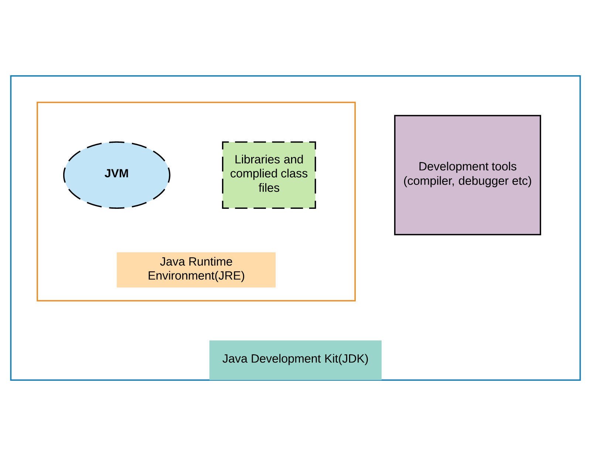
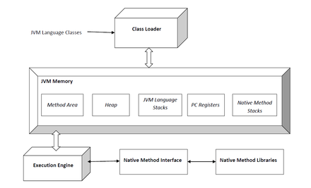
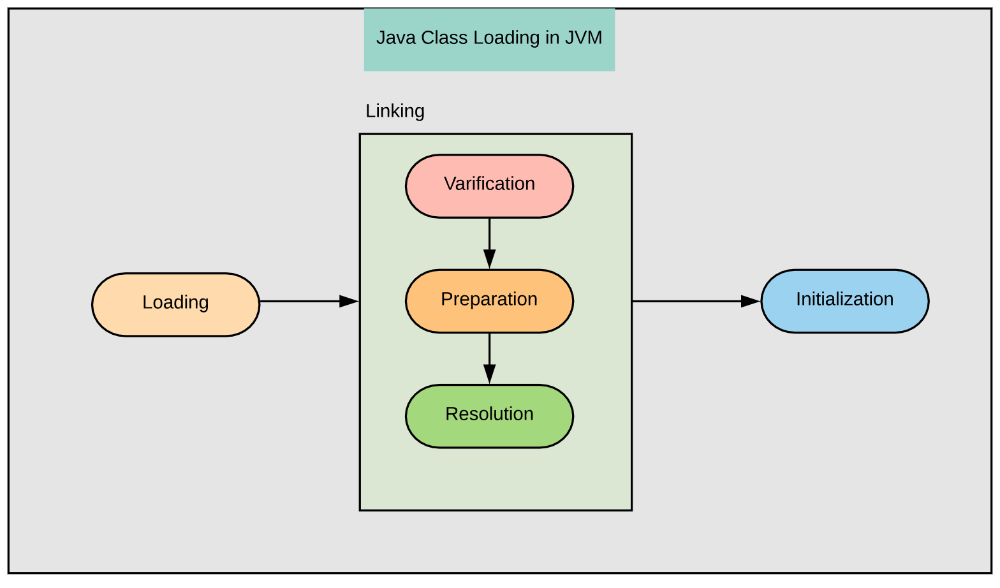
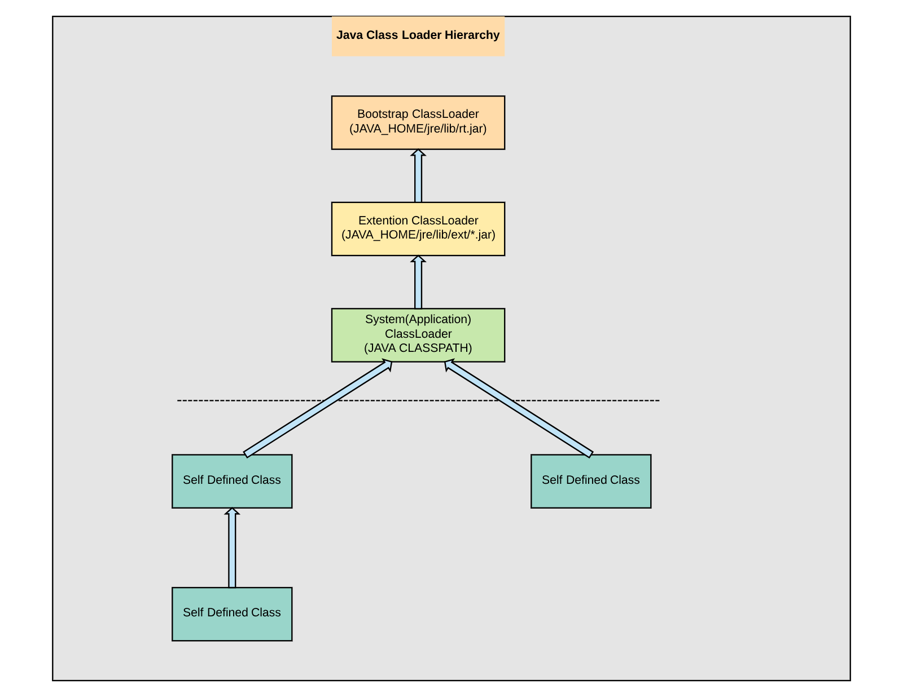

## Week 8 ARTS

### [A] - LC 22: Generate Parentheses
---
```java
package leetcode;

import java.util.ArrayList;
import java.util.List;

/**
 * 22. Generate Parentheses
 *
 * Given n pairs of parentheses, write a function to generate all combinations of well-formed parentheses.
 *
 * For example, given n = 3, a solution set is:
 *
 * [
 *   "((()))",
 *   "(()())",
 *   "(())()",
 *   "()(())",
 *   "()()()"
 * ]
 */
public class GenerateParentheses22 {
  /**
   * Solutoin here is using backtracking, every time we generate a valid sequence,
   * we keep track of left and right (open and close) brackets, 
   * comparing remaining open and close brackets, return when open > close. 
   * When count to open and close brackets = 0, add into res.
   * Keep tracking of left, left > 0, add "(" into current String,
   * Keep tracking right, right > 0, add ")" into current String
   */
  public List<String> generateParentheses(int n) {
    if (n <= 0) return null;
    List<String> res = new ArrayList<>();
    helper(res, "", n, n);
    return res;
  }

  private void helper(List<String> res, String curr, int left, int right) {
    if (left > right) return;
    if (left == 0 && right == 0) {
      res.add(curr);
      return;
    }
    if (left > 0) {
      helper(res, curr + "(", left - 1, right);
    }
    if (right > 0) {
      helper(res, curr + ")", left, right - 1);
    }
  }

  public static void main(String[] args) {
    GenerateParentheses22 test = new GenerateParentheses22();
    System.out.println(test.generateParentheses(3));
    System.out.println(test.generateParentheses(1));
    System.out.println(test.generateParentheses(4));
  }
}
```
[R] - Java Class Loader
---
JVM vs JRE vs JDK


#### What is Java Virtual Machine(JVM)?
The Java virtual machine(JVM) is an abstract computer and provide a runtime environmenet to execute java 
bytecodes and load class files.

JVM main operations:
- Loading required `.class` files and jar files
- Assign references and verification code
- Execution the code
- Provide runtime environment for Java bytecodes

Overview Java Virtural Machine(JVM) architecture ([source from Wiki](https://www.wikiwand.com/en/**Java_virtual_machine)):


#### Java Class Loader
The Java Classloader is a part of the Java Runtime Environment that dynamically loads Java classes(`.class` files) and saving the bytecode in the JVM method area. the classloader subsystem handles the dynamic class loading functionality. Delegation is one main principles of Java Class Loader.

When the JVM is started, three class loaders are used:

1. Bootstrap class loader

    which loads the core Java libraries located in `<JAVA_HOME>/jre/lib` (i.e, `rt.jar`)
2. Extensions class loader

    Which loads the code in the extentions directories `<JAVA_HOME>/jre/lib/ext` or `java.ext.dirs`. Implemented by `sun.misc.Launcher$ExtClassLoader` class.

3. System class loader(Application class)

    Which loads code found on `java.class.path`, maps to the `CLASSPATH` environment variable. Implemented by `sun.misc.Launcher$AppClassLoader` class.

Overview of the ClassLoader subsystem[1]:


How Java ClassLoader Hierarchy Delegation works[1]:

Delegation: According to the Delegation Hierarchhy:
- JVM will check whether the specified `.class` file is loaded or not when JVM needs to load a class.
- If the `.class` file is already loaded in the method area, then JVM will consider that class. If not, JVM requests the classloader subsystem to load that specific class.
- The classloader system will use double parent delegation system to pass the request to the **Application classloader** then delegates to the **Extension classloader**. The Extension classloader will again delegate this request to the **Primordial(Bootstrap) classloader**
- The **Primordial(Bootstrap) classloader** will search this class in the bootstrap classpath (i.e. `jdk\jre\lib\rt.jar`).  Found, then load, if not, delegate back to **Extension classloader**, found then load, if not, then continue delegation back to **Application classloader**, found then load, if not, then throw `ClassNotFountException` at runtime.


Reference:

[1] [JVM Architecture: JVM Class loader and Runtime Data Areas](https://www.javacodegeeks.com/2018/04/jvm-architecture-jvm-class-loader-and-runtime-data-areas.html)

[2] [Java Class Loader Source Code](https://github.com/frohoff/jdk8u-jdk/blob/master/src/share/classes/java/lang/ClassLoader.java#L64)

[3] [Inside the Java Virtual Machine](https://www.artima.com/insidejvm/ed2/index.html)

[4][Java Virtual Machine](https://www.wikiwand.com/en/Java_virtual_machine)

[5] [Java ClassLoader](https://www.wikiwand.com/en/Java_Classloader)


[T] - 
---

[S] - 
