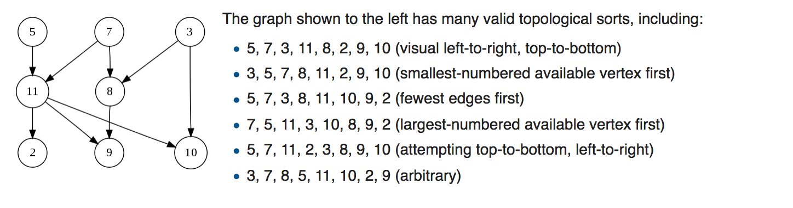
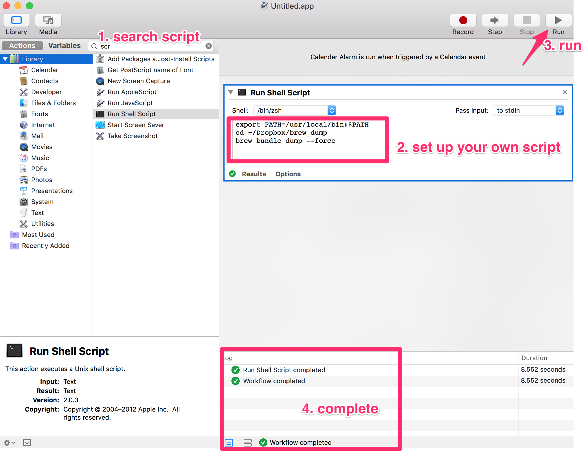
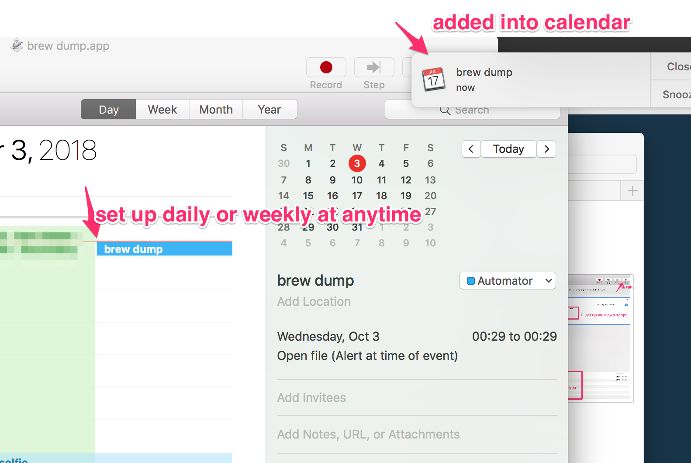
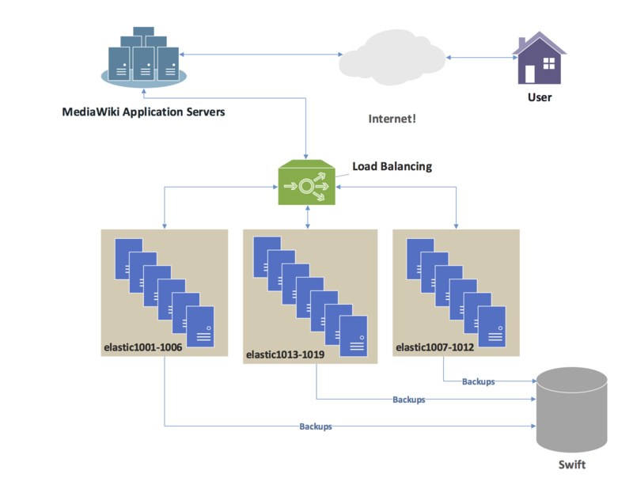

## Week 10 ARTS

### [A] - LC: 554. Brick Wall
---
```java
package leetcode;

import java.util.*;

/**
 * 554. Brick Wall
 *
 * There is a brick wall in front of you. The wall is rectangular and has several rows of
 * bricks. The bricks have the same height but different width. You want to draw a vertical
 * line from the top to the bottom and cross the least bricks.
 *
 * The brick wall is represented by a list of rows. Each row is a list of integers
 * representing the width of each brick in this row from left to right.
 *
 * If your line go through the edge of a brick, then the brick is not considered as crossed.
 * You need to find out how to draw the line to cross the least bricks and return the number of crossed bricks.
 *
 * You cannot draw a line just along one of the two vertical edges of the wall,
 * in which case the line will obviously cross no bricks.
 *
 * Example:
 * Input:
 * [[1,2,2,1],
 *  [3,1,2],
 *  [1,3,2],
 *  [2,4],
 *  [3,1,2],
 *  [1,3,1,1]]
 * Output: 2
 *
 * Note:
 * The width sum of bricks in different rows are the same and won't exceed INT_MAX.
 * The number of bricks in each row is in range [1,10,000]. The height of wall is in
 * range [1,10,000]. Total number of bricks of the wall won't exceed 20,000.
 */
public class BrickWall554 {
  // Idea here is using Map to record every subsum count, and find the maximum sum
  public static int leastBricks(List<List<Integer>> wall) {
    if (wall == null
        || wall.size() == 0
        || wall.get(0).size() == 0) return 0;
    int height = wall.size();
    Map<Integer, Integer> numBrakeMap = new HashMap<>();
    int max = 0;
    for (List<Integer> list : wall) {
      int sum = 0;
      for (int i = 0; i < list.size(); i++) {
        sum += list.get(i);
        numBrakeMap.put(sum, numBrakeMap.getOrDefault(sum, 0) + 1);
        if (i != list.size() - 1) {
          max = Math.max(max, numBrakeMap.get(sum));
        }
      }
    }
    
    return height - max;
  }
  
  public static void main(String[] args) {
    List<List<Integer>> test = new ArrayList<>();
    test.add(Arrays.asList(1,2,2,1));
    test.add(Arrays.asList(3,1,2));
    test.add(Arrays.asList(1,3,2));
    test.add(Arrays.asList(2,4));
    test.add(Arrays.asList(3,1,2));
    test.add(Arrays.asList(1,3,1,1));
    System.out.println(leastBricks(test));
    
  }
}
```
```java
package others;

import java.util.Stack;

/**
 * Expression Evaluator
 * <p>
 * Given a string containers numbers and operators, calculate the result
 * e.g 1+2-4*1+8 = 6
 */
public class ExpressionEvaluator {
  public static int calculateStr(String s) {
    int len;
    if (s == null || (len = s.length()) == 0)
      return 0;
    Stack<Integer> stack = new Stack<>();
    char sign = '+';
    for (int i = 0; i < len; i++) {
      int num = 0;
      while (i < s.length() && Character.isDigit(s.charAt(i))) {
        num = num * 10 + s.charAt(i) - '0';
        i++;
      }
      if (sign == '-') {
        stack.push(-num);
      } else if (sign == '+') {
        stack.push(num);
      } else if (sign == '*') {
        stack.push(stack.pop() * num);
      } else if (sign == '/') {
        stack.push(stack.pop() / num);
      }
      if (i < s.length()) {
        sign = s.charAt(i);
      }
    }
    
    int res = stack.pop();
    while (!stack.isEmpty()) res += stack.pop();
    
    return res;
  }
  
  public static void main(String[] args) {
    System.out.println(calculateStr("1*2-2+1*4"));
    System.out.println(calculateStr("10*2-20+100*4"));
  }
}
```

[R] - [Topological sorting](https://en.wikipedia.org/wiki/Topological_sorting)
---
Was reviewing a DAG(directed acyclic graph) problem, and based on Wiki definition of Topological algorithm,

Definition: a topological sort or topological ordering of a directed graph is a linear ordering of its vertices such that for every directed edge uv from vertex u to vertex v, u comes before v in the ordering.[1]

Any DAG has at least one topological ordering, and algorithms are known for constructing a topological ordering of any DAG in **linear time**.[1]

An example: [source from Wiki]


Reference:
[1] [Topological sorting](https://en.wikipedia.org/wiki/Topological_sorting)

A BFS implementation to do topological sort
```java
package others;

import java.util.*;

/**
 * A DAG (directed acyclic graph),
 */
public class TopologicalSort {
  // another solution will be:
  // build a graph, with vertex and adjs
  // DFS or BFS iterator through all vertex and edges, mark visited vertex.
  // Time complexity will be O(v + e) - v: number of vertex, e: number of edges
  class Graph {
    int V;
    LinkedList<Integer> adjs[];
  
    public Graph(int v) {
      V = v;
      for (int i = 0; i < v; i++) {
        adjs[i] = new LinkedList<>();
      }
    }
    
    public void addEdge(int v, int u) {
      adjs[v].add(u);
    }
  }
  
  /**
   * BFS to do topological sort
   * @param v - number of vertex
   * @param edges - vertex dependencies
   * @return topological order
   */
  public List<Integer> topologicalSort(int v, int[][] edges) {
    List<Integer> topoOrder = new ArrayList<>();
    int[] adjDegree = new int[v];
    Map<Integer, Set<Integer>> map = new HashMap<>();
    // record edges, and degree of each vertex
    for (int[] adj : edges) {
      Set<Integer> set = map.containsKey(adj[0]) ? map.get(adj[0]) : new HashSet<>();
      set.add(adj[1]);
      map.put(adj[0], set);
      adjDegree[adj[0]]++;
    }
    Queue<Integer> queue = new LinkedList<>();
    // add independent vertex (degree is 0) into queue
    for (int i = 0; i < v; i++) {
      if (adjDegree[i] == 0) {
        queue.offer(i);
      }
    }
    
    while (!queue.isEmpty()) {
      int currV = queue.poll();
      topoOrder.add(currV);
      // check vertex has adjs, and decrease degree if it has currVertex as dependency,
      // add into queue if it becomes independent vertex
      for (int i = 0; i < v; i++) {
        if (map.containsKey(i) && map.get(i).contains(currV)) {
          map.get(i).remove(currV);
          if (--adjDegree[i] == 0) {
            queue.offer(i);
          }
        }
      }
    }
    
    return topoOrder;
  }
  
  public static void main(String[] args) {
    TopologicalSort test = new TopologicalSort();
    System.out.println(test.topologicalSort(5,
        new int[][]{{1, 2}, {1, 0}, {3, 1}, {3, 2}}));
  }
}
```

[T] - Using **Automator** on Mac
---
When you want to run some scripts daily on specific time, e.g, you want to start some applications when you start your Mac.

when you want to run some scripts at 12pm daily for some tasks, etc. 

Recently I discover Mac powerful Automator tool, I will step by step set up on how to run a script daily,
here we will choose calendar alarm as an example to set up daily brew bundle dumple to a folder daily.

1. open **Automator**
2. choose your own needs
3. set up shell script. 
4. add to calendar and update calendar 
   
Congratulations, you've already set up one automator script, the script will run at 12pm daily as long as you open your Mac.

You can set up different documents~

Enjoy Automator! :) 


[S] - [Introduction to modern network load balancing and proxying](https://blog.envoyproxy.io/introduction-to-modern-network-load-balancing-and-proxying-a57f6ff80236)
---
[Wiki load balancing definition](https://www.wikiwand.com/en/Load_balancing_(computing)):
>In computing, load balancing[1] improves the distribution of workloads across multiple computing resources, such as computers, a computer cluster, network links, central processing units, or disk drives.[1] Load balancing aims to optimize resource use, maximize throughput, minimize response time, and avoid overload of any single resource. Using multiple components with load balancing instead of a single component may increase reliability and availability through redundancy. Load balancing usually involves dedicated software or hardware, such as a multilayer switch or a Domain Name System server process.

>


A very good article to explain load balancing and proxy in a great detail. 

Still reading ~ :p