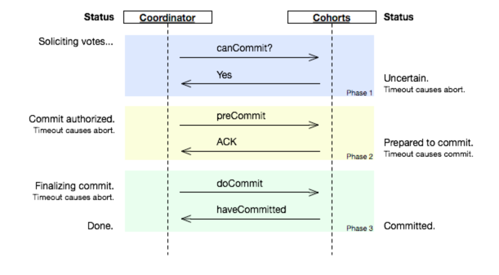
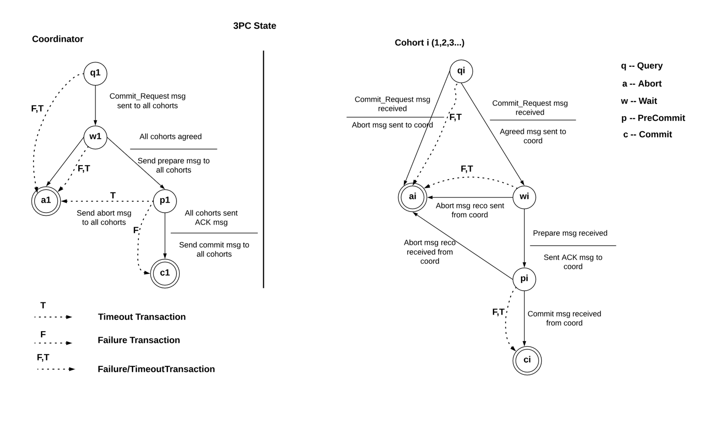

## Week 9 ARTS

### [A] - LC: 435. Non-overlapping Intervals
---
```java
package leetcode;

import java.util.Arrays;
import java.util.Collections;
import java.util.Comparator;

/**
 * 435. Non-overlapping Intervals
 *
 * Given a collection of intervals, find the minimum number of intervals you need
 * to remove to make the rest of the intervals non-overlapping.
 *
 * Note:
 * You may assume the interval's end point is always bigger than its start point.
 * Intervals like [1,2] and [2,3] have borders "touching" but they don't overlap each other.
 * Example 1:
 * Input: [ [1,2], [2,3], [3,4], [1,3] ]
 *
 * Output: 1
 *
 * Explanation: [1,3] can be removed and the rest of intervals are non-overlapping.
 * Example 2:
 * Input: [ [1,2], [1,2], [1,2] ]
 *
 * Output: 2
 *
 * Explanation: You need to remove two [1,2] to make the rest of intervals non-overlapping.
 * Example 3:
 * Input: [ [1,2], [2,3] ]
 *
 * Output: 0
 *
 * Explanation: You don't need to remove any of the intervals since they're already non-overlapping.
 *
 */
class Interval {
  int start;
  int end;
  
  public Interval() {
    start = end = 0;
  }
  
  public Interval(int start, int end) {
    this.start = start;
    this.end = end;
  }
  
  public int getStart() {
    return start;
  }
  
  public int getEnd() {
    return end;
  }
}
public class NonOverlappingIntervals435 {
  // Solution here is rather simple, first sort the array.
  // use count to record the overlapping
  // use end to record the previous end value (overlapping value will skip)
  // comparing next start with previous end value, if start less than prev end value, count++
  // else change end value.
  public int eraseOverlapIntervals(Interval[] intervals) {
    if (intervals == null || intervals.length < 2) {
      return 0;
    }
    int count = -1;
    Collections.sort(Arrays.asList(intervals),
        Comparator.comparing(Interval::getEnd)
        .thenComparing(Interval::getStart));
    int end = intervals[0].end;
    for (Interval inv : intervals) {
      if (inv.start < end) {
        count++;
      } else {
        end = inv.end;
      }
    }
    return count;
  }
  
  public static void main(String[] args) {
    NonOverlappingIntervals435 test = new NonOverlappingIntervals435();
    Interval[] intervals = new Interval[]{new Interval(1, 2),
        new Interval(2, 3), new Interval(3, 4), new Interval(1, 3)};
    System.out.println(test.eraseOverlapIntervals(intervals));
    
    intervals = new Interval[]{new Interval(1, 2),new Interval(1, 2),new Interval(1, 2)};
    System.out.println(test.eraseOverlapIntervals(intervals));
    
    intervals = new Interval[]{new Interval(1, 2),new Interval(2, 3),new Interval(3, 4)};
    System.out.println(test.eraseOverlapIntervals(intervals));
  }
}
```
```java
package others;

import java.util.*;

/**
 * Given a string, check whether a string contains a string in a list.
 *
 * Example:
 * "Bear a b"
 * ["a b", "c d", "e f"]
 */
public class ContainBlackList {
  // Build an index with first character in the blacklist
  // use map<key, value> key : "a", value: "a b"
  // iterator through a str
  public boolean isContainBlackList(List<String> blacklist, String str) {
    // build a index map
    Map<Character, IndexMap> indexMap = new HashMap<>();
    for (String s : blacklist) {
      IndexMap map;
      char ch = s.charAt(0);
      if (indexMap.containsKey(ch)) {
        map = indexMap.get(ch);
        map.maxLen = Math.max(map.maxLen, s.length());
        map.set.add(s);
      } else {
        Set<String> temp = new HashSet<>();
        temp.add(s);
        map = new IndexMap(temp, s.length());
      }
      indexMap.put(ch, map);
    }
    
    // iterate through str
    int len = str.length();
    for (int i = 0; i < len; i++) {
      char currCh = str.charAt(i);
      if (!indexMap.containsKey(currCh)) {
        continue;
      }
      Set<String> currSet = indexMap.get(currCh).set;
      int max = indexMap.get(currCh).maxLen;
      for (int j = i; j < len && j < max + i; j++) {
        if (currSet.contains(str.substring(i, j + 1))) {
          return true;
        }
      }
      
    }
    return false;
  }
  
  // Build a trie of blacklist String
  private Trie buildTrie(List<String> strs) {
    Trie root = new Trie();
    for (String str : strs) {
      root.insert(str);
    }
    return root;
  }
  
  // 1. build a trie tree
  // 2. search str
  public boolean isContainBlackListWithTrie(List<String> blacklist, String str) {
    Trie root = buildTrie(blacklist);
    for (int i = 0; i < str.length(); i++) {
      char ch = str.charAt(i);
      if (root.root.children.containsKey(ch)) {
        for (int j = i + root.minLen; j <= str.length() && j < i + root.maxLen; j++) {
          if (root.search(str.substring(i, j))) {
            return true;
          }
        }
      }
    }
    return false;
  }
  
  public static void main(String[] args) {
    ContainBlackList test = new ContainBlackList();
    List<String> blackList = Arrays.asList("a b", "c d", "a db", "ab test");
    System.out.println(test.isContainBlackList(blackList, "bear ab"));
    System.out.println(test.isContainBlackList(blackList, "bear a b"));
    System.out.println(test.isContainBlackList(blackList, "bear c bdf"));
    System.out.println(test.isContainBlackList(blackList, "bear a dbdhdjdf"));
  
    System.out.println("===================================================");
    System.out.println(test.isContainBlackListWithTrie(blackList, "bear ab"));
    System.out.println(test.isContainBlackListWithTrie(blackList, "bear a b"));
    System.out.println(test.isContainBlackListWithTrie(blackList, "bear c bdf"));
    System.out.println(test.isContainBlackListWithTrie(blackList, "bear a dbdhdjdf"));
    
    
//    test.buildTrie(blackList);
  }
}
class IndexMap {
  Set<String> set;
  int maxLen;
  
  public IndexMap(Set<String> set, int maxLen) {
    this.set = set;
    this.maxLen = maxLen;
  }
}

class Trie {
  TrieNode root;
  int minLen;
  int maxLen;
  
  public Trie() {
    root = new TrieNode();
    minLen = Integer.MAX_VALUE;
    maxLen = Integer.MIN_VALUE;
  }
  
  public void insert(String str) {
    Map<Character, TrieNode> children = root.children;
    for (int i = 0; i < str.length(); i++) {
      char ch = str.charAt(i);
      TrieNode node;
      if (children.containsKey(ch)) {
        node = children.get(ch);
      } else {
        node = new TrieNode(ch);
        children.put(ch, node);
      }
      children = node.children;
      
      if (i == str.length() - 1) {
        node.isString = true;
      }
    }
    minLen = Math.min(minLen, str.length());
    maxLen = Math.max(maxLen, str.length());
  }
  
  public boolean search(String str) {
    TrieNode node = searchNode(str);
    if (node != null && node.isString) {
      return true;
    }
    return false;
  }
  
  public boolean searchPrefix(String prefix) {
    if (searchNode(prefix) == null) {
      return false;
    }
    return true;
  }
  
  public TrieNode searchNode(String str) {
    Map<Character, TrieNode> children = root.children;
    TrieNode node = null;
    for (char ch : str.toCharArray()) {
      if (!children.containsKey(ch)) {
        return null;
      }
      node = children.get(ch);
      children = node.children;
    }
    
    return node;
  }
}

class TrieNode {
  char ch;
  Map<Character, TrieNode> children;
  boolean isString;
  
  public TrieNode() {
    children = new HashMap<>();
  }
  
  public TrieNode(char ch) {
    this.ch = ch;
    children = new HashMap<>();
  }
}
```

```java
package others;

import java.util.*;

/**
 * Question: Guess Passcode
 * we need to decryping a digital lock, now we have 4-digit length passcode, get a passcode with a minimum tries.
 * assume that we knew the correct passcode, you can use check(String passcode),
 * return boolean to check whether your generated passcode is correct or not.
 */

 // Before dive into code, ask clarify questions, e.g
 // give number will put into set, so no duplicate num.
 // can a passcocde contains duplicate num, i.e. "1212" - Yes
 // given numers will be more than 4 digits, i.e. set(1, 2, 3, 4, 5) - NO
 
 public class PasscodeGenerator {
  private static final int PASSCODE_LENGTH = 4;
  private static final String PASSCODE = "1234";
  
  // solution 1: permutation question, using backtracking
  // generate all the possible passcode, then check
  private List<String> allCodes = new ArraysList<>();
  private String passcode = "";
  public String getPasscode(Set<Integer> nums) {
    generatePasscodeHelper(nums, allCodes, new StringBuilder());
    return passcode;
  }

  private generatePasscodeHelper(Set<Integer> nums, List<String> allCodes,
      StringBuilder temp) {
    if (temp.length() > PASSCODE_LENGTH) return;
    if (temp.length() == PASSCODE_LENGTH) {
      allCodes.add(new String(temp.toString()));
      if (check(temp.toString)) {
        passcode = new String(temp.toString());
        return;
      }
    }
    for (int num : nums) {
      temp.append(num);
      generatePasscodeHelper(nums, allCodes, temp);
      temp.deleteCharAt(temp.length() - 1);
    }
  }
 }

 private boolean check(String passcode) {
   return passcode.equals(PASSCODE);
 }

// solution 2: general solution will generate duplicate passcode, how to de-duplicate.
// use two sets, one for used nums, another for unused nums
public String getPasscodeDedup(Set<Integer> nums) {
  List<String> recordAllCodesGenerated = new ArraysList<>();
  return generateCodeHelper(nums, new HashSet<String>(), new StringBuilder(), recordAllCodesGenerated);
}

private String generateCodeHelper(Set<String> used, Set<String> unUsed, StringBuilder passcode, List<String> allCodes) {
  // check generated code length match 4 digits
  if (passcode.length() == PASSCODE_LENGTH) {
    allCodes.add(new String(passcode.toString()));
    if (check(passcode.toString())) {
      return passcode.toString();
    }
  }
  // use used numbers, if we don't have to use all the numbers
  if (passcode.length() + used.size() < PASSCODE_LENGTH) {
    for (int num : used) {
      passcode.append(num);
      String code = generateCodeHelper(used, unUsed, passcode, allCodes);
      // backtracking
      passcode.deleteCharAt(passcode.length() - 1); 
      if (code != null) {
        return code;
      }
    }
  }

  // use unused numbers
  for (int num : unUsed) {
    used.add(num);
    unUsed.remove(num);
    String code = generateCodeHelper(used, unUsed, passcode, allCodes);
    // backtracking
    passcode.deleteCharAt(passcode.length() - 1);
    used.remove(num);
    unUsed.add(num);
    
    if (code != null) {
      return code;
    }
  }
  // return null if we find nothing
  return null;
}
```

```java
package leetcode;

import java.util.ArrayList;
import java.util.List;

/**
 * 77. Combinations
 *
 * Given two integers n and k, return all possible combinations of k numbers out of 1 .
 * .. n.
 *
 * Example:
 *
 * Input: n = 4, k = 2
 * Output:
 * [
 *   [2,4],
 *   [3,4],
 *   [2,3],
 *   [1,2],
 *   [1,3],
 *   [1,4],
 * ]
 *
 */
public class Combinations77 {
  // solution: general backtracking solution
  public List<List<Integer>> combine(int n, int k) {
    List<List<Integer>> res = new ArrayList<>();
    if (n < k) return res;
    generateCombinations(n, k, res, new ArrayList<Integer>(), 1);
    return res;
  }

  private void generateCombinations(int n, int k, List<List<Integer>> res,
      List<Integer> temp, int idx) {
    if (temp.size() == k) {
      res.add(new ArrayList<>(temp));
      return;
    }
    for (int i = idx; i <= n; i++) {
      temp.add(i);
      generateCombinations(n, k, res, temp, i + 1);
      // backtracking
      temp.remove(temp.size() - 1);
    }
  }

  public static void main(String[] args) {
    Combinations77 test = new Combinations77();
    System.out.println(test.combine(4, 2));
    System.out.println(test.combine(1, 2));
    System.out.println(test.combine(5, 3));
  }
}
```
```java
package leetcode;

import java.util.ArrayList;
import java.util.List;

/**
 * 916. Word Subsets
 *
 * We are given two arrays A and B of words.  Each word is a string of lowercase letters.
 *
 * Now, say that word b is a subset of word a if every letter in b occurs in a,
 * including multiplicity.  For example, "wrr" is a subset of "warrior", but is not a
 * subset of "world".
 *
 * Now say a word a from A is universal if for every b in B, b is a subset of a.
 *
 * Return a list of all universal words in A.  You can return the words in any order.
 *
 *
 *
 * Example 1:
 *
 * Input: A = ["amazon","apple","facebook","google","leetcode"], B = ["e","o"]
 * Output: ["facebook","google","leetcode"]
 * Example 2:
 *
 * Input: A = ["amazon","apple","facebook","google","leetcode"], B = ["l","e"]
 * Output: ["apple","google","leetcode"]
 * Example 3:
 *
 * Input: A = ["amazon","apple","facebook","google","leetcode"], B = ["e","oo"]
 * Output: ["facebook","google"]
 * Example 4:
 *
 * Input: A = ["amazon","apple","facebook","google","leetcode"], B = ["lo","eo"]
 * Output: ["google","leetcode"]
 * Example 5:
 *
 * Input: A = ["amazon","apple","facebook","google","leetcode"], B = ["ec","oc","ceo"]
 * Output: ["facebook","leetcode"]
 *
 *
 * Note:
 *
 * 1 <= A.length, B.length <= 10000
 * 1 <= A[i].length, B[i].length <= 10
 * A[i] and B[i] consist only of lowercase letters.
 * All words in A[i] are unique: there isn't i != j with A[i] == A[j].
 */
public class WordSubsets916 {
  // solution:
  // record a count for each character for each string in A,
  // record a maximum count for each character in B
  // compare countA and countB
  // if countA[i] < countB[i] continue next string in A
  // if all countA[i] >= countB[i], then add string into result list
  public List<String> wordSubsets(String[] A, String[] B) {
    int[] countB = new int[26];
    for (String b : B) {
      int[] currCount = countChar(b);
      for (int i = 0; i < 26; i++) {
        countB[i] = Math.max(countB[i], currCount[i]);
      }
    }
    List<String> res = new ArrayList<>();
    int i;
    for (String a : A) {
      int[] countA = countChar(a);
      for (i = 0; i < 26; i++) {
        if (countA[i] < countB[i]) {
          break;
        }
      }
      if (i == 26) {
        res.add(a);
      }
    }
    return res;
  }

  private int[] countChar(String str) {
    int[] count = new int[26];
    for (char ch : str.toCharArray()) {
      count[ch - 'a']++;
    }

    return count;
  }


  public static void main(String[] args) {
    WordSubsets916 test = new WordSubsets916();
    String[] A = new String[]{"amazon","apple","facebook","google","leetcode"};
    System.out.println(test.wordSubsets(A, new String[]{"e","o"}));
    System.out.println(test.wordSubsets(A, new String[]{"l","e"}));
    System.out.println(test.wordSubsets(A, new String[]{"e","oo"}));
    System.out.println(test.wordSubsets(A, new String[]{"lo","eo"}));
    System.out.println(test.wordSubsets(A, new String[]{"ec","oc","ceo"}));
  }
}
```

[R] - [Three Phase Commit protocol (3PC)](https://www.wikiwand.com/en/Three-phase_commit_protocol)  
---
We knwow there have a big issue when in 2PC, after 1st vote phase, when coordinator failed, cohorts cannot recieve commit/abort message from cooridinator, cohorts will be unknown states, hence, keep waiting for coordinator or resent 1st msg. 

3PC, unlike 2PC, is non-blocking. It will have 3 phases, befor commit, it will lock resources right after vote.

See below pic from [WIKI](https://www.wikiwand.com/en/Three-phase_commit_protocol#/Protocol_Description),



3 Phases:
1. Voting phase - waiting state
2. Prepared to commit(Locking resource) - prepared state
3. Commit phase - commit state

3PC core idea is not lock resources during voting phase, start locking unless all cohorts **ACKs**.[1]


From 3PC State, we can see that when on PreCommit state, transaction can still become Commit state.

#### References:
[1] [COOLSHELL Distribution](https://coolshell.cn/articles/10910.html)
[2] [Three-Phase Commit Protocol](http://courses.cs.vt.edu/~cs5204/fall00/distributedDBMS/sreenu/3pc.html)

[T] - Chrome Extension [**Source Graph**](https://chrome.google.com/webstore/detail/sourcegraph/dgjhfomjieaadpoljlnidmbgkdffpack?hl=en)
---
>Code intelligence for your code host and code reviews: hovers, documentation, definitions, and references in files, PRs, and diffs
The Sourcegraph extension adds code intelligence to GitHub and other code hosts: hovers, documentation, definitions, and references in files, pull requests, and diffs.

Highly recommand this extension, save your ass when you are on open source code like github code. 

[S] - [How Wechat faded into the silence in India](https://factordaily.com/how-wechat-faded-into-the-silence-in-india/)
---
Localization is not just to add a language, this is a good article to let us think about how to properlly manage company globally.
