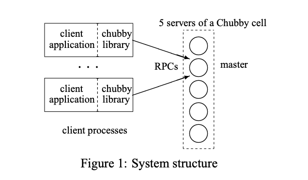
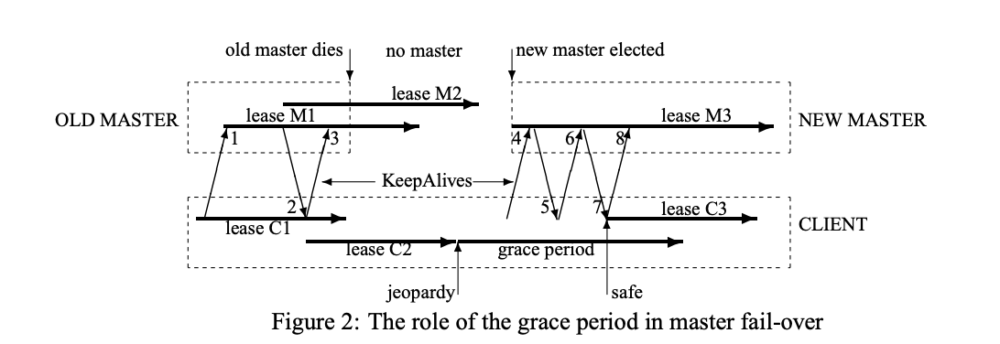
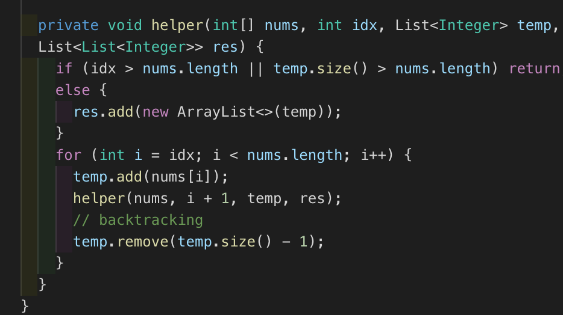

## Week 9 ARTS

### [A] - LC 908, 910, 301, 78, 90
---
```java
package leetcode;

/**
 * 908. Smallest Range I
 *
 * Given an array A of integers, for each integer A[i] we may choose any x with -K <= x
 * <= K, and add x to A[i].
 *
 * After this process, we have some array B.
 *
 * Return the smallest possible difference between the maximum value of B and the
 * minimum value of B.
 *
 * Example 1:
 *
 * Input: A = [1], K = 0
 * Output: 0
 * Explanation: B = [1]
 * Example 2:
 *
 * Input: A = [0,10], K = 2
 * Output: 6
 * Explanation: B = [2,8]
 * Example 3:
 *
 * Input: A = [1,3,6], K = 3
 * Output: 0
 * Explanation: B = [3,3,3] or B = [4,4,4]
 *
 * Note:
 *
 * 1 <= A.length <= 10000
 * 0 <= A[i] <= 10000
 * 0 <= K <= 10000
 */
public class SmallestRangeI908 {
  // solution:
  // 1.understand what the smallest range mean
  // 2. -K <= x <= K, meaning the range is 2*K
  // 3. find the maximum range between A, meaning, find Maximum and minimum number in A.
  // 4. compare 2*K and maxA - minA.
  public int smallestRangeI(int[] A, int K) {
    int max = Integer.MIN_VALUE;
    int min = Integer.MAX_VALUE;
    for (int num : A) {
      max = Math.max(num, max);
      min = Math.min(min, num);
    }

    return (max - min) > 2 * K ? max - min - 2 * K : 0;
  }

  public static void main(String[] args) {
    SmallestRangeI908 test = new SmallestRangeI908();
    System.out.println(test.smallestRangeI(new int[]{1}, 0));
    System.out.println(test.smallestRangeI(new int[]{0, 10}, 2));
    System.out.println(test.smallestRangeI(new int[]{1, 3, 6}, 3));
  }
}
```

```java
package leetcode;

import java.util.Arrays;

/**
 * 910. Smallest Range 910
 *
 * Given an array A of integers, for each integer A[i] we need to choose either x = -K
 * or x = K, and add x to A[i] (only once).
 *
 * After this process, we have some array B.
 *
 * Return the smallest possible difference between the maximum value of B and the
 * minimum value of B.
 *
 * Example 1:
 *
 * Input: A = [1], K = 0
 * Output: 0
 * Explanation: B = [1]
 * Example 2:
 *
 * Input: A = [0,10], K = 2
 * Output: 6
 * Explanation: B = [2,8]
 * Example 3:
 *
 * Input: A = [1,3,6], K = 3
 * Output: 3
 * Explanation: B = [4,6,3]
 *
 * Note:
 *
 * 1 <= A.length <= 10000
 * 0 <= A[i] <= 10000
 * 0 <= K <= 10000
 */
public class SmallestRangeII910 {
  // solution: idea here is sort array A
  // find the minimum number of each turn comparing.
  // the minimum would be the A[0] + K
  // find max and min number and compare,
  // here max number is A[i - 1] + K vs A[len] - K
  // min number is A[i] - K vs A[0] + K
  // compare and record every currSmall = Math.min(currSmall, max - min)
  public int smallestRangeII(int[] A, int K) {
    int len = A.length;
    Arrays.sort(A);
    // maxNumber: A[len - 1] - K
    // minNumber: A[0] - K
    // the smallest range is diff
    int diff = A[len - 1] - A[0];
    int currSmall = Integer.MAX_VALUE;
    int min1 = A[0] + K;
    int max1 = A[len - 1] - K;
    for (int i = 1; i < len; i++) {
      int min = Math.min(min1, A[i] - K);
      int max = Math.max(max1, A[i - 1] + K);
      currSmall = Math.min(currSmall, max - min);
    }
    return Math.min(currSmall, diff);
  }

  public static void main(String[] args) {
    SmallestRangeII910 test = new SmallestRangeII910();
    System.out.println(test.smallestRangeII(new int[]{1, 3, 6}, 3));
    System.out.println(test.smallestRangeII(new int[]{5, 4, 2, 6}, 5));
  }
}
```
```java
package leetcode;

import java.util.*;

/**
 * 301. Remove Invalid Parenthese
 *
 * Remove the minimum number of invalid parentheses in order to make the input string
 * valid. Return all possible results.
 *
 * Note: The input string may contain letters other than the parentheses ( and ).
 *
 * Example 1:
 * Input: "()())()"
 * Output: ["()()()", "(())()"]
 *
 * Example 2:
 * Input: "(a)())()"
 * Output: ["(a)()()", "(a())()"]
 *
 * Example 3:
 * Input: ")("
 * Output: [""]
 */
public class RemoveInvalidParenthese301 {
  // solution: Generate all possible string and validate a string
  // using set record visited string to de-duplicate string,
  // Keep adding new generated string into queue
  // Boolean found here is important, when you found one valid string, then continue
  // otherwise, you will get all possible valid string,
  // e.g. you will get [(())(), ()()(), ()(), (()), (), ] instead of [(())(), ()()()]
  public List<String> removeInvalidParentheses(String s) {
    List<String> res = new ArrayList<>();
    Set<String> visited = new HashSet<>();
    Queue<String> queue = new LinkedList<>();
    queue.offer(s);
    visited.add(s);

    boolean found = false;
    while (!queue.isEmpty()) {
      String curr = queue.poll();
      if (isValidParen(curr)) {
        res.add(curr);
        found = true;
      }
      if (found) continue;

      for (int i = 0; i < curr.length(); i++) {
        char ch = curr.charAt(i);
        if (ch != '(' && ch != ')') continue;
        String newStr = new StringBuilder(curr).deleteCharAt(i).toString();
        // if not visited, then add into queue, and mark visited.
        if (!visited.contains(newStr)) {
          queue.offer(newStr);
          visited.add(newStr);
        }
      }
    }

    return res;
  }

  private boolean isValidParen(String s) {
    int count = 0;
    for (char ch : s.toCharArray()) {
      if (ch == '(') {
        count++;
      }
      if (ch == ')' && count-- == 0) {
        return false;
      }
    }
    return count == 0;
  }

  // another solutoin : https://leetcode.com/problems/remove-invalid-parentheses/discuss/75027/Easy-Short-Concise-and-Fast-Java-DFS-3-ms-solution
  // which is concise, I thought to remove invalid parentheses, (using map to record each index, and found invalid, then remove previous invalid.
  // DFS is better.
  public List<String> removeInvalidParentheses_recur(String s) {
    List<String> res = new ArrayList<>();
    removeInvalidHelper(s, res, 0, 0, new char[]{'(', ')'});
    return res;
  }

  private void removeInvalidHelper(String s, List<String> res, int last_i, int last_j,
      char[] chars) {
    for (int count = 0, i = last_i; i < s.length(); i++) {
      if (s.charAt(i) == chars[0]) count++;
      if (s.charAt(i) == chars[1]) count--;
      if (count >= 0) continue;
      for (int j = last_j; j <= i; j++) {
        if (s.charAt(j) == chars[1] && (j == last_j || s.charAt(j - 1) != chars[1])) {
          removeInvalidHelper(new StringBuilder(s).deleteCharAt(j).toString(), res, i, j, chars);
        }
      }
      return;
    }

    // reverse string, do from right to left
    String revertStr = new StringBuilder(s).reverse().toString();
    if (chars[0] == '(') {
      removeInvalidHelper(revertStr, res, 0, 0, new char[]{')', '('});
    } else {
      res.add(revertStr);
    }
  }

  public static void main(String[] args) {
    RemoveInvalidParenthese301 test = new RemoveInvalidParenthese301();
    System.out.println(test.removeInvalidParentheses("()())()"));
    System.out.println(test.removeInvalidParentheses("(a)())()"));
    System.out.println(test.removeInvalidParentheses(")("));
    System.out.println(test.removeInvalidParentheses("(()("));

    System.out.println("============================================ Recur");
    System.out.println(test.removeInvalidParentheses_recur("()())()"));
    System.out.println(test.removeInvalidParentheses_recur("(a)())()"));
    System.out.println(test.removeInvalidParentheses_recur(")("));
    System.out.println(test.removeInvalidParentheses_recur("(()("));
  }
}
```
```java
package leetcode;

import java.util.ArrayList;
import java.util.List;

/**
 * 78. Subsets
 *
 * Given a set of distinct integers, nums, return all possible subsets (the power set).
 *
 * Note: The solution set must not contain duplicate subsets.
 *
 * Example:
 *
 * Input: nums = [1,2,3]
 * Output:
 * [
 *   [3],
 *   [1],
 *   [2],
 *   [1,2,3],
 *   [1,3],
 *   [2,3],
 *   [1,2],
 *   []
 * ]
 */
public class Subsets78 {
  // solution: backtracking
  public List<List<Integer>> subsets(int[] nums) {
    List<List<Integer>> res = new ArrayList<>();
    if (nums == null || nums.length < 1) {
      return res;
    }
    helper(nums, 0, new ArrayList<Integer>(), res);

    return res;
  }

  private void helper(int[] nums, int idx, List<Integer> temp, List<List<Integer>> res) {
    if (idx > nums.length || temp.size() > nums.length) return;
    else {
      res.add(new ArrayList<>(temp));
    }
    for (int i = idx; i < nums.length; i++) {
      temp.add(nums[i]);
      helper(nums, i + 1, temp, res);
      // backtracking
      temp.remove(temp.size() - 1);
    }
  }
}
```
```java
package leetcode;

import java.util.ArrayList;
import java.util.Arrays;
import java.util.List;

/**
 * 90. Subset II
 *
 * Given a collection of integers that might contain duplicates, nums, return all
 * possible subsets (the power set).
 *
 * Note: The solution set must not contain duplicate subsets.
 *
 * Example:
 *
 * Input: [1,2,2]
 * Output:
 * [
 *   [2],
 *   [1],
 *   [1,2,2],
 *   [2,2],
 *   [1,2],
 *   []
 * ]
 */
public class SubsetII90 {
  public List<List<Integer>> subsetsWithDup(int[] nums) {
    List<List<Integer>> res = new ArrayList<>();
    if (nums == null || nums.length < 1) return res;
    // sort array to skip dup number
    Arrays.sort(nums);
    helper(nums, 0, new ArrayList<>(), res);
    return res;
  }

  private void helper(int[] nums, int idx, List<Integer> temp, List<List<Integer>> res) {
    if (idx > nums.length || temp.size() > nums.length) return;
    res.add(new ArrayList<>(temp));
    Integer remove = null;
    for (int i = idx; i <= nums.length; i++) {
      // skip duplicate number
      if (remove != null && remove == nums[i]) continue;
      temp.add(nums[i]);
      helper(nums, i + 1, temp, res);
      // backtracking
      remove = temp.remove(temp.size() - 1);
    }
  }

  public static void main(String[] args) {
    SubsetII90 test = new SubsetII90();
    System.out.println(test.subsetsWithDup(new int[]{1,2,2}));
  }
}
```

### [R] - [The Chubby lock service for loosely-coupled distributed systems](https://static.googleusercontent.com/media/research.google.com/en//archive/chubby-osdi06.pdf)
---
This paper introduces a lock service for loosely coupled distributed systems. It is designed for coarse-grained locking and provides a limited but reliable distributed file system.[1]
Chubby is used extensively inside Google, such as GFS, BigTable etc.
1. What is Chubby?
  Chubby, a centrolized lock service for loosely coupled distributed systems.

**Chubby Design Goals**
1. Small data storing capability in addition to a lock service
  - Master can broadcast its state status to clients without external service.
2. Coarse-grained locking
  - Application can have locks for longer duration. E.g. Electing a master is not a frequent event
3. High availability, scalability
  - allow thousands of clients to observe changes (Master change)
  - Ops can deploy multiple machines to group a Chubby cell (Master with multiple replicas)
4. Notification mechanism
  - clients need to know when the changes occurs in the file which is shared.
5. Strong caching guarantees to simplfy developer usage

**Chubby System structure**

Server and clients through **RPC** comminicate



**Chubby Cell** - Master consistes of multiple replicas (Paxos protocol), vote to elect **Master**
  
**Master**
  - Elected Master, will extend lease and keep function, which is responsible for writing to the database any persistent state, replicas will sync with Master data updates.
  - If Master fails, Paxos protocol will elect a new Master
**Client**
  - Clients through **DNS** find Master
  - Clients will look up all replicas and master server to find master, replicas will response with master info back to Client, so clients can quickly locate Master.
  
Failures:
1. Mastser fail, will elect new Master, if replica fail, no impact to Chubby Cell.
2. If there is on machine no response in long time, then it will add new machine into Chubby Cell, and update DNS, use new IP replace old IP.
3. Master will periodically poll DNS list.  

Chubby Data nodes:
- persistent nodes - need to call API to delete 
- Temporary nodes - Session life cycle - bind with client session life cycle, it will delete when session expired. It can used to check client session availability
  
Chubby event notification mechanism - reduce chubby clients pol pressure
  - file content updates
  - nodes deletion 
  - child node creation , deletion
  - Master server change

Chubby caching (client cache ) - reduce refrequently read/write requests pressure to server

Chubby KeepAlive:
  
```
1, 3, 4, 6, 8 -> client 向 Master 发送 KeepAlive request
2, 5, 7 -> Master 反馈 KeepAlive response
M -> Master
C -> Client
```
If new Master elected in a short time, then it will use KeepAlive machenism to keep Clients communication with extend the client-master session.
  1. New Master will have a new epoch number time (4 requests will be rejected, because request with old Master, 5, master will response with a new time. 6, clients will send a new request with new master)
  2. New Master can immediately response clients DNS lookup, but will not response with any session relate opperation.
  3. Master will create a server memory state based on database sesion and lock info
  4. Master can handle KeepAlive requests
  5. Master will send a "Master fail change` event to all session to clients, client receives request, then will clear local cache, then response to upper application. 
  6. Master will wait client's response, untill all clients reponse change event successfully
  7. Master will begin session requests
   
#### References
[1] [Distributed lock manager](https://www.wikiwand.com/en/Distributed_lock_manager)

[2] [Chubby: A lock service for distributed coordination](https://medium.com/coinmonks/chubby-a-centralized-lock-service-for-distributed-applications-390571273052)


### [T] - VS code plugin - indent-rainbow
---
Indent sometimes is frastrating, especially with python, etc. With different color indent is helpful. try it out to see whether you like it. :)



### [S] - [Uber’s Big Data Platform: 100+ Petabytes with Minute Latency](https://eng.uber.com/uber-big-data-platform/)
---
>Uber relies heavily on making data-driven decisions at every level.
>Over time, the need for more insights has resulted in over 100 petabytes of analytical data that needs to be cleaned, stored, and served with minimum latency through our Hadoop-based Big Data platform. Since 2014, we have worked to develop a Big Data solution that ensures data reliability, scalability, and ease-of-use, and are now focusing on increasing our platform’s speed and efficiency. 

Uber Data platform transform journey, how they start from Vertica as dataware house, building a data pipeline with hours latency to last generation of heavily use Spark to reduce latency down to minutes. 
