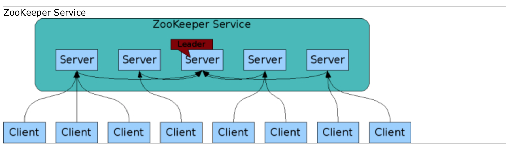
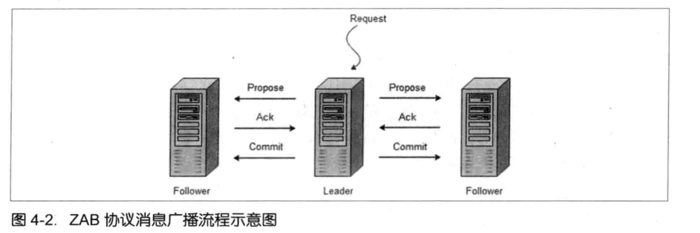
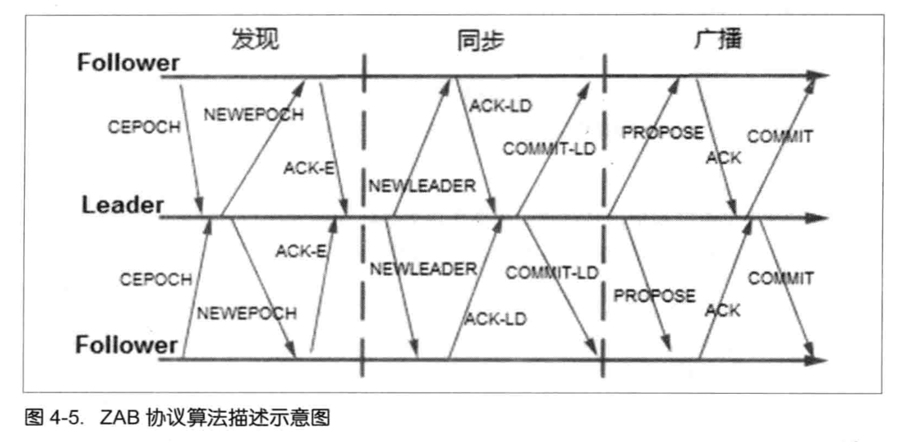
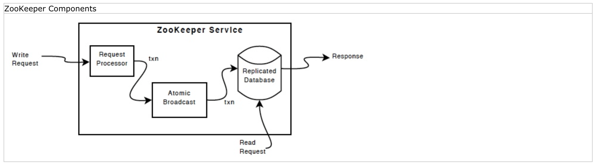

## Week 9 ARTS

### [A] - LC 17, 817, 206, 92
---
```java
package leetcode;

import java.util.ArrayList;
import java.util.List;

/**
 * 17. Letter Combination of a Phone Number
 */
public class LetterCombination17 {
  // solution: combination
  public List<String> letterCombinations(String digits) {
    List<String> res = new ArrayList<>();
    if (digits == null || digits.length() == 0) {
      return res;
    }
    // map number to letters
    String[] map = new String[]{"", "*", "abc", "def", "ghi", "jkl", "mno", "pqrs",
        "tuv", "wxyz"};
    helper(digits, 0, new StringBuilder(), res, map);
    return res;
  }

  private void helper(String digits, int idx, StringBuilder temp, List<String> res, String[] map) {
    if (temp.length() == digits.length()) {
      res.add(new String(temp));
      return;
    }
    int num = digits.charAt(idx) - '0';
    for (int i = 0; i < map[num].length(); i++) {
      char curr = map[num].charAt(i);
      temp.append(curr);
      helper(digits, idx + 1, temp, res, map);
      // backtracking
      temp.deleteCharAt(temp.length() - 1);
    }
  }

  public static void main(String[] args) {
    LetterCombination17 test = new LetterCombination17();
    System.out.println(test.letterCombinations("123"));
    System.out.println(test.letterCombinations("23"));
    System.out.println(test.letterCombinations("2389"));
  }
}
```
```java
package others;

/**
 * Given a list of people with their birth and end years,
 * find the year with the most number of people alive.
 *
 * You may assume that all people were born between 1900 and 2020 (inclusive). If a
 * person was alive during any portion of that year, they should be included in that
 * year's count. For example, Person (birth= 1908, death= 1909) is included in the
 * counts for both 1908 and 1909.
 *
 * assume people can live no more than 200 years.
 *
 * We may assume that if there are multiple years with the same most born,
 * then return any year.
 *
 * example:
 * p1: [1900, 1900]
 * p2: [2000, 2020]
 * p3: [1989, 2020]
 * p4: [1929, 2010]
 * p5: [1929, 2000]
 * p5: [1990, 2010]
 *
 */
public class FindPeekPopulation {
  // people live no more than 200 years, 2020 - 1900 + 200 = 320
  private static final int YEAR_RANGE = 320;

  // solution: list all birth year and death year in one line,
  // using an array from 1900 - 2020 to record the number of living people in the year,
  // using a count, when birth year, array[birthY - 1900]++,
  // when death year, array[birthY - 1900]--, and record to array
  // using a maxLivePeople to record the year with most live people
  // return maxLivePeople + 1900.
  public int getMostLivePeopleYear(final Person[] people) {
    // array
    final int[] birthP = new int[YEAR_RANGE];
    final int[] deathP = new int[YEAR_RANGE];
    for (Person pl : people) {
      birthP[pl.birthY - 1900]++;
      deathP[pl.deathY - 1900]++;
    }
    int maxLivePeople = 0;
    int offsetYear = 0;
    int maxPop = 0;
    for (int i = 0; i < YEAR_RANGE; i++) {
      maxLivePeople += birthP[i];
      if (maxLivePeople > maxPop) {
        maxPop = maxLivePeople;
        offsetYear = i;
      }
      maxLivePeople -= deathP[i];
    }
    return offsetYear + 1900;
  }

  // assume year range didn't give, can be any year
  // the same approach, instead of getting the range from assumption directly,
  // we need to find firstBirthYear and lastBirthYearh, and get the range
  // assume a person can live no more than 200 years
  private static final int MAX_LIVE_YEAR = 200;

  public int getMaxPopulationYear(Person[] people) {
    final int firstBirthY = getBirthYear(people)[0];
    final int lastBirthY = getBirthYear(people)[1];
    int[] deltas = getDeltas(people, firstBirthY, lastBirthY);
    int maxPopulationYear = getMaxLivingPeopleYear(deltas);

    return maxPopulationYear + firstBirthY;
  }

  private int getMaxLivingPeopleYear(int[] deltas) {
    int maxLivingYear = 0;
    int tempSum = 0;
    int offsetYear = 0;
    for (int year = 0; year < deltas.length; year++) {
      tempSum += deltas[year];
      if (maxLivingYear < tempSum) {
        maxLivingYear = tempSum;
        offsetYear = year;
      }
    }
    return offsetYear;
  }

  private int[] getBirthYear(Person[] people) {
    int firstBirthY = Integer.MAX_VALUE;
    int lastBirthY = Integer.MIN_VALUE;
    for (Person p : people) {
      firstBirthY = Math.min(firstBirthY, p.birthY);
      lastBirthY = Math.max(lastBirthY, p.birthY);
    }

    return new int[]{firstBirthY, lastBirthY};
  }

  private int[] getDeltas(Person[] people, int firstBirthY, int lastBirthY) {
    final int[] delats = new int[lastBirthY - firstBirthY + MAX_LIVE_YEAR];
    for (Person p : people) {
      addDeltas(delats, p, firstBirthY);
      addDeltas(delats, p, firstBirthY);
    }

    return delats;
  }

  private void addDeltas(int[] deltas, Person p, int firstBirthY) {
    for (int year = p.birthY; year < p.deathY; year++) {
      deltas[year - firstBirthY]++;
    }
    deltas[p.deathY + 1]--;
  }

  public static void main(String[] args) {
    FindPeekPopulation test = new FindPeekPopulation();
    Person[] people = new Person[3];
    people[0] = new Person(1990, 2030);
    people[1] = new Person(1900, 2020);
    people[2] = new Person(2000, 2008);
    System.out.println(test.getMostLivePeopleYear(people));
  }
}

class Person {
  int birthY;
  int deathY;

  public Person(int birthY, int deathY) {
    this.birthY = birthY;
    this.deathY = deathY;
  }
}
```
```java
package leetcode;

import java.util.HashSet;
import java.util.Set;

/**
 * 817. LinkedList Components
 *
 * We are given head, the head node of a linked list containing unique integer values.
 *
 * We are also given the list G, a subset of the values in the linked list.
 *
 * Return the number of connected components in G, where two values are connected if
 * they appear consecutively in the linked list.
 *
 * Example 1:
 *
 * Input:
 * head: 0->1->2->3
 * G = [0, 1, 3]
 * Output: 2
 * Explanation:
 * 0 and 1 are connected, so [0, 1] and [3] are the two connected components.
 * Example 2:
 *
 * Input:
 * head: 0->1->2->3->4
 * G = [0, 3, 1, 4]
 * Output: 2
 * Explanation:
 * 0 and 1 are connected, 3 and 4 are connected, so [0, 1] and [3, 4] are the two
 * connected components.
 * Note:
 *
 * If N is the length of the linked list given by head, 1 <= N <= 10000.
 * The value of each node in the linked list will be in the range [0, N - 1].
 * 1 <= G.length <= 10000.
 * G is a subset of all values in the linked list.
 */
public class LinkedListComponents817 {
  // solution: straight forward, using Set, lookup O(1)
  public int numComponents(ListNode head, int[] G) {
    // null check
    if (head == null) return 0;
    Set<Integer> sets = new HashSet<>();
    for (int g : G) {
      sets.add(g);
    }

    int numComponent = 0;
    boolean isOneComponent = false;
    while (head != null) {
      while (sets.contains(head.val) && head.next != null) {
        isOneComponent = true;
        if (head.next == null) break;
        head = head.next;
      }
      if (isOneComponent) {
        isOneComponent = false;
        numComponent++;
      }
      head = head.next;
    }

    return numComponent;
  }
}

class ListNode {
  int val;
  ListNode next;

  public ListNode(int val) {
    this.val = val;
  }
}
```
```java
package leetcode;

/**
 * 206. Reverse LinkedList
 *
 * Reverse a singly linked list.
 *
 * Example:
 *
 * Input: 1->2->3->4->5->NULL
 * Output: 5->4->3->2->1->NULL
 * Follow up:
 *
 * A linked list can be reversed either iteratively or recursively. Could you implement
 * both?
 */
public class ReverseLinkedList206 {

  class ListNode {
    int val;
    ListNode next;

    public ListNode(int val) {
      this.val = val;
    }
  }

  // insert every node into head of the listNode
  public ListNode reverseListNode(ListNode head) {
    if (head == null || head.next == null) return head;
    ListNode pre = null;
    while (head != null) {
      ListNode temp = head.next;
      head.next = pre;
      pre = head;
      head = temp;
    }
    return pre;
  }
}
```
```java
package leetcode;

/**
 * 92. Reverse LinkedList II
 *
 * Reverse a linked list from position m to n. Do it in one-pass.
 *
 * Note: 1 ≤ m ≤ n ≤ length of list.
 *
 * Example:
 *
 * Input: 1->2->3->4->5->NULL, m = 2, n = 4
 * Output: 1->4->3->2->5->NULL
 */
public class ReverseLinkedListII95 {
  public ListNode reverseBetween(ListNode head, int m, int n) {
    if (head == null || head.next == null) {
      return head;
    }
    ListNode dummy = new ListNode(0);
    dummy.next = head;
    ListNode pre = dummy;
    for (int i = 1; i < m; i++) {
      pre = pre.next;
    }

    ListNode start = pre.next;
    ListNode curr = start.next;
    for (int i = m; i < n; i++) {
      start.next = curr.next;
      curr.next = pre.next;
      pre.next = curr;
      curr = start.next;
    }

    return dummy.next;
  }

  public static void main(String[] args) {
    ListNode head = new ListNode(1);
    ListNode n1 = new ListNode(2);
    ListNode n2 = new ListNode(3);
    ListNode n3 = new ListNode(4);
    ListNode n4 = new ListNode(5);
    n3.next = n4;
    n2.next = n3;
    n1.next = n2;
    head.next = n1;

    ReverseLinkedListII95 test = new ReverseLinkedListII95();
    test.reverseBetween(head, 2, 4);
  }
}
```

### [R] - [Zookeeper](https://data-flair.training/blogs/zookeeper-tutorial/) 
--
1. What is Zookeeper?
   >ZooKeeper is a distributed, open-source coordination service for distributed applications. It exposes a simple set of primitives that distributed applications can build upon to implement higher level services for synchronization, configuration maintenance, and groups and naming.

2. [Zookeeper Features](https://zookeeper.apache.org/doc/r3.4.13/zookeeperOver.html#guarantees)
  - Sequential Consistency - Updates from a client will be applied in the order that they were sent.

  - Atomicity - Updates either succeed or fail. No partial results.

  - Single System Image - A client will see the same view of the service regardless of the server that it connects to.

  - Reliability - Once an update has been applied, it will persist from that time forward until a client overwrites the update.

  - Timeliness - The clients view of the system is guaranteed to be up-to-date within a certain time bound.

**Zookeeper Architecture:**

The following figure shows the relationship between servers and clients.


1. Zookeeper mode
   - Standalone - meaning zookeeper has a single server
   - quorum - meaning it has a gourp of Zookeeper servers

2. ZooKeeper Atomic Broadcast(ZAB) protocal VS Paxos 
   - **Leader** - 
        - Leader will handle all transaction requests (global unique ID (ZXID)).
        - Leader is responsible for transfering a client request to Proposal, and sent the proposal to all followers
        - Leader wait for followers response, it requires more than half responses from followers
        - Leader gets more than half ACK, will sent commit request to all followers
   - **Follower** - response to leader, and keep connection with leader

#### ZAB models
- Broadcast
    - use atomic broadcast protocal, similar to 2PC protocal (below figure is from [1])

    

    - Based on FIFO queue to build a **TCP** connection, it guarantees sequential order
    - Leader creates global unique Id for each Proposal called **ZXID**
    - Leader allocates a Queue for each Follower
    - Follower receives Proposal, will write into local disk, response (ACK) to Leader once successfully written
    - Leader receives more than half ACK, broadcast a commit (Proposal commit msg) to all Followers, complete commit
  
- Failover and recover
  - It will re-elect new leader when old leader, notify all follows
  - It guarantees all committed transaction will commited by all servers.

ZAB 3 phases:
1. Discover
2. Synchronization
3. Broadcast
   
below figure is coming from [1].



Zookeeper Components (below figure is from [3])


>The replicated database is an in-memory database containing the entire data tree. Updates are logged to disk for recoverability, and writes are serialized to disk before they are applied to the in-memory database.
>
>Every ZooKeeper server services clients. Clients connect to exactly one server to submit irequests. Read requests are serviced from the local replica of each server database. Requests that change the state of the service, write requests, are processed by an agreement protocol.
>
>As part of the agreement protocol all write requests from clients are forwarded to a single server, called the leader. The rest of the ZooKeeper servers, called followers, receive message proposals from the leader and agree upon message delivery. The messaging layer takes care of replacing leaders on failures and syncing followers with leaders.
>
>ooKeeper uses a custom atomic messaging protocol. Since the messaging layer is atomic, ZooKeeper can guarantee that the local replicas never diverge. When the leader receives a write request, it calculates what the state of the system is when the write is to be applied and transforms this into a transaction that captures this new state.

#### References
[1] [从 Paxos 到 Zookeeper 分布式一致性原理](https://github.com/double-qiu/books/blob/master/%E4%BB%8EPAXOS%E5%88%B0ZOOKEEPER%E5%88%86%E5%B8%83%E5%BC%8F%E4%B8%80%E8%87%B4%E6%80%A7%E5%8E%9F%E7%90%86%E4%B8%8E%E5%AE%9E%E8%B7%B5.pdf)

[2] [Zookeeper Tutorial](https://data-flair.training/blogs/zookeeper-tutorial/)

[3] [Apache Zookeeper Doc](https://zookeeper.apache.org/doc/r3.4.13)


### [T] - Install Zookeeper on macos
---
On Mac, brew install zookeeper
```
> brew search zookeeper

> brew install zookeeper

# start zookeeper
> zkServer start

# stop zookeeper
> zkServer stop

# check zookeeper cli 
> zkCli 

Connecting to localhost:2181
Welcome to ZooKeeper!
JLine support is enabled

WATCHER::

WatchedEvent state:SyncConnected type:None path:null
[zk: localhost:2181(CONNECTED) 0]

# or checking zookeeper set up
> telnet 127.0.0.1 2181
Trying 127.0.0.1...
Connected to localhost.
Escape character is '^]’.

> stat
Zookeeper version: 3.4.13-2d71af4dbe22557fda74f9a9b4309b15a7487f03, built on 06/29/2018 04:05 GMT
Clients:
 /127.0.0.1:53754[0](queued=0,recved=1,sent=0)

Latency min/avg/max: 0/5/72
Received: 19
Sent: 18
Connections: 1
Outstanding: 0
Zxid: 0x6
Mode: standalone
Node count: 4
Connection closed by foreign host.

## notice mode: standalone - meaning this is a single machine zookeeper
```

### [S] - [Apple News’s Radical Approach: Humans Over Machines](https://www.nytimes.com/2018/10/25/technology/apple-news-humans-algorithms.html)
---
This article talked about Apple News use human resource like Ms. Kern to select head news rather than Machine (algorithms).
>The former journalist has quietly become one of the most powerful figures in English-language media. The stories she and her deputies select for Apple News regularly receive more than a million visits each.

Even with companis like Apple, using human resources to select head news, then what about others? so it raised some doubts / questions to think about? 

1. Why Apple cannot select head news by Algorithms?
2. How far (difference) between AI and human? 
3. Machine Learning isn't good enough to do recommendation jobs?
4. What about all the news / articles about machine (AI) will replace human labor?
5. All lie? if not, how far it already reached?