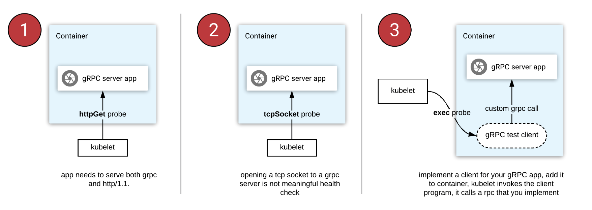

## Week 17 ARTS

### [A] - LC 209, 621, 938, 334, 325, 218
---
```java
package leetcode;

import java.util.HashMap;
import java.util.Map;

/**
 * 621. Task Scheduler
 *
 * Given a char array representing tasks CPU need to do. It contains capital
 * letters A to Z where different letters represent different tasks.Tasks could be done
 * without original order. Each task could be done in one interval. For each interval,
 * CPU could finish one task or just be idle.
 *
 * However, there is a non-negative cooling interval n that means between two same tasks,
 * there must be at least n intervals that CPU are doing different tasks or just be idle.
 *
 * You need to return the least number of intervals the CPU will take to finish
 * all the given tasks.
 *
 *
 *
 * Example:
 *
 * Input: tasks = ["A","A","A","B","B","B"], n = 2
 * Output: 8
 * Explanation: A -> B -> idle -> A -> B -> idle -> A -> B.
 *
 *
 * Note:
 *
 * The number of tasks is in the range [1, 10000].
 * The integer n is in the range [0, 100].
 */
public class TaskScheduler621 {
  // at the beginning, I didn't understand the question,
  // checked [jinzhou's solution](https://leetcode.com/problems/task-scheduler/discuss/104500/java-on-time-o1-space-1-pass-no-sorting-solution-with-detailed-explanation)
  // it is asking to arrange CPU tasks, which it will at least n intervals between two
  // same tasks.
  // always arrange tasks with the most frequency first
  // e.g 1:
  // AAABBC, n = 2
  // arrange A first, and between A it will have 2 slots need to be filled.
  // A # # A # # A
  // # : empty slots
  // now arrage B, then C
  // A B # A B # A
  // A B C A B # A  --> # : idle

  // e.g 2:
  // AAABBBCCCDDDEE, n = 2
  // now A, B, C , D has the same more frequency, we will need to put them as one,
  // ABCD | ABCD | ABCD
  // ABCD (the characters with the most frequency is already greater than n, so there
  // is not empty slots.)
  // ABCDE | ABCDE | ABCD
  // no empty slots. -> return tasks.length
  public int leastInterval(char[] tasks, int n) {
    // recorde task frequency
    Map<Character, Integer> frequency = new HashMap<>();
    // the most frequency
    int maxFreq = 0;
    // number characters with the most maxFreq
    int maxCount = 0;
    for (char task : tasks) {
      frequency.put(task, frequency.getOrDefault(task, 0) + 1);
      int curr = frequency.get(task);
      if (maxFreq == curr) {
        maxCount++;
      } else if (maxFreq < curr) {
        maxFreq = curr;
        // the max frequency changed, need to reset maxCount = 1
        maxCount = 1;
      }
    }

    int preCount = maxFreq - 1;
    int preLength = n - (maxCount - 1);
    int emptySlots = preCount * preLength;
    int remainTasks = tasks.length - maxFreq * maxCount;
    int idleSlots = Math.max(0, emptySlots - remainTasks);

    return tasks.length + idleSlots;
  }
}
```
```java
package leetcode;

/**
 * 209. Minimum Size Subarray Sum
 *
 * Given an array of n positive integers and a positive integer s,
 * find the minimal length of a contiguous subarray of which the sum ≥ s.
 * If there isn't one, return 0 instead.
 *
 * Example:
 *
 * Input: s = 7, nums = [2,3,1,2,4,3]
 * Output: 2
 * Explanation: the subarray [4,3] has the minimal length under the problem constraint.
 *
 * Follow up:
 * If you have figured out the O(n) solution, try coding another
 * solution of which the time complexity is O(n log n).
 */
public class MinimumSizeSubArraySum209 {
  // solution: two pointer, left and right, keep sum between left to right,
  // compare sum and s, if greater than s, then record minLen (right - left)
  public int minSubArrayLen(int s, int[] nums) {
    if (nums == null || nums.length == 0) return 0;
    int minLen = Integer.MAX_VALUE;
    int currSum = 0;
    int l = 0;
    int r = 0;
    while (l < nums.length) {
      // two pointers, keep sum between left and right
      while (r < nums.length && currSum < s) {
        currSum += nums[r++];
      }
      // keep track minLen when sum > s
      if (currSum >= s) {
        minLen = Math.min(minLen, r - l);
      }
      // left point move to right, sum minus left value.
      currSum -= nums[l++];
    }

    return minLen == Integer.MAX_VALUE ? 0 : minLen;
  }
}
```
```java
package leetcode;

import java.util.LinkedList;
import java.util.Queue;

/**
 * 938. Range Sum of BST
 *
 * Given the root node of a binary search tree, return the sum of values of all nodes
 * with value between L and R (inclusive).
 *
 * The binary search tree is guaranteed to have unique values.
 *
 *
 *
 * Example 1:
 *
 * Input: root = [10,5,15,3,7,null,18], L = 7, R = 15
 * Output: 32
 * Example 2:
 *
 * Input: root = [10,5,15,3,7,13,18,1,null,6], L = 6, R = 10
 * Output: 23
 *
 *
 * Note:
 *
 * The number of nodes in the tree is at most 10000.
 * The final answer is guaranteed to be less than 2^31.
 */
public class RangeSumofBST938 {
  class TreeNode {
    int val;
    TreeNode left;
    TreeNode right;

    public TreeNode(int val) {
      this.val = val;
    }
  }
  // BFS,
  public int rangeSumBST(TreeNode root, int L, int R) {
    Queue<TreeNode> queue = new LinkedList<>();
    queue.offer(root);
    int sum = 0;
    while (!queue.isEmpty()) {
      TreeNode curr = queue.poll();
      if (curr.val > R && curr.left != null) {
        queue.offer(curr.left);
      }
      if (curr.val < L && curr.right != null) {
        queue.offer(curr.right);
      }
      if (curr.val >= L && curr.val <= R) {
        sum += curr.val;
        if (curr.left != null) queue.offer(curr.left);
        if (curr.right != null) queue.offer(curr.right);
      }
    }
    return sum;
  }

  // DFS
  public int rangeSumBST_DFS(TreeNode root, int L, int R) {
    return dfs(root, L, R);
  }

  private int dfs(TreeNode root, int L, int R) {
    if (root == null) return 0;
    if (root.val < L) return dfs(root.right, L, R);
    if (root.val > R) return dfs(root.left, L, R);

    return root.val + dfs(root.left, L, R) + dfs(root.right, L, R);
  }
}
```
```java
package leetcode;

/**
 * 334. Increasing Triplet Subsequence
 *
 * Given an unsorted array return whether an increasing subsequence of
 * length 3 exists or not in the array.
 *
 * Formally the function should:
 *
 * Return true if there exists i, j, k
 * such that arr[i] < arr[j] < arr[k] given 0 ≤ i < j < k ≤ n-1 else return false.
 * Note: Your algorithm should run in O(n) time complexity and O(1) space complexity.
 *
 * Example 1:
 *
 * Input: [1,2,3,4,5]
 * Output: true
 * Example 2:
 *
 * Input: [5,4,3,2,1]
 * Output: false
 */

  // solution: refer from sim5:
  // https://leetcode.com/problems/increasing-triplet-subsequence/discuss/79004/Concise-Java-solution-with-comments.
  // idea is brilliant, set two numbers, small and big, if both value updated, if we find
  // third number which greater than both, then find sequence, otherwise not found
  // e.g. [1, 5, 2, 4, 3], small = MAX_VALUE, big = MAX_VALUE
  // 1 <= small, small = 1,
  // 5 > small && 5 <= big, big = 5
  // 2 > small, 2 < big, big = 2
  // 4 > small, 4 > big, return true, found one
  //
  // another example:
  // [5, 3, 2, 4, 1]
  // 5 <= small, small = 5
  // 3 <= small, small = 3
  // 2 <= small, small = 2
  // 4 > small, 4 < big, big = 4
  // 1 < small, small = 1
  // didn't find third value greater both, not found.

  // Time: O(n), space: O(1)
public class IncreasingTripletSubsequence334 {
  public boolean increasingTriplet(int[] nums) {
    int small = Integer.MAX_VALUE;
    int big = Integer.MAX_VALUE;
    for (int num : nums) {
      if (num <= small) small = num;  // num <= small update small
      else if (num <= big) big = num; // update when num > small, num <= big
      else return true; //  found third value small < big < num
    }
    return false;
  }
}
```
```java
/**
 * 325. Maximum Size Subarray Sum Equals k
 *
 * Given an array nums and a target value k, find the maximum length of a subarray
 * that sums to k. If there isn't one, return 0 instead.
 *
 * Example 1:
 * Given nums = [1, -1, 5, -2, 3], k = 3,
 * return 4. (because the subarray [1, -1, 5, -2] sums to 3 and is the longest)
 *
 * Example 2:
 * Given nums = [-2, -1, 2, 1], k = 1,
 * return 2. (because the subarray [-1, 2] sums to 1 and is the longest)
 *
 * Follow Up:
 * Can you do it in O(n) time?
 */
public class MaximumSizeSubArraySumEqualsK325 {
  // solution: prefixsum and hash map, prefixSum as key, idx as value.
  // using prefixsum build a hashmap, if current sum equals to target sum, then from
  // beginning to current will be one subarray length,
  // if didn't find sum == target, we also find subarray between current idx to
  // map.get(currsum - target).
  // e.g:
  // [1,-1,5,-2,3], 3
  // map[0, -1] -> for target from the beginning
  // sum = 1, map[1, 0], sum - 3 not in map
  // sum = 0, sum - 3 not in map
  // sum = 5, map[5, 2], sum - 3 not in map
  // sum = 3, map[3, 3], sum - 3 in map, len = currIdx - map.get(sum - 3)
  // sum = 6, map [6, 4], sum - 3 in map, len = currIdx - map.get(sum - 3)
  // keep maxLen, compare with each len

  // another example:
  // e.g. [-2. -1, 2, 1], 1
  // map[0, -1]
  // sum = -2, map[-2, 0]
  // sum = -3, map[-3, 1]
  // sum = -1, map[-1, 2], found sum - 1 in map,  maxLen in (maxLen, currIdx - map.get(sum-1)
  // sum = 0, found sum - 1 in map, checking maxlen with currIdx - map.get(sum - 1)
  // return maxLen

  // time: O(n), space: O(n)
  public int maxSubArrayLen(int[] nums, int k) {
    Map<Integer, Integer> map = new HashMap<>();
    // initial map, put 0, if maximum length from 0, we need to calculate
    // i - 1.
    map.put(0, -1);
    int currSum = 0;
    int maxLen = 0;
    for (int i = 0; i < nums.length; i++) {
      currSum += nums[i];
      if (!map.containsKey(currSum)) {
        map.put(currSum, i);
      }
      if (map.containsKey(currSum - k)) {
        maxLen = Math.max(maxLen, i - map.get(currSum - k));
      }
    }

    return maxLen;
  }
}
```
```java
package leetcode;

import java.util.*;

/**
 * 218. The Skyline Problem - https://leetcode.com/problems/the-skyline-problem/
 *
 * A city's skyline is the outer contour of the silhouette formed by all the buildings
 * in that city when viewed from a distance. Now suppose you are given the locations
 * and height of all the buildings as shown on a cityscape photo (Figure A), write a
 * program to output the skyline formed by these buildings collectively (Figure B).
 *
 * Buildings  Skyline Contour
 * The geometric information of each building is represented by a triplet of integers
 * [Li, Ri, Hi], where Li and Ri are the x coordinates of the left and right edge of
 * the ith building, respectively, and Hi is its height. It is guaranteed that 0 ≤ Li,
 * Ri ≤ INT_MAX, 0 < Hi ≤ INT_MAX, and Ri - Li > 0. You may assume all buildings are
 * perfect rectangles grounded on an absolutely flat surface at height 0.
 *
 * For instance, the dimensions of all buildings in Figure A are recorded as: [ [2 9
 * 10], [3 7 15], [5 12 12], [15 20 10], [19 24 8] ] .
 *
 * The output is a list of "key points" (red dots in Figure B) in the format of [ [x1,
 * y1], [x2, y2], [x3, y3], ... ] that uniquely defines a skyline. A key point is the
 * left endpoint of a horizontal line segment. Note that the last key point, where the
 * rightmost building ends, is merely used to mark the termination of the skyline, and
 * always has zero height. Also, the ground in between any two adjacent buildings
 * should be considered part of the skyline contour.
 *
 * For instance, the skyline in Figure B should be represented as:[ [2 10], [3 15], [7
 * 12], [12 0], [15 10], [20 8], [24, 0] ].
 *
 * Notes:
 *
 * The number of buildings in any input list is guaranteed to be in the range [0, 10000].
 * The input list is already sorted in ascending order by the left x position Li.
 * The output list must be sorted by the x position.
 * There must be no consecutive horizontal lines of equal height in the output skyline.
 * For instance, [...[2 3], [4 5], [7 5], [11 5], [12 7]...] is not acceptable; the
 * three lines of height 5 should be merged into one in the final output as such: [..
 * .[2 3], [4 5], [12 7], ...]
 */


/**
 *
 * Idea: the building has three dimensions, (startPoint, endPoint, height), here we
 * will separate into two parts, (startPoint, height) and (endPoint, height), sort
 * these two parts, and using priority queue(PQ) to manage the height, when is
 * startPoint,
 * we will push height into PQ, and when see endPoints, we will remove the height from
 * PQ, then when to add key points, when previous height is different than current
 * height in PQ (pq.peek()), keep scanning buildings, until to last building.
 *
 * For example:
 * [ [2 9 10], [3 7 15], [5 12 12], [15 20 10], [19 24 8] ]
 *
 * 1. Separate into two parts, (start, height) and (end, height) and using a flag to
 * check whether is start point. Remember we will sort this array.
 * sort rule:
 *    1). if start compared, then higher height should pick first
 *    2). if end compared, then lower height should pick first
 *    3). if start and end compared, then start should be before than end.
 *
 * T -> isStartPoint
 * F -> not start point, represent end point
 * [2, 10, T]
 * [3, 15, T]
 * [5, 12, T]
 * [7, 15, F]
 * [9, 10, F]
 * [12, 12, F]
 * [15, 10, T]
 * [19, 8, T]
 * [20, 10, F]
 * [24, 8, F]
 *
 * 2. Initial PQ (maximum heap), pq.add(0), previousHeight = 0;
 *  [2, 10, T] -> pq.add(10) - currentHeight = 10 != previousHeight
 *  add key point into result [[2, 10]], previousHeight = 10, pq[0,10]
 *  [3, 15, T] -> pq.add(15) - currentHeight = 15 != previousHeight
 *  add key point into result [[2, 10], [3, 15]], previousHeight = 15, pq[0,10,15]
 *  [5, 12, T] -> pq.add(12) - currentHeight = 15 == previousHeight
 *  do nothing, [[2, 10], [3, 15]], previousHeight = 15, pq[0,10,12,15]
 *  [7, 15, F] -> pq.remove(15) - currentHeight = 12 != previousHeight
 *  add key point into result [[2,10][3,15],[7,12]], previousHeight = 12, pq[0,10,12]
 *  [9,10,F] -> pq.remove(10) - currentHeight = 12 == previousHeight
 *  do nothing, [[2,10][3,15],[7,12]], previousHeight = 12, pq[0,12]
 *  [12,12,F] -> pq.remove(12) - currentHeight = 0 != previousHeight
 *  add key point [[2,10][3,15],[7,12],[12,0]], previousHeight = 0, pq[0]
 *  [15,10,T] -> pq.add(10) - currentHeight = 10 != previousHeight
 *  add, [[2,10][3,15],[7,12],[12,0],[15,10]], previousHeight = 10, pq[0,10]
 *  [19,8,T] -> pq.add(8) - currentHeight = 10 == previousHeight
 *  do nothing, [[2,10][3,15],[7,12],[12,0],[15,10]], previousHeight = 10, pq[0,8,10]
 *  [20,10,F] -> pq.remove(10) - currentHeight = 8 != previousHeight
 *  add, [[2,10][3,15],[7,12],[12,0],[15,10],[20,8]], previousHeight = 8, pq[0,8]
 *  [24,8,F] -> pq.remove(8) - currentHeight = 0 != previousHeight,
 *  add [[2,10][3,15],[7,12],[12,0],[15,10],[19,8],[24,0]], previousHeight = 0, pq[0]
 *
 *  NO more intput endpoint, return result.
 *
 */
 public class TheSkylineProblem218 {
  class Edge {
    int pos;
    int height;

    public Edge(int pos, int height) {
      this.pos = pos;
      this.height = height;
    }
  }
  public List<int[]> getSkyline(int[][] buildings) {
    List<Edge> edges = new ArrayList<>();
    for (int[] bld : buildings) {
      Edge startEdge = new Edge(bld[0], bld[2]);
      Edge endEdge = new Edge(bld[1], -bld[2]);
      edges.add(startEdge);
      edges.add(endEdge);
    }

    Collections.sort(edges, (e1, e2) -> {
      if (e1.pos == e2.pos) {
        return Integer.compare(e1.height, e2.height);
      }
      return Integer.compare(e1.pos, e2.pos);
    });

    PriorityQueue<Integer> pq = new PriorityQueue<>(Collections.reverseOrder());
    pq.offer(0);
    int pre = 0;
    int curr;
    int preHeight = -1;
    List<int[]> res = new ArrayList<>();
    for (Edge edg : edges) {
      if (edg.height > 0) {
        pq.offer(edg.height);
      } else {
        preHeight = -edg.height;
        pq.remove(-edg.height);
      }
      curr = pq.peek();
      if (pre != curr) {
        if (res.size() > 0 && edg.pos == res.get(res.size() - 1)[0]) {
          res.remove(res.size() - 1);
        }
        pre = curr;
        if (preHeight != curr) {
          res.add(new int[]{edg.pos, curr});
        }
      }
    }
    return res;
  }
 }
```

### [R] - [Health checking gRPC servers on Kubernetes](https://kubernetes.io/blog/2018/10/01/health-checking-grpc-servers-on-kubernetes/)
---
[gRPC](https://grpc.io/docs) is open source remote procedure call. It uses HTTP/2, [Protocol Buffers](https://www.wikiwand.com/en/Protocol_Buffers) (serializing structured data), to generate cross-platform client and server bindings for many languages. Common use is for Microservice. When you deploy your gPRC application to Kubernets, how to configure health checks.

Here talking about using kubernetes-native way to check gPRC apps - [grpc-health-probe](https://github.com/grpc-ecosystem/grpc-health-probe/).

Kubernetes [health checks](https://kubernetes.io/docs/tasks/configure-pod-container/configure-liveness-readiness-probes/), liveness and readiness probes.
- Liveness probe - [kubelet](https://kubernetes.io/docs/reference/command-line-tools-reference/kubelet/) uses liveness probes to know when to restart or reschedule a Container.
- Readiness probe - kubelet uses readiness prbes to know when a Container is ready to start accepting traffic. 

General Three ways to check gRPC apps health:
- httpGet probe: need to serve both gRPC and HTTP/1.1 protocols (ont different port numbers)
- tcpSocket probe
- exec probe:

Examples: httpGet probe config:

```yaml
spec:
  containers:
  - name: health-check-server
    image: [healthCheckServerImage]
    ports:
      - containerPort: 1337 # [containerPort number]
    env:
      - name: HEALTH_CHECK_SERVER_PORT
        value: "1337"
      - name: GRPC_SERVER_PORT
        value: "8080"
    livenessProbe: # define livenessProbe, 
      httpGet:
        path: /self # if /self path return a success code, kubelet then consider the container alive and health. if return failure code, kubelet kills the container and restarts it
        port: 1337  # to perform a probe, kubelet sends HTTP GET request to server listening on port 1337
      initialDelaySeconds: 30 # tells kubelet that it should wait 30 secons before performig the first probe.
      timeoutSeconds: 2 # Number of seconds after which the probe times out, default value 1
      periodSeconds: 5  # kubelet should perfomr a liveness probe every 5 seconds.
```

Example: exec probe config:
```yaml
spec:
  containers:
  - name: liveness
    image: k8s.gcr.io/busybox
    args:
    - /bin/sh
    - -c
    - touch /tmp/healthy; sleep 30; rm -rf /tmp/healthy; sleep 600
    livenessProbe:
      exec:
        command:
        - cat
        - /tmp/healthy  # to perform probe, exec `cat /tmp/healthy`, health return 0, if return non-zero value, kubelet kills and restarts the container
      initialDelaySeconds: 5  # kubelet that it should wait 5 second before performing the first probe.
      periodSeconds: 5  # kubelet perform every 5 seconds
```

Example on tcpSocket probe:

```yaml
spec:
  containers:
  - name: goproxy
    image: k8s.gcr.io/goproxy:0.1
    ports:
    - containerPort: 8080
    readinessProbe:
      tcpSocket:
        port: 8080 # connect to container on port 8080
      initialDelaySeconds: 5 # The kubelet will send the first readiness probe 5 seconds after the container starts
      periodSeconds: 10  # run every 10 seconds
    livenessProbe:
      tcpSocket:
        port: 8080
      initialDelaySeconds: 15 # The kubelet will run the first liveness probe 15 seconds after the container starts
      periodSeconds: 20
```



"grpc-health-probe" use gRPC [standard health checking protocol](https://github.com/grpc/grpc/blob/v1.15.0/doc/health-checking.md) for health check by configuring Kubernetes `exec` probe to invoke `grpc-health-probe` into container.


Example: gRPC health checking on Kubernetes 

Recommend to use Kubernetes exec probe and define readiness and liveness checks for gRPC server pods.

```yaml
spec:
  containers:
  - name: server
    image: "[YOUR-DOCKER-IMAGE]"
    ports:
    - containerPort: 5000
    readinessProbe:
      exec:
        command: ["/bin/grpc_health_probe", "-addr=:5000"]
      initialDelaySeconds: 5
    livenessProbe:
      exec:
        command: ["/bin/grpc_health_probe", "-addr=:5000"]
      initialDelaySeconds: 10
```

### Exit codes (for exec probe)

| Exit Code | Description |
|:-----------:|-------------|
| **0** | success: rpc response is `SERVING`. |
| **1** | failure: invalid command-line arguments |
| **2** | failure: connection failed or timed out |
| **3** | failure: rpc failed or timed out |
| **4** | failure: rpc successful, but the response is not `SERVING` |

----


### References

[1] [reddit Health checking gRPC servers on K8s](https://www.reddit.com/r/kubernetes/comments/9kopui/health_checking_grpc_servers_on_kubernetes/)

[2] [Health checking gRPC servers on Kubernetes](https://kubernetes.io/blog/2018/10/01/health-checking-grpc-servers-on-kubernetes/)

[3] [Protocol Buffers](https://www.wikiwand.com/en/Protocol_Buffers)

[4] [gRPC health probe](https://github.com/grpc-ecosystem/grpc-health-probe/)

[5] [Kubernetes best practices: Setting up health checks with readiness and liveness probes](https://cloud.google.com/blog/products/gcp/kubernetes-best-practices-setting-up-health-checks-with-readiness-and-liveness-probes)

### [T] - This week tips: [istats-menus](https://bjango.com/mac/istatmenus/)
---
istat-menus - an advanced Mac system monitor for your menubar.


You can install istat-menus by `brew` install

`brew cask install istat-menus`

### [S] - [How to build a growth team – lessons from Uber, Hubspot, and others](https://andrewchen.co/how-to-build-a-growth-team/?utm_source=wanqu.co&utm_campaign=Wanqu+Daily&utm_medium=website)
---
- Whether a company need a Growth team, what kine of company needs it?
- Why Growth team? What is the main take of it?
  - Some example companies with Growth team ( Uber, Linked, Pinterest, airbnb, slack, tesla etc)
  - Easiest way to talk about The Product Death Cycle
  - Growth is **TOOL** - use to solve different types of problems
  - Growth is discipline of applying to business **KPIs**
- Where should Growth team focus? Difference between growth team vs marketing vs product?
- What is the Structure of the Growth Team? (Based on your company insights and hypotheses, AKA goals)
- I'm starting or joining a growth team! What should I expect?

When Growth team changed one feature's code, should them be responsible for future maintainence?