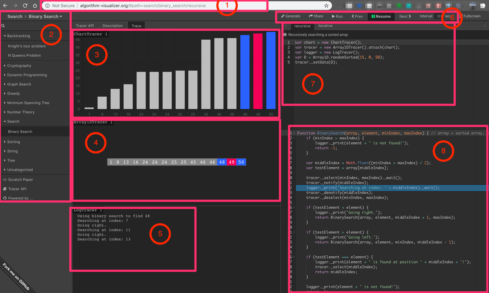

## Week 18 ARTS

### [A] - LC 819
---

```java
package leetcode;

import java.util.*;

/**
 * 819. Most Common Word
 *
 * Given a paragraph and a list of banned words, return the most frequent word that is not in the list of banned words.
 * It is guaranteed there is at least one word that isn't banned, and that the answer is unique.
 *
 * Words in the list of banned words are given in lowercase, and free of punctuation.  Words in the paragraph are not
 * case sensitive.  The answer is in lowercase.
 *
 *
 *
 * Example:
 *
 * Input:
 * paragraph = "Bob hit a ball, the hit BALL flew far after it was hit."
 * banned = ["hit"]
 * Output: "ball"
 * Explanation:
 * "hit" occurs 3 times, but it is a banned word.
 * "ball" occurs twice (and no other word does), so it is the most frequent non-banned word in the paragraph.
 * Note that words in the paragraph are not case sensitive,
 * that punctuation is ignored (even if adjacent to words, such as "ball,"),
 * and that "hit" isn't the answer even though it occurs more because it is banned.
 *
 *
 * Note:
 *
 * 1 <= paragraph.length <= 1000.
 * 1 <= banned.length <= 100.
 * 1 <= banned[i].length <= 10.
 * The answer is unique, and written in lowercase (even if its occurrences in paragraph may have uppercase symbols,
 * and even if it is a proper noun.)
 * paragraph only consists of letters, spaces, or the punctuation symbols !?',;.
 * There are no hyphens or hyphenated words.
 * Words only consist of letters, never apostrophes or other punctuation symbols.
 */
public class MostCommonWord819 {
  // solution: Map the word counts, then compare
  // 1. split paragraph into string arrays
  // 2. word count into map
  // 3. compare word not in banned,
  // 4. return the most common word
  public String mostCommonWord(String paragraph, String[] banned) {
    String[] words = paragraph.split("\\W+");
    Map<String, Integer> frequency = new HashMap<>();
    for (String word : words) {
      frequency.put(word.toLowerCase(), frequency.getOrDefault(word.toLowerCase(), 0) + 1);
    }
    Set<String> bannedSet = new HashSet<>();
    Arrays.stream(banned).forEach(bannedWord -> bannedSet.add(bannedWord));
    return frequency.entrySet().stream()
        .filter(entry -> !bannedSet.contains(entry.getKey()))
        .max(Map.Entry.comparingByValue()).get().getKey();
  }
}
```

### [R] - Vacation week, no review, but read some articles, sharing~ :p 
---
- [Scaling Machine Learning at Uber with Michelangelo](https://eng.uber.com/scaling-michelangelo/)

### [T] - [Algorithm Visualizer](http://algorithm-visualizer.org/#path=search/binary_search/recursive)
---
Today introduce a very good algorithm visualization study github project. 



1. [website url](http://algorithm-visualizer.org/#path=search/binary_search/recursive) and [Github project](https://github.com/algorithm-visualizer/algorithm-visualizer)
2.  Search, you can select many algorithms, such as binary search, tree, backtracking etc.
3.  CharTracer, histogram shows input data, as #4, blue color histograms represents current search area, red color is found value.
4.  ArrayIDTracer, using array to show how to search value
5.  LogTracer, log output tracing values
6.  Control Tool Bar, you can Run, and stop at anytime, go backward / forward, and show the executing time for each steps.
7.  Show relate information -> #3, #4, #5
8.  Algorithm, and you can debug to see which code is running.

It is very good tool / website to learn algorithm with visualization...

### [S] - [Infrastructure as code](https://blog.gruntwork.io/5-lessons-learned-from-writing-over-300-000-lines-of-infrastructure-code-36ba7fadeac1)
---
- Using Terraform, Packer, Docker build and manage infrastructure
- Using code to implement automatically server configurations
- Avoid large modules

> “Do one thing and do it well” —Unix Philosophy
> 
> “The first rule of functions is that they should be small. The second rule of functions is that they should be smaller than that.”—Clean Code
- Write test, write automated tests (inlcuding Unit tests, Integration tests, E2E tests)
- Build small, release new version, promote from environment to enviroment (dev->qa->stage->prod)

