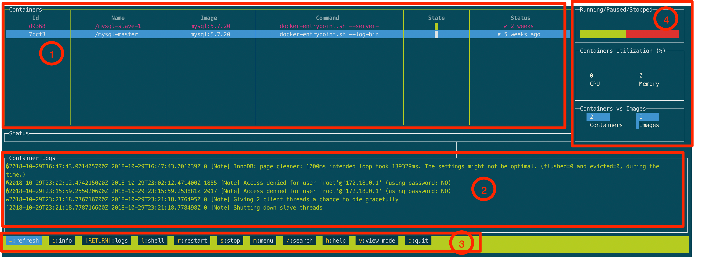

## Week 19 ARTS

### [A] - LC 721
---
```java
package leetcode;

import java.util.*;

/**
 * 721. Accounts Merge
 *
 * Given a list accounts, each element accounts[i] is a list of strings, where the first element accounts[i][0] is a name,
 * and the rest of the elements are emails representing emails of the account.
 *
 * Now, we would like to merge these accounts. Two accounts definitely belong to the same person
 * if there is some email that is common to both accounts. Note that even if two accounts have the same name,
 * they may belong to different people as people could have the same name. A person can have any number of accounts
 * initially, but all of their accounts definitely have the same name.
 *
 * After merging the accounts, return the accounts in the following format: the first element of each account is the name,
 * and the rest of the elements are emails in sorted order. The accounts themselves can be returned in any order.
 *
 * Example 1:
 * Input:
 * accounts = [["John", "johnsmith@mail.com", "john00@mail.com"], ["John", "johnnybravo@mail.com"],
 * ["John", "johnsmith@mail.com", "john_newyork@mail.com"], ["Mary", "mary@mail.com"]]
 * Output: [["John", 'john00@mail.com', 'john_newyork@mail.com', 'johnsmith@mail.com'],
 * ["John", "johnnybravo@mail.com"], ["Mary", "mary@mail.com"]]
 * Explanation:
 * The first and third John's are the same person as they have the common email "johnsmith@mail.com".
 * The second John and Mary are different people as none of their email addresses are used by other accounts.
 * We could return these lists in any order, for example the answer [['Mary', 'mary@mail.com'],
 * ['John', 'johnnybravo@mail.com'],
 * ['John', 'john00@mail.com', 'john_newyork@mail.com', 'johnsmith@mail.com']] would still be accepted.
 * Note:
 *
 * The length of accounts will be in the range [1, 1000].
 * The length of accounts[i] will be in the range [1, 10].
 * The length of accounts[i][j] will be in the range [1, 30].
 */
public class AccountsMerge721 {
  /**
   *
   * solutions: Union Find
   * this problem is to merge associate accounts together, similar to number of components
   * 1. Each email can be seen as a representative, and need to find parent.
   * 2. each account is a group of emails, and it will have the same parents
   * 3. first, each email be parent of itself
   * 4. iterator all accounts, and emails in each account, find parent of each email, union the emails together
   * if they have the same parents
   *
   * Example: accounts = [["a", "1", "2"], ["a", "3"],
   *  * ["a", "1", "4"], ["c", "5"]]
   *
   *  using a map to track account which emails belong to
   *  Map<>acount
   *  UF - Find parent -> need parent Map
   *  Union emails and need to be sorted -> need union Map and TreeSet to keep all emails
   *
   *  1. initial parent and account map
   *  account - [1, a], [2, a], [3, a], [4, a], [5, c]
   *  parent - [1, 1], [2, 2], [3, 3], [4, 4], [5, 5]
   *
   *  2. find a common parent within one group
   *  parent - [1, 1], [2, 1], [3, 3], [4, 1], [5, 5]
   *
   *  3. union emails
   *  unions - [[1, [1, 2, 4]], [3, 3], [5, 5]]
   *
   *  4. combine results
   *  result - [[a, 1, 2, 4], [a, 3], [c, 5]]
   *
   */

  public List<List<String>> accountsMerge(List<List<String>> accounts) {
    Map<String, String> account = new HashMap<>();
    Map<String, String> parents = new HashMap<>();
    Map<String, TreeSet<String>> unions = new HashMap<>();

    // initial parent and account map
    for (List<String> acct : accounts) {
      // emails start from index 1, account is in index 0,
      for (int i = 1; i < acct.size(); i++) {
        // keep track account which email belongs to
        account.put(acct.get(i), acct.get(0));
        // start with parent with itself
        parents.put(acct.get(i), acct.get(i));
      }
    }

    // find a common parent within one group
    for (List<String> acct : accounts) {
      // find first email parent
      String p = findP(acct.get(1), parents);
      // the rest of email should have the same parent
      for (int i = 2; i < acct.size(); i++) {
        parents.put(findP(acct.get(i), parents), p);
      }
    }

    // union emails from different accounts with same parent
    for (List<String> acct : accounts) {
      String p = findP(acct.get(1), parents);
      if (!unions.containsKey(p)) {
        unions.put(p, new TreeSet<>());
      }
      for (int i = 1; i < acct.size(); i++) {
        unions.get(p).add(acct.get(i));
      }
    }

    // find result
    List<List<String>> result = new ArrayList<>();
    for (String p : unions.keySet()) {
      List<String> emails = new ArrayList<>(unions.get(p));
      emails.add(0, account.get(p));
      result.add(emails);
    }

    return result;
  }

  public String findP(String s, Map<String, String> parent) {
    return parent.get(s) == s ? s : findP(parent.get(s), parent);
  }
}
```
### [R] - [Understand Java OutOfMemoryError Exception](https://docs.oracle.com/javase/8/docs/technotes/guides/troubleshoot/memleaks002.html) and [how to how to capture Heap Dumps](https://www.baeldung.com/java-heap-dump-capture)
---
Common memory leak exception: **OutOfMemoryError**

Cause types:
- **Exception in thread thread_name: java.lang.OutOfMemoryError: Java heap space** (below example)
  >**cause**: The detail message Java heap space indicates object could not be allocated in the Java heap. This error does not necessarily imply a memory leak. The problem can be as simple as a configuration issue, where the specified heap size (or the default size, if it is not specified) is insufficient for the application.
  >
  >**action**: find more information about how to monitor objects for which finalization is pending in
- **Exception in thread thread_name: java.lang.OutOfMemoryError: GC Overhead limit exceeded**
  >**Cause**: The detail message "GC overhead limit exceeded" indicates that the garbage collector is running all the time and Java program is making very slow progress.
  >
  >**action**: Increase the heap size. The java.lang.OutOfMemoryError exception for GC Overhead limit exceeded can be turned off with the command line flag -XX:-UseGCOverheadLimit.
- **Exception in thread thread_name: java.lang.OutOfMemoryError: Requested array size exceeds VM limit**
  >**cause**: the application (or APIs used by that application) attempted to allocate an array that is larger than the heap size. For example, 
  >
  >**action**: config issue (heap size it too small, allocat big heap size), or optimize algorithm when creating a big array size
- **Exception in thread thread_name: java.lang.OutOfMemoryError: Metaspace**
  >**cause**: Metaspace - the virtual machines internal presentation of Java class, 
- **Exception in thread thread_name: java.lang.OutOfMemoryError: request size bytes for reason. Out of swap space?**
- **Exception in thread thread_name: java.lang.OutOfMemoryError: Compressed class space**
- **Exception in thread thread_name: java.lang.OutOfMemoryError: reason stack_trace_with_native_method**

Failed to set up visualVM in Intellij IDEA, cannot show how to use it, continue setting it up~~

Let's do something stupid to reproduce OOM in Java.
```java
public class OOMTest {
  private static List<String> test = new ArrayList<>();

  public static void main(String[] args) {
    while (true) {
      test.add("hello");
    }
  }
}
```
and here we go, OOM exception

```java
Exception in thread "main" java.lang.OutOfMemoryError: Java heap space
	at java.base/java.util.Arrays.copyOf(Arrays.java:3719)
	at java.base/java.util.Arrays.copyOf(Arrays.java:3688)
	at java.base/java.util.ArrayList.grow(ArrayList.java:237)
	at java.base/java.util.ArrayList.grow(ArrayList.java:242)
	at java.base/java.util.ArrayList.add(ArrayList.java:467)
	at java.base/java.util.ArrayList.add(ArrayList.java:480)
	at JVM.OOMTest.main(OOMTest.java:11)

```

Analyze the problem, using [VisualVM](https://visualvm.github.io/), and there is plugin within Intellij.

#### References 

1. [How to set up visualVM with Intellij IDEA](https://medium.com/@oleg.vashenkov/profiling-java-app-or-unit-test-in-jetbrains-idea-and-visualvm-6df1653354c2)
2. [Out of Memory Exception in Java](https://medium.com/@ggajos/out-of-memory-exception-in-java-7c6c8b38f9c9)

### [T] -  [Dockly](https://github.com/lirantal/dockly)
---
> Immersive terminal interface for managing docker containers and services



1. list docker containers you run on your local
2. checking your logs for selected container
3. shortcuts to show logs/restart container/stop container etc.
4. show container status

### [S] - [GraphQA a Retrospective](http://verve.co/engineering/graphql-a-retrospective/)
---
Recently trying to write a personal blog using Gatsby.js and GraphQL (do not familiar with any of them, need more time to digest the official docs)
[GraphQL](https://graphql.org/), Facebook internally developer in 2012, 2015 publically released, 2018 moved GraphQL foundation, and hosted by non-profit Linux Foundation.
GraphQL provides efficient, powerful, flexibility for developing APIs, by design a data structure, and return exactly what they asked and nothing more, makes easier.

- Ask for what you need, get exactly that
- Get many resources in a request
- Describe what's possible with a type system