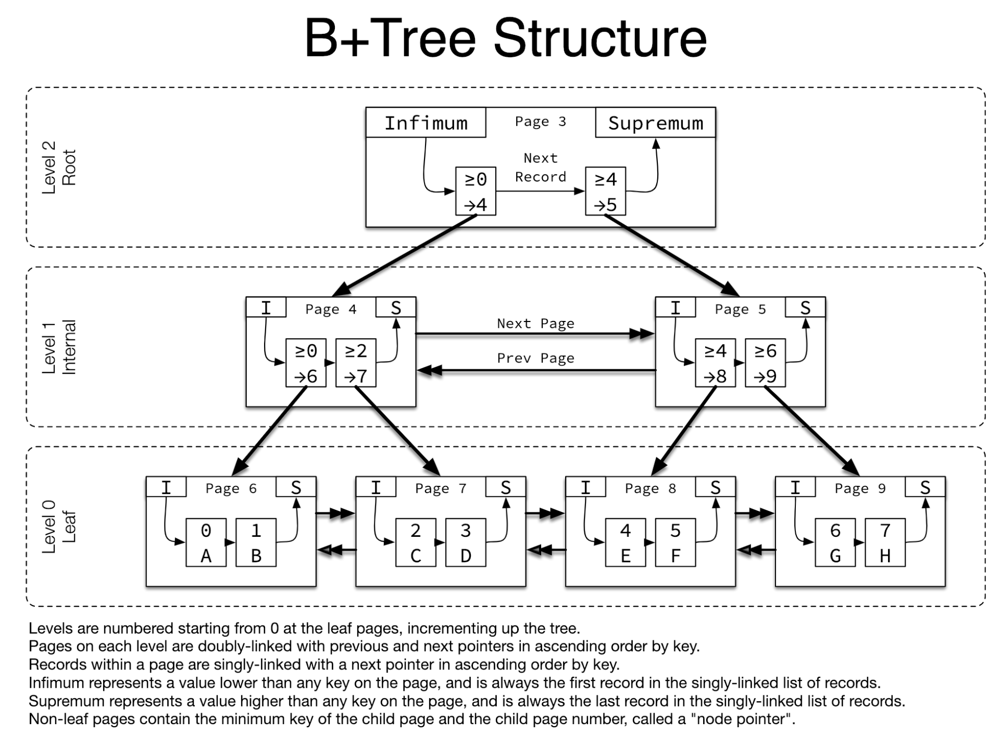

## Week 20 ARTS

### [A] - Add two binary Strings with only `0` and `1`
---
```java
package others;

/**
 * Add two binary Strings with only '0' and '1', return sum of string
 * e.g
 * 1. input: "1001', "110"
 * output: "1111"
 *
 * 2. input: "1001", "11"
 * output: "1100"
 *
 */
public class SumOfTwoBinaryStrings {
  // solution: add sum from the right most index
  // 1. make two string the equal length (with the longest string,
  // and add '0' in front of the shorter string to be equal (e.g #2, "1001", "0011"
  // 2. Using a var carry to carry the additional 1 for next index sum (can use bit operators, will be faster. - not familar with bit operators,:())
  // 3. continue 1 to index 0
  // 4. check carry is '1' or not, add to result
  // 5. add check from the beginning, when null then return "";
  public String binarySum(String a, String b) {
    String res = "";
    if ((a == null || a.length() == 0) && (b == null || b.length() == 0)) return res;
    if (a == null || a.length() == 0) return b;
    if (b == null || b.length() == 0) return a;

    int carry = 0;
    int len = a.length() > b.length() ? a.length() : b.length();
    if (a.length() > b.length()) {
      b = makeEqualStrings(b, len);
    } else {
      a = makeEqualStrings(a, len);
    }
    for (int i = len - 1; i >= 0; i--) {
     int currA = a.charAt(i) - '0';
     int currB = b.charAt(i) - '0';
     int currSum = currA + currB + carry;
     if (currSum > 1) {
       currSum %= 2;
       carry = 1;
     } else {
       carry = 0;
     }
     res = currSum + res;
    }
    if (carry > 0) {
      res = carry + res;
    }
    return res;
  }

  private String makeEqualStrings(String a,  int len) {
    for (int i = a.length(); i < len; i++) {
      a = '0' + a;
    }
    return a;
  }
}
```

### [R] - [MySQL Index]
---
(We were facing MySQL store connection issues, the issue was some slow queries took over the connection, and other queries waited long time to case connection TIME OUT, after diagonose the slow queries, we found out that that query didn't add index, after adding index to the key, query speed up.)

1. What is MYSQL Index?
  
    MYSQL index is used to improve poor performance of
  finding rows with specific column values. Without index,MySQL need to search the entire table to find rows.
  With Index, MySQL will quickly determine the position of the data file without searching for the entire table.

    MySQL index is like dictionary, sorted by letters (index), when you search for a word, if without index, you need to search for the entire dictionary, which is nightmare, luckily, you know how to use index, you search for a first letter, and quickly drump to the position, and then second letter, etc...until you find the word. (you skip most of the unnecessary searching steps to search quickly.)

2. MYSQL Index structure
  - B Tree Indexes - Balanced Tree, nodes are arranged in sorted order based on the key values.
  
    MySql Innodb Index uses [**B+ Tree**](https://www.wikiwand.com/en/B%2B_tree) for its indexs. And all the actual data stored in leaf nodes. non-leaf node store positions of other non-leaf node or leaf node. (see below screenshot from [Jeremy Cole InnoDB diagram](https://github.com/jeremycole/innodb_diagrams/blob/master/images/InnoDB_Structures.pdf))
    
     
  - Hash Indexes - resemble a hash table, based on the hash code (hash function to generate a hash code using key value).

  - R Tree Indexes - used for spatial or N-dimensional data.


### References

1. [MySQL 索引原理及慢查询优化](https://segmentfault.com/a/1190000017122459)

2. [B+ tree index structure in Innodb](https://blog.jcole.us/2013/01/10/btree-index-structures-in-innodb/)
   
3. [B+ Tree](https://www.wikiwand.com/en/B%2B_tree)

4. [Indexes - High Performance MYSQL](https://www.oreilly.com/library/view/high-performance-mysql/0596003064/ch04.html)

### [T] - [Shift + Command + 5 in MacOS Mojave] (https://support.apple.com/en-us/HT208721)
---
Use **Shift+Command+5** on MacOS Mojave for **Screenshot**, **Recording** for entire screen or part screen.


### [S] - [Envoy Proxy at Reddit](https://redditblog.com/2018/12/18/envoy-proxy-at-reddit/)
---
- Envoy as service discovery, the advantages of performing as L4/L7 Layer proxy.
- Added Envoy for L7 proxy Thrift support.
- Envoy (dynamic configuration) replace HAProxy (static configuration).
- Integrations and extensibility, 