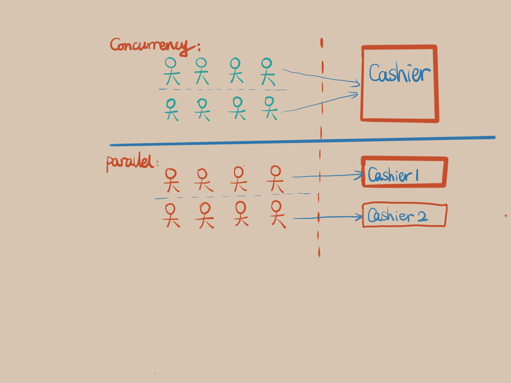

## Week 21 ARTS

### [A] - LC 692
---
```java
package leetcode;

import java.util.*;
import java.util.stream.Collectors;

/**
 * 692. Top K Frequent Words
 * <p>
 * Given a non-empty list of words, return the k most frequent elements.
 * <p>
 * <p>
 * Your answer should be sorted by frequency from highest to lowest. If two words have the same frequency, then the word with the lower alphabetical order comes first.
 * <p>
 * Example 1:
 * Input: ["i", "love", "leetcode", "i", "love", "coding"], k = 2
 * Output: ["i", "love"]
 * Explanation: "i" and "love" are the two most frequent words.
 * Note that "i" comes before "love" due to a lower alphabetical order.
 * Example 2:
 * Input: ["the", "day", "is", "sunny", "the", "the", "the", "sunny", "is", "is"], k = 4
 * Output: ["the", "is", "sunny", "day"]
 * Explanation: "the", "is", "sunny" and "day" are the four most frequent words,
 * with the number of occurrence being 4, 3, 2 and 1 respectively.
 * Note:
 * You may assume k is always valid, 1 ≤ k ≤ number of unique elements.
 * Input words contain only lowercase letters.
 * Follow up:
 * Try to solve it in O(n log k) time and O(n) extra space.
 * Can you solve it in O(n) time with only O(k) extra space?
 */
public class TopKFrequentWords692 {
  // Implementation with PriorityQueue, O(nlog(k))
  // solution: using a map to record words frequencies
  // Iterator map, PQ(small on top) to put into size k numbers based on word frequency.
  // at last, the PQ is the results of top K frequency words
  public List<String> topKFrequent(String[] words, int k) {
    List<String> res = new ArrayList<>();
    if (words == null || words.length == 0 || k <= 0) return res;
    Map<String, Integer> countMap = new HashMap<>();
    for (String word : words) {
      countMap.put(word, countMap.getOrDefault(word, 0) + 1);
    }
    if (k > countMap.size()) {
      return countMap.keySet().stream().collect(Collectors.toList());
    }
    PriorityQueue<Map.Entry<String, Integer>> pq = new PriorityQueue<>((a, b) -> (a.getValue() == b.getValue() ?
        b.getKey().compareToIgnoreCase(a.getKey()) : (a.getValue() - b.getValue())));
    for (Map.Entry<String, Integer> entry : countMap.entrySet()) {
      pq.offer(entry);
      if (pq.size() > k) {
        pq.poll();
      }
    }
    while (!pq.isEmpty()) {
      res.add(0, pq.poll().getKey());
    }
    return res;
  }
}
```

### [R] - [Concurrency vs Parallelism](http://tutorials.jenkov.com/java-concurrency/concurrency-vs-parallelism.html)
---

> - Concurrency: means that an application is making progress on more than one task at the same time (concurrently). Well, if the computer only has one CPU the application may not make progress on more than one task at exactly the same time, but more than one task is being processed at a time inside the application. It does not completely finish one task before it begins the next. 


>- Parrallelism: means that an application splits its tasks up into smaller subtasks which can be processed in parallel, for instance on multiple CPUs at the exact same time.

Example: concurrency, two queues request one cashier as service at the same time, or two tasks happen and complete in overlapping time periods.
parrale, two queues request two cashier as services, complete tasks in multicore, parallel occurs.




### [T] - Taking notes of everything 
---
It isn't really a tip, just to remind us that it is better to take notes of what you've done, what is your plan etc...

And it is better to choose a better tools to write them down, which support better search, and tags. 

Recommand two NoteTake Apps ([Evernote](https://evernote.com/), [Notion](https://www.notion.so/))

### [S] - [Container as I didn't know them](https://itnext.io/containers-as-i-didnt-know-them-67cd4eaf3739)
---
We started to try Dockerize the whole monolith env, will start with a baby step, starting from MySql DB.

I already worked with docker for a while and wrote some small projects with docker. This article shared a different angle of Docker. 

After reading this article, I'd say it is kinda brief introduction article about docker for beginers. 

The real learning and get deeper into it is to get your hands dirty on Docker, explore the features~
