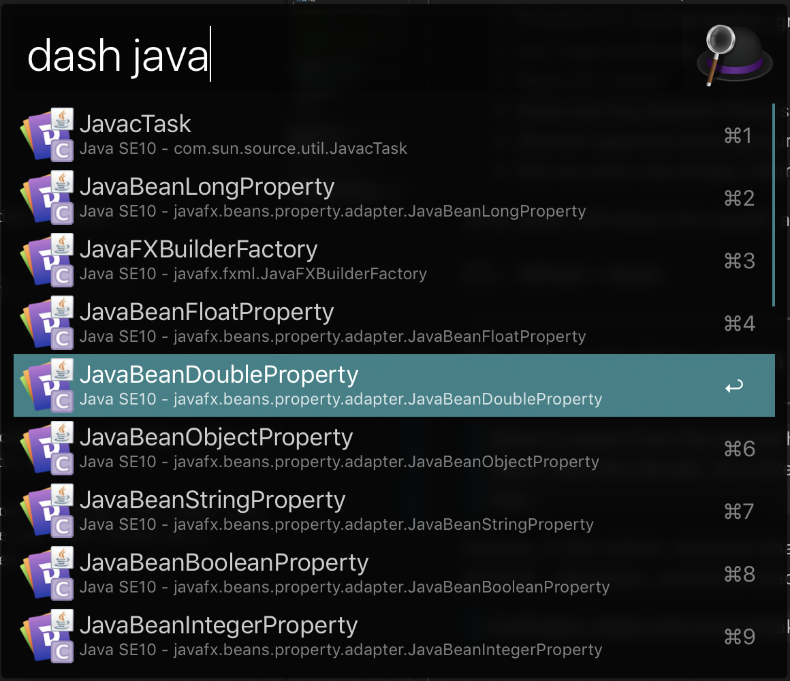

## Week 24 ARTS

### [A] - LC 253
---
```java
package leetcode;

import java.util.Arrays;
import java.util.PriorityQueue;

/**
 * 253. Meeting Rooms II
 *
 * Given an array of meeting time intervals consisting of start and end times [[s1,e1],[s2,e2],...] (si < ei),
 * find the minimum number of conference rooms required.
 *
 * Example 1:
 *
 * Input: [[0, 30],[5, 10],[15, 20]]
 * Output: 2
 * Example 2:
 *
 * Input: [[7,10],[2,4]]
 * Output: 1
 */
public class MeetingRoomII253 {
  class Interval {
    int start;
    int end;

    public Interval() {
      start = 0;
      end = 0;
    }

    public Interval(int start, int end) {
      this.start = start;
      this.end = end;
    }
  }

  // First understand the question, minimum meeting rooms required meaning that if 2 meetings are non-overlapped,
  // then 1 meeting room, if 2 meetings are overlapped, then need 2 meeting rooms.
  // solution: Will use Minimum Heap to solve this problem, keep overlapped meetings in the heap.
  // example: [[0, 30],[5, 10],[15, 20]]
  // steps:
  // 1. Sort input with start time
  // 2. Min PQ with end time, start with first element, PQ: [0, 30]
  // 3. compare next element start time(startTime) with PQ head end time(endTime),
  // if startTime >= endTime (non-overlap), update current endTime to next element end time, put back into PQ / or just put next element into PQ.
  // if startTime < endTime (overlapping), put element into PQ, PQ: ([5, 10], [0, 30])
  // curr: [5, 10], next: [15, 20], 15 > 10 -> PQ: ([5, 20], [0, 30])
  // curr: [5, 20], next: null.
  // return PQ.size()
  // 4. continue comparing, until no more elements
  // 5. return the size of PQ.
  // TC(Time complexity): O(nlogn), SC(Space complexity): O(n)
  public int minMeetingRooms(Interval[] intervals) {
    if (intervals == null) return 0;
    if (intervals.length <= 1) return intervals.length;
    Arrays.sort(intervals, (a, b) -> a.start - b.start);
    PriorityQueue<Interval> minPQ = new PriorityQueue<>((a, b) -> a.end - b.end);
    minPQ.offer(intervals[0]);

    for (int i = 1; i < intervals.length; i++) {
      Interval curr = minPQ.poll();
      if (intervals[i].start >= curr.end) { // overlap
        curr.end = intervals[i].end;
      } else {
        minPQ.offer(intervals[i]);
      }

      minPQ.offer(curr);
    }
    return minPQ.size();
  }
}
```

### [R] - Review 2018, Plan 2019
___
Overall, 2018 was a good year, achieved: 
- Working on different teams and learned different tech stack skills, overall, good practice
- Joined 左耳听风群, started and keep doing ARTS
- Finished my second master, graduated. :) 
- Got Yoga certificate. 
- Read 20+ books
- Keep learning Spanish 30mins everyday
- Started Japanese learning journey
- Got my work visa (finally, after 4 years struggling)
  

2019, plans, will keep it for myself, and stick with it, review on 2020 :)


### [T] - [Dash Alfred workflow](https://github.com/Kapeli/Dash-Alfred-Workflow)
---
Nice to have and improve your workflow with Dash, you can add multiple languages, and search for APIs definitions in Alfred, simple, fast, convinient.


[Dash: Quicker API Documentation Browsing](https://www.alfredapp.com/blog/productivity/dash-quicker-api-documentation-search/)

### [S] - The Trump Show, season Two (The Economist - 2019)
---
>What to expect from the second half of Donald Trump's term
Trump has been American president for 2 years, feels like decade. As a foreign worker in US, struggling and fighting for work visa, you won't like this man. 

Anyway, In this article, reviewed what he has achieved, (almost nothing, plus made lots of chaos and damage on all kinds - diplomacy, economic (trade war with China etc).
> Confusion, chaos and norm-breaking are how Mr Trump operates.
