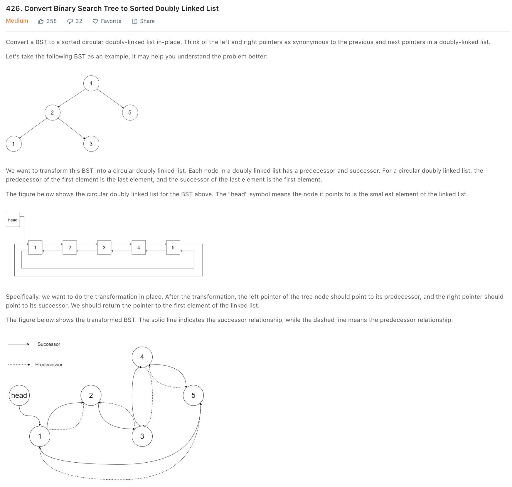
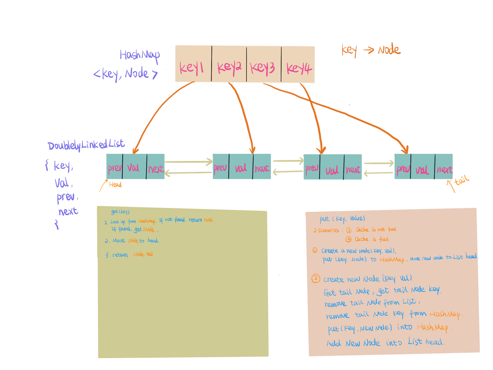

## Week 25 ARTS

### [A] - LC 273, 426, 314, 124, 146
---
```java
/**
 * 273. Integer to English Words
 *
 * Convert a non-negative integer to its english words representation. Given input is guaranteed to be less than 231 - 1.
 *
 * Example 1:
 *
 * Input: 123
 * Output: "One Hundred Twenty Three"
 * Example 2:
 *
 * Input: 12345
 * Output: "Twelve Thousand Three Hundred Forty Five"
 * Example 3:
 *
 * Input: 1234567
 * Output: "One Million Two Hundred Thirty Four Thousand Five Hundred Sixty Seven"
 * Example 4:
 *
 * Input: 1234567891
 * Output: "One Billion Two Hundred Thirty Four Million Five Hundred Sixty Seven Thousand Eight Hundred Ninety One"
 */
public class Integer2EnglishWords273 {
  // understanding the problem: english words, below 10 is different, below 20 is different, below 100,
  // thousand, million and billion. so looking at the pattern, the problem can be divided into smaller problems top-down.
  // billion -> million -> thousand -> hundred -> below 100 -> below 20 -> below 10 -> return answer.
  // this can be solved with recursive
  private final String[] belowTen = new String[]{"", "One", "Two", "Three", "Four", "Five", "Six", "Seven", "Eight", "Nine"};
  private final String[] belowTwenty = new String[]{"Ten", "Eleven", "Twelve", "Thirteen", "Fourteen", "Fifteen", "Sixteen", "Seventeen", "Eighteen", "Nineteen"};
  private final String[] belowHundred = new String[]{"", "Ten", "Twenty", "Thirty", "Forty", "Fifty", "Sixty", "Seventy", "Eighty", "Ninety"};
  public String numberToWords(int num) {
    if (num == 0) return "Zero";
    return help(num);
  }

  private String help(int num) {
    String res;
    if (num < 10) return belowTen[num];
    else if (num < 20) res = belowTwenty[num - 10];
    else if (num < 100) res = belowHundred[num / 10] + " " + help(num % 10);
    else if (num < 1000) res = help(num / 100) + " Hundred " + help(num % 100);
    else if (num < 1000000) res = help(num / 1000) + " Thousand " + help(num % 1000);
    else if (num < 1000000000) res = help(num / 1000000) + " Million " + help(num % 1000000);
    else res = help(num / 1000000000) + " Billion " + help(num % 1000000000);
    return res.trim();
  }
}
```

```java
package leetcode;
public class Tree2DoublyList426 {
  class Node {
    public int val;
    public Node left;
    public Node right;

    public Node() {}

    public Node(int val, Node left, Node right) {
      this.val = val;
      this.left = left;
      this.right = right;
    }
  }
  // solution: Binary search tree -> sorted doubly linked list
  // Inorder traverse binary search tree to convert sorted node, recursively inorder traverse root, doubly link node,
  // use a dummy node to doubly linking left and right nodes.
  // after all nodes converted into doubly linked list, we need to make it circle.
  // connect tail and first node together.
  // Example: Node root : [4, 2, 5, 1, 3]
  // Node dummy: 0
  // another node to keep traverse prev = dummy, pre: 0
  // 1. 0 -> 1, 0 <- 1, prev = 1
  // 2. 1 -> 2, 2 <- 1, prev = 2
  // 3. 2 -> 3, 2 <- 3, prev = 3
  // 4. 3 -> 4, 3 <- 4, prev = 4
  // 5. 4 -> 5, 5 <- 4, prev = 5
  // dummy 0->1->2->3->4->5, 0<-1<-2<-3<-4<-5,
  // let tail to connect first node
  // tail : prev, first node: dummy.right
  // prev.right = dummy.right;
  // dummy.right.left = prev;
  // return first node: dummy.right.
  Node pre = null;
  public Node treeToDoublyList(Node root) {
    if (root == null) return null;
    Node dummy = new Node(0, null, null);
    pre = dummy;
    inorder(root);
    pre.right = dummy.right;
    if (dummy.right != null) dummy.right.left = pre;
    return dummy.right;
  }

  private void inorder(Node node) {
    if (node == null) return;
    inorder(node.left);
    pre.right = node;
    node.left = pre;
    pre = node;
    inorder(node.right);
  }
}
```
```java
package leetcode;

import java.util.*;

/**
 * 314. Binary Tree Vertical Order Traversal
 *
 * Given a binary tree, return the vertical order traversal of its nodes' values. (ie, from top to bottom, column by column).
 *
 * If two nodes are in the same row and column, the order should be from left to right.
 *
 * Examples 1:
 *
 * Input: [3,9,20,null,null,15,7]
 *
 *    3
 *   /\
 *  /  \
 *  9  20
 *     /\
 *    /  \
 *   15   7
 *
 * Output:
 *
 * [
 *   [9],
 *   [3,15],
 *   [20],
 *   [7]
 * ]
 * Examples 2:
 *
 * Input: [3,9,8,4,0,1,7]
 *
 *      3
 *     /\
 *    /  \
 *    9   8
 *   /\  /\
 *  /  \/  \
 *  4  01   7
 *
 * Output:
 *
 * [
 *   [4],
 *   [9],
 *   [3,0,1],
 *   [8],
 *   [7]
 * ]
 * Examples 3:
 *
 * Input: [3,9,8,4,0,1,7,null,null,null,2,5] (0's right child is 2 and 1's left child is 5)
 *
 *      3
 *     /\
 *    /  \
 *    9   8
 *   /\  /\
 *  /  \/  \
 *  4  01   7
 *     /\
 *    /  \
 *    5   2
 *
 * Output:
 *
 * [
 *   [4],
 *   [9,5],
 *   [3,0,1],
 *   [8,2],
 *   [7]
 * ]
 *
 */
public class BTVerticleOrder314 {
  class TreeNode {
    int val;
    TreeNode left;
    TreeNode right;

    public TreeNode(int val) {
      this.val = val;
    }
  }
  class Node {
    TreeNode node;
    int weight;

    public Node(TreeNode node, int weight) {
      this.node = node;
      this.weight = weight;
    }
  }

  // solution:
  // use a helper class with weight and TreeNode, BFS to traverse root, put helper class Node into queue.
  // every left child, weight - 1, for every right child, weight + 1, put into queue
  // Using TreeMap (sorted), weight as key, value is a list of node value with same weight
  // return list of treemap value.
  // Example:
  // Input: [3,9,20,null,null,15,7]
  // *
  // *    3
  // *   /\
  // *  /  \
  // *  9  20
  // *     /\
  // *    /  \
  // *   15   7
  // Queue: ([3, 0]), TreeMap: ()
  // TreeMap: ((0, [3])), Queue: ([9, -1], [20, 1])
  // TreeMap: ((-1, 9), (0, [3])), Queue: ([20, 1])
  // TreeMap: ((-1, [9]), (0, [3]), (1, [20])), Queue: ([15, 0], [7, 2])
  // TreeMap: ((-1, [9]), (0, [3, 15]), (1, [20])), Queue: ([7, 2])
  // TreeMap: ((-1, [9]), (0, [3, 15]), (1, [20]), (2, [7])), Queue: ()
  //
  // Output:
  // [
  //    [9],
  //    [3,15],
  //    [20],
  //    [7]
  // ]
  public List<List<Integer>> verticalOrder(TreeNode root) {
    List<List<Integer>> res = new ArrayList<>();
    if (root == null) return res;
    Map<Integer, List<Integer>> weightMap = new TreeMap<>((a, b) -> a - b);
    Queue<Node> queue = new LinkedList<>();
    queue.offer(new Node(root, 0));
    while (!queue.isEmpty()) {
      Node curr = queue.poll();
      putIntoMap(curr, weightMap);
      if (curr.node.left != null) {
        queue.offer(new Node(curr.node.left, curr.weight - 1));
      }
      if (curr.node.right != null) {
        queue.offer(new Node(curr.node.right, curr.weight + 1));
      }
    }
    weightMap.forEach((key, value) -> res.add(value));
    return res;
  }

  private void putIntoMap(Node node, Map<Integer, List<Integer>> treeMap) {
    List<Integer> list = treeMap.get(node.weight) == null ? new ArrayList<>() : treeMap.get(node.weight);
    list.add(node.node.val);
    treeMap.put(node.weight, list);
  }
}
```
```java
package leetcode;

import utils.TreeNode;
/**
 * 124. Binary Tree Maximum Path Sum
 *
 * Given a non-empty binary tree, find the maximum path sum.
 *
 * For this problem, a path is defined as any sequence of nodes from some starting node to any node in the tree along
 * the parent-child connections. The path must contain at least one node and does not need to go through the root.
 *
 * Example 1:
 *
 * Input: [1,2,3]
 *
 *        1
 *       / \
 *      2   3
 *
 * Output: 6
 * Example 2:
 *
 * Input: [-10,9,20,null,null,15,7]
 *
 *    -10
 *    / \
 *   9  20
 *     /  \
 *    15   7
 *
 * Output: 42
 */
public class BTMaximumPathSum124 {
  // solution: keep tracking a path bottom up, keep global maxSum to record max value.
  // recursively bottom up, return positive data, otherwise return 0 if negative. return maxValue including current node value.
  // each time keep one current max sum path extend to parent node.
  //
  // Example: [-10,9,20,null,null,15,7]
  // left, right -> bottom up
  // left: 0, right: 0, node.val: 9, maxSum: 9, currentSum = 9(return Math.max(left, right) + node.val)
  // left: 0, right: 0, node.val: 15, maxSum: 15, currentSum = 15
  // left: 0, right: 0, node.val: 7, maxSum 7, currentSum = 7
  // left: 15, right: 7, node.val: 20, maxSum: 42, currentSum = 35
  // left: 9, right: 35, node.val: -10, maxSum: 42, currenSum = 25
  // return maxSum: 42
  int maxSum = Integer.MIN_VALUE;
  public int maxPathSum(TreeNode root) {
    maxPathSumHelper(root);
    return maxSum;
  }

  private int maxPathSumHelper(TreeNode node) {
    if (node == null) return 0;
    int left = Math.max(0, maxPathSumHelper(node.left));
    int right = Math.max(0, maxPathSumHelper(node.right));
    maxSum = Math.max(maxSum, left + right + node.val);
    // System.out.println("left value: " + left);
    // System.out.println("right value: " + right);

    // System.out.println("current max sum: " + maxSum);
    // System.out.println("current return value: " + (Math.max(left, right) + node.val));
    return Math.max(left, right) + node.val;
  }
}
```

### [R] - [Cache Algorithms](https://www.wikiwand.com/en/Cache_replacement_policies) 
---
Cache is must have for software/hardware, Caching usually keeps recent or often-used data in a memory locations to improve applications' performance. and Cache will have capacities, when cache is full, cache algorithms need to choose what items to be evicted and put the new items.

Now, we have all kinds of cache to accelarate our systems/applications. 
e.g. DNS Cache, web browser cache...

by improving performance, we increase cache hit ratio and reduce latency.
>The most efficient caching algorithm would be to always discard the information that will not be needed for the longest time in the future. 

Cache algorithms:
1. First in first out (FIFO) - easy to implement, keep maintaining Queue, cache evict the first item to the Queue
2. Last in first out (LIFO) - easy to implement, LIFO Queue, cache evict last item to Queue
3. Least recently used (LRU) - Cache discard the least used item in cache. 
 
   Cache requires:
      - Fixed Size - Based on the memory of your systems/applications
      - Fast Access - look up and insert into cache should be fast, TC should be O(1)
      - Cache should evict the least recently used item, and replace with new item when memmory is full.

    [HashMap](https://www.wikiwand.com/en/Hash_table) - fast look up and insert, O(1), HashMap cannot track which item been queried.
  
    Need fast tracking, meaning, delete, insert, update should be fast, then **Doublely Linked List** O(1)

    HashMap will store key, to look up, and value as a DoublelyLinkedList node, DoublelyLinkedList will hold value. 

    so, the overall structure and steps will be:
    
    
    Code refer:
```java
package leetcode;

import java.util.HashMap;
import java.util.Map;
import java.util.Objects;
import java.util.concurrent.locks.Lock;
import java.util.concurrent.locks.ReadWriteLock;
import java.util.concurrent.locks.ReentrantReadWriteLock;

/**
 * 146. LRU Cache
 *
 * Design and implement a data structure for Least Recently Used (LRU) cache.
 * It should support the following operations: get and put.
 *
 * get(key) - Get the value (will always be positive) of the key if the key exists in the cache,
 * otherwise return -1.
 * put(key, value) - Set or insert the value if the key is not already present.
 * When the cache reached its capacity, it should invalidate the least recently used item before inserting a new item.
 *
 * Follow up:
 * 1. Could you do both operations in O(1) time complexity?
 * 2. How to make concurrent LRU cache? (using concurrentMap and ReentrantReadWriteLock)
 * get(int key) - will use readlock to lock concurrent threads
 * put(int key, int value) - use write lock to lock concurrent reads/writes
 *
 * Example:
 *
 *  LRUCache cache = new LRUCache(2); // capacity
    
    cache.put(1,1);
    cache.put(2,2);
    cache.get(1);       // returns 1
    cache.put(3,3);    // evicts key 2
    cache.get(2);       // returns -1 (not found)
    cache.put(4,4);    // evicts key 1
    cache.get(1);       // returns -1 (not found)
    cache.get(3);       // returns 3
    cache.get(4);       // returns 4
 */
public class LRUCache146 {
  class LRUCacheItem {
    int key;
    int val;
    LRUCacheItem prev;
    LRUCacheItem next;
  
    public LRUCacheItem(int key, int val) {
      this.key = key;
      this.val = val;
      this.prev = this.next = null;
    }
  
    @Override
    public int hashCode() {
      return Objects.hash(this.key);
    }
  
    @Override
    public boolean equals(Object obj) {
      if (this == obj) {
        return true;
      }
      if (obj == null || this.getClass() != obj.getClass()) {
        return false;
      }
      LRUCacheItem other = (LRUCacheItem) obj;
      return Objects.equals(this.key, other.key);
    }
  }
  
  private final int capacity;
  // to make concurrent LRU cache, we can use ConcurrentHashMap(thread safe)
  private Map<Integer, LRUCacheItem> cacheMap;
  private LRUCacheItem head;
  private LRUCacheItem tail;
  
  private ReadWriteLock rwLock = new ReentrantReadWriteLock();
  private Lock writeLock = rwLock.writeLock();
  private Lock readLock = rwLock.readLock();
  
  public LRUCache146(int capacity) {
    if (capacity == 0) {
      throw new IllegalArgumentException();
    }
    this.capacity = capacity;
    this.cacheMap = new HashMap<>(capacity);
//    this.cacheMap = new ConcurrentHashMap<>(capacity);
    this.head = new LRUCacheItem(0, 0);
    this.tail = new LRUCacheItem(0, 0);
    this.head.next = this.tail;
    this.tail.prev = this.head;
  }
  
  public int get(int key) {
    readLock.lock();
    try {
      if (!this.cacheMap.containsKey(key)) {
        return -1;
      }
      LRUCacheItem currCache = this.cacheMap.get(key);
      moveToHead(currCache);
      return currCache.val;
    } finally {
      readLock.unlock();
    }
  }
  
  private void moveToHead(LRUCacheItem currCache) {
    // already on head, no need to move
    LRUCacheItem start = this.head.next;
    if (currCache == null || currCache == start) {
      return;
    }
    LRUCacheItem next = currCache.next;
    LRUCacheItem prev = currCache.prev;
    // remove current cache
    if (next != null) {
      prev.next = next;
    }
    if (prev != null)  {
      next.prev = prev;
    }
    // move current cache to head
    start.prev = currCache;
    this.head.next = currCache;
    
    currCache.prev = this.head;
    currCache.next = start;
  }
  
  public final synchronized void put(int key, int value) {
    // jdk 1.9 or newer version,will throw java.util.ConcurrentModificationException
    // at java.base/java.util.HashMap.computeIfAbsent
    writeLock.lock();
    try {
      LRUCacheItem cacheItem = this.cacheMap.computeIfAbsent(key, k -> {
        LRUCacheItem currCache = new LRUCacheItem(key, value);
        if (this.cacheMap.size() == this.capacity) {
          LRUCacheItem end = this.tail.prev;
          this.tail.prev = end.prev;
          end.prev.next = this.tail;
          this.cacheMap.remove(end.key);
        
          // release object for GC
          end.prev = end.next = null;
        }
        return currCache;
      });
  
      cacheItem.val = value;
      moveToHead(cacheItem);
      this.cacheMap.put(key, cacheItem);
    } finally {
      writeLock.unlock();
    }
  }
}
```
4. Time aware least recently used (TLRU)
    >The Time aware Least Recently Used (TLRU)[5] is a variant of LRU designed for the situation where the stored contents in cache have a valid life time. The algorithm is suitable in network cache applications, such as Information-centric networking (ICN), Content Delivery Networks (CDNs) and distributed networks in general. TLRU introduces a new term: TTU (Time to Use
5. Most recently used (MRU) - Discard the most recent used item from Cache. MRU algorithms are most useful in situations where the older an item is, the more likely it is to be accessed.
6. Random replacement (RR) - Randomly selects a candidate item and discards it to make space when necessary.
7. [Least-frequently used (LFU)](https://www.wikiwand.com/en/Least_frequently_used) - Counts how often an item is needed. Those that are used least often are discarded first
8. Least frequent recently used (LFRU) - The Least Frequent Recently Used (LFRU)[11] cache replacement scheme combines the benefits of LFU and LRU schemes.

### [T] - [Latency Charts](https://gist.github.com/jboner/2841832)
---
Latency Numbers...

### [S] -  [MyRocks: A space- and write-optimized MySQL database](https://code.fb.com/core-data/myrocks-a-space-and-write-optimized-mysql-database/)
---
MySql is widely used inside FB with InnoDB engine, with great performance and reliability for many workloads, but the inefficiencies on space and write amplification when for flashed storage usage.

That leads FB to rebuild MySql combine with [RocksDB](https://github.com/facebook/rocksdb) to [MyRocks](https://github.com/facebook/mysql-5.6).
- **RocksDB** - FB opensourced an embeddable, persistent key-value store for fast storage that has several advantages compared with InnoDB for space efficiency.
- **MyRocks** - FB open source project that integrated with RocksDB as MySQL storage engine. 

