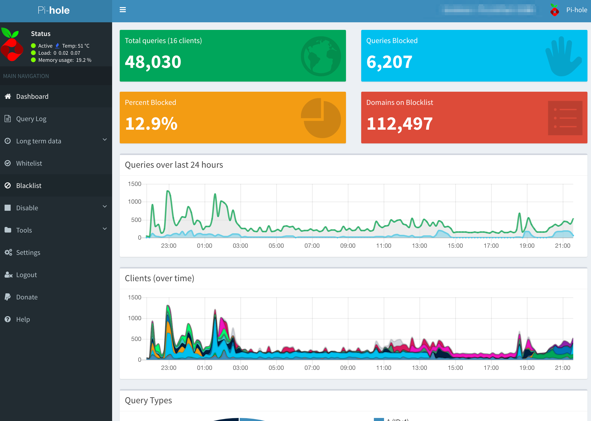
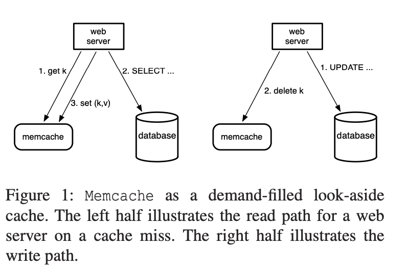
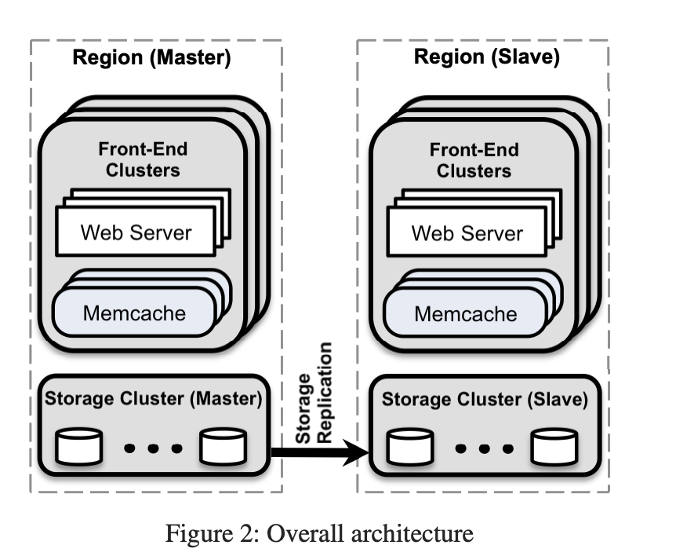
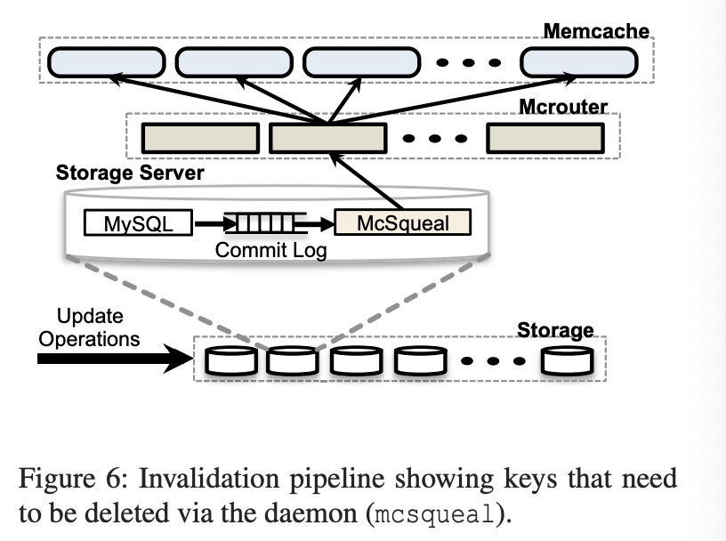

## Week 26 ARTS

### [A] - LC 785
---
```java
package leetcode;

import java.util.HashMap;
import java.util.Map;
import java.util.Stack;

/**
 * 785. Is Graph Bipartite?
 *
 * Given an undirected graph, return true if and only if it is bipartite.
 *
 * Recall that a graph is bipartite if we can split it's set of nodes into two independent subsets A and B such that
 * every edge in the graph has one node in A and another node in B.
 *
 * The graph is given in the following form: graph[i] is a list of indexes j for which the edge between nodes i and j exists.
 * Each node is an integer between 0 and graph.length - 1.  There are no self edges or parallel edges: graph[i] does not contain i, and it doesn't contain any element twice.
 *
 * Example 1:
 * Input: [[1,3], [0,2], [1,3], [0,2]]
 * Output: true
 * Explanation:
 * The graph looks like this:
 * 0----1
 * |    |
 * |    |
 * 3----2
 * We can divide the vertices into two groups: {0, 2} and {1, 3}.
 * Example 2:
 * Input: [[1,2,3], [0,2], [0,1,3], [0,2]]
 * Output: false
 * Explanation:
 * The graph looks like this:
 * 0----1
 * | \  |
 * |  \ |
 * 3----2
 * We cannot find a way to divide the set of nodes into two independent subsets.
 *
 *
 * Note:
 *
 * graph will have length in range [1, 100].
 * graph[i] will contain integers in range [0, graph.length - 1].
 * graph[i] will not contain i or duplicate values.
 * The graph is undirected: if any element j is in graph[i], then i will be in graph[j].
 */
public class IsGraphBipartite785 {
  // solution: BFS,
  // asking graph to cut into two sets, we can think of using 0 and 1 to represent different nodes. 
  // if node is 0, then all its neighbors need to be 1, otherwise, it cannot be bipartite.
  // so we can use BFS to layer by layer scan all nodes, treat all its neighbors as different layer
  // Need to be aware of independent nodes.
  // for example: [[1,3], [0,2], [1,3], [0,2]]
  // 0, not in stack, stack: [0], not in hashmap, hashmap: [0, 0]
  // scan all stack, and its neighbors, 
  // 0 -> [1, 3], check if neighbors are in hashmap, not put int stack, and hashmap (value in hashmap should be 
  // hashmap.get(currNode) ^ 1. stack, [1, 3], hashmap: [0, 0],[1, 1],[3,1]
  // 3 -> [0, 2]. stack, [1, 2], hashmap: [0, 0],[1, 1],[3,1], [2,0]
  // 1 -> [0,2], stack, [2], hashmap: [0, 0],[1, 1],[3,1]
  // 2 -> [1,3, stack: null, hashmap: [0, 0],[1, 1],[3,1]
  // so can separate into two groups: {0, 2}, {1, 3}. 
  public boolean isBipartite(int[][] graph) {
    Map<Integer, Integer> nodeMap = new HashMap<>();
    Stack<Integer> stack = new Stack<>();
    for (int i = 0; i < graph.length; i++) {
      if (!nodeMap.containsKey(i)) {
        stack.push(i);
        nodeMap.put(i, 0);

        while(!stack.isEmpty()) {
          int curr = stack.pop();
          for (int neighbor : graph[curr]) {
            if (!nodeMap.containsKey(neighbor)) {
              stack.push(neighbor);
              nodeMap.put(neighbor, nodeMap.get(curr) ^ 1);
            } else if (nodeMap.get(curr) == nodeMap.get(neighbor)) {
              return false;
            }
          }
        }
      }
    }
    return true;
  }
}
```
```java
package leetcode;

import java.util.ArrayList;
import java.util.Arrays;
import java.util.List;

/**
 * 15. 3Sum
 *
 * Given an array nums of n integers, are there elements a, b, c in nums such that a +
 * b + c = 0? Find all unique triplets in the array which gives the sum of zero.
 *
 * Note:
 *
 * The solution set must not contain duplicate triplets.
 *
 * Example:
 *
 * Given array nums = [-1, 0, 1, 2, -1, -4],
 *
 * A solution set is:
 * [
 *   [-1, 0, 1],
 *   [-1, -1, 2]
 * ]
 */
public class ThreeSum15 {
  // solution: sort original input array, take the first element, then do 2sum (add left most and right most, keep moving..)
  // also remember to remove duplicates.
  // for example: [-1, 0, 1, 2, -1, -4]
  // Sort input: [-4, -1, -1, 0, 1, 2]
  // first: -4, left = -1, right = 2, sum = first + left + right, sum < 0, left moving to right(left++) (skip duplicates)
  // until left == right, no found
  // firts: -1, left = -1, right = 2, sum = 0, add (first, left, right) into result, keep moving, left -> right, right -> left
  // first: -1 (skip, duplicate with previous first element)
  // first: 0, left = 1, right = 2, sum > 0, move right -> left (right--)
  // end, return result.
  // TC: O(n^2)
  public List<List<Integer>> threeSum(int[] nums) {
    List<List<Integer>> res = new ArrayList<>();
    if (nums == null || nums.length < 3) {
      return res;
    }
    // sort array
    Arrays.sort(nums);
    for (int i = 0; i < nums.length - 2; i++) {
      // skip the duplicates
      if (i > 0 && nums[i] == nums[i - 1]) {
        continue;
      }
      int left = i + 1;
      int right = nums.length - 1;
      while (left < right)  {
        int currSum = nums[i] + nums[left] + nums[right];
        if (currSum == 0) {
          res.add(Arrays.asList(nums[i], nums[left], nums[right]));
          // from left to right, skip the duplicate number
          while (left < right && nums[left] == nums[left + 1]) {
            left++;
          }
          // from right to left, skip the duplicate number
          while (left < right && nums[right] == nums[right - 1]) {
            right--;
          }
          left++;
          right--;
        } else if (currSum < 0){ // move right when currSum < 0
          left++;
        } else {
          right--; // move to left when currSum > 0
        }
      }
    }
    return res;
  }
}
```
```java
package leetcode;

import java.util.Arrays;

/**
 * 259. 3Sum Smaller
 *
 * Given an array of n integers nums and a target, find the number of index triplets i, j, k with 0 <= i < j < k < n
 * that satisfy the condition nums[i] + nums[j] + nums[k] < target.
 *
 * Example:
 *
 * Input: nums = [-2,0,1,3], and target = 2
 * Output: 2
 * Explanation: Because there are two triplets which sums are less than 2:
 *              [-2,0,1]
 *              [-2,0,3]
 * Follow up: Could you solve it in O(n2) runtime?
 *
 */
public class ThreeSumSmaller259 {
  // solution: Sort original input array, then using two pointers (left, right), and add all satisfied answers to result
  // for example: [-2,0,1,3], target = 2
  // sort input: [-2,0,1,3]
  // first: -2, left = 0, right = 3, sum = first + left + right = 1 < target, then between left and right all satisfy with the condition,
  // res += rightIdx - leftIdx;
  // first: 0, left = 1, right = 3, sum > target. move right -> left (right--),
  // no more elements, end traverse, return result.
  public int threeSumSmaller(int[] nums, int target) {
    int count = 0;
    // sort input array
    Arrays.sort(nums);
    for (int i = 0; i < nums.length - 2; i++) {
      int left = i + 1;
      int right = nums.length - 1;
      while (left < right) {
        int sum = nums[i] + nums[left] + nums[right];
        if (sum < target) {
          count += right - left;
          left++;
        } else {
          right--;
        }
      }
    }
    return count;
  }
}
```

[R] - Review how to Design Distributed Cache (Memcached)
---
Design a Cache system, need to consider below perpectives:
Why Cache? - 
- Reduce latency, reduce Persistent DB burden, reducing load (how to deal with stale date and thundering herds)
- reduce network round trip (parallel requests and batching)

Break down the problem:
1. Cache Problem (why need cache?)
2. Eviction policy (LRU Cache, LFU Cache), and describe algorithm you choose to apply. 
3. Cache concurrency (why there is concurrency and how to solve it?)
4. Distributed Cache system (how to scale, how to distribute cache into multiple servers, and maintain it, consistent hashing)

**Design Goals**

- **Latency** - Is this problem very latency sensitive (Or in other words, Are requests with high latency and a failing request, equally bad?). For example, search typeahead suggestions are useless if they take more than a second.
- **Consistency** - Does this problem require tight consistency? Or is it okay if things are eventually consistent?
- **Availability** - Does this problem require 100% availability?

**Eviction policy**
- LRU Cache - least recent used cache, when cache capacity is reached, we will remove least recent used items from cache, and add the new items into cache.
  
**Access pattern for given cache**

There are 3 kinds of cache systems:
1. **Write Through Cache**: When update data to cache, and this will make sure writing to Cache and Persisten DB both at once successfully. Then return the response back to requester. 
   - this will maintain the consistency with DB and Cache
   - this will also increasing latency (since this requires waiting to write to DB)
2. **Write Around Cache**: This is a caching system where write directly goes to the DB. The cache system reads the information from DB incase of a miss. While this ensures lower write load to the cache and faster writes, this can lead to higher read latency incase of applications which write and re-read the information quickly
3. **Write Back Cache**: the write is directly done to the caching layer and the write is confirmed as soon as the write to the cache completes. The cache then asynchronously syncs this write to the DB.
    - read quickly, high write throughput
    - loosing data when cache dies (add replicas to make sure not single point of failure)

**Estimation (calculate some data)**

For example: for this cache system, total cache size: **70TB**

**QPS (query per second)** for this cache system: 

Let's assume that one production machine have 72GB RAM, in order to handle 70TB data, we will need 

**70TB/72GB = 1000 machines**

If we are about to handle load like Google/Twitter, assume that we can handle **10M QPS** total.

Then For each machine, one machine should be handle **10M / 1000 = 10000** QPS.

With **1000 QPS** maybe not easily doing, so we can incease machines(shards) to reduce each machine QPS, let's say we double machine number to **2000**, then for each machine **QPS** will be **500 QPS**, which is reasonable.

Now that we have **2000** machines for cache with each machine **500 QPS**, now how will we decide shard number for each key?
  
  we can simply shard based on **hash(key)%TOTAL_MACHINES**, our case, would be **hash%2000**. 
  
  With this, the implementation is easy, but the downside would be when we need scale more data, and add more machines, current cached data would be invalid, and would request data from DB to warm up Cache. (We can reference how FB scale Memcache - implement a cold cluster warmup mechanism), but this would make more complex. Thus we can use [**Consistent Hashing**](https://www.wikiwand.com/en/Consistent_hashing), cached data will be available when scale more machines.

**Handle failure**

What if one machine goes down? (one machine per shard)
    
  All requests to that machine(shard) will hit Persistent DB and increase latency. As a cache system, our primary goal is to reduce latency as much as possible.
  
  One way to handle failure, we can add more machines to do **replicas**, `Master-Follower` model, `replica` machine will have the same amount of data as `master` machine, when `master` goes down, we can switch `replica` to master immediately without downtime(a small delay time will be acceptable). The hard part would be how tomaintain data synchronized, just as **MYSQL** `master-slave` mechanism, which maintain a change log with version numbers to keep data sync.

  we can also divide our system as **one master and multiple replicas**, which one master takes all writes, and all reads from replicas. (this may require we are ok with enventual consistency.)

  since system like Google/Twitter, some stale data can be tolerable, as long as we can keep data updated in a small amount of time.
    

### References:
[1]: [Design Cache](https://www.interviewbit.com/problems/design-cache/#_=_)

[2]: [Consistent Hashing](https://www.wikiwand.com/en/Consistent_hashing)

[3]: [Latency comparision](https://gist.github.com/jboner/2841832)

[4]: [Scaling Memcache at Facebook](https://www.usenix.org/system/files/conference/nsdi13/nsdi13-final170_update.pdf)

[5]: [Cache replacemente policies](https://www.wikiwand.com/en/Cache_replacement_policies)

[6]: [Distributed Cache](https://www.wikiwand.com/en/Distributed_cache)

[7]: [System Design - Cache](https://medium.com/system-designing-interviews/system-design-chapter-4-caching-b59a4cf83f10)

[8]: Memcached - https://github.com/memcached/memcached

[9]: Cache - https://www.wikiwand.com/en/Cache_(computing)


[T] - [Pi-Hole](https://github.com/pi-hole/pi-hole) - [DNS sinkhole](https://www.wikiwand.com/en/DNS_sinkhole) that protects your devices from unwanted content
---
1. Easy to set up, and a fancy dashboard to mornitor all the queries. 
2. Easy to add blacklists(e.g. some ads to block) and whitelists 
3. Access query logs



[S] - [Scaling Memcached at Facebook](https://www.usenix.org/system/files/conference/nsdi13/nsdi13-final170_update.pdf) 
---
Facebook is a largest social network, handles billions requests per second and holds trillions of items for billions users. 

How Facebook can handle that large scale QPS without downtime?
This paper describes how Facebook scale Memcached (distributed key value store).

Goals (social network): 
- Allow near real-time communucations
- Aggregate content on-the-fly from multiple sources.
- Be able to access and update popular shared content
- scale to process millions of user requests per second

This paper focus on: (performance, efficiency, fault-tolerance, consistency)
1. describe the evolution of Facebook's [Memcached](https://github.com/memcached/memcached)-based architecture
2. Enhance Memcached, improve performance and memory efficiency
3. Highlight mechanism that improve ability to operate system at scale
4. characterize production workloads imposed on system.

Memcache get/delete(evict item) from cache


Overall architecture


Scaled Memcache at Facebook includes Pools:
1. Wildcard : default pool
2. App : a pool devoted for a specific application
3. Replicated pool: for frequently accessed data
4. A regional pool: for rarely accessed information

Benefits of introducting Cache into System:
- Reducing Latency
- Reducing load to persistent storage
- Easier to scale system.

How to reduce latency:
1. parallel requests and batching (DAG)
2. Client server communication rather than memcache server communication
   - simplify memcache, easy for scale.
   - make client server stateless, easy to scale
   - clients server communication using UDP / TCP based on different requests, UDP is connectless, less latency, more reliable data or use cases use TCP connection
   - using sliding window mechanism to reduce incast congestion
3. Multi regions (geographic placement of data center)
  - web server close to end user, reduce latency
  - mitigate disater (natural, power failure, etc)
  - new location provide cheaper power and other economic options  
4. Cold Cluster Warmup : new cluster to retrieve data from warm cluster rather than from persistent storage.
  Note: may introduce inconsistency.
  - cold cluster - a frontend cluster with an empty cache
  - warm cluster - a frontend cluster with normal hit rates 

Reduce loads, introduce lease, pools, and region replication to handle 

Here McSqueal (Daemons), inspects the SQL Statements (DB commits, deletes), broadcasts these deletes to Memcache deployment in every frontend cluster in that region.
  1. Reducing packet rates: (high rate of packets sent from backend cluster to frontend cluster) -> many DBs and many memcached servers communicating across a cluster boundary. 
  2. Invalidation Daemons batch deletes into fewer packets and sent to a set of dedicated servers running mcrouter instances in each frontend cluster. 
  3. Mcrouter unpack individual deletes from each batch and route those invalidations to the right memcached server co-located within the frontend cluster.

The problem with distributed system is how to keep data consistency.
- using MYSQL replication mechanism to keep **master-slave** data sync. 
  - One region as Master
  - Other regions as Slaves
- To keep performance and availability, keep data **Eventual Consistency**
   Strategy:
   1. Writes from a master region: race condition, write a stale data into memache, (mcsqueal to minimize stale data)
   2. Write from a non-master region: implement remote marker to detect whether it is stale data on non-master DB. 
  
  ``` Note: it may still have stale data during concurrent modifications to the same key as one operation may delete a remote marker that should remain present for another in-flight operation.```

In this paper, also introduced: 

Single Server Improvements
* Performance Optimizations
  1. Allow automatic expansion of the hash table, avoid look up time to O(n).
  2. Make server multi-threaded using a global lock to protect multiple data structures
  3. Giving each thread its own UDP port to reduce connection during process data requests and responses
* Adaptive Slab Allocator
Use slab allocator to manage memory, use LRU to allocate new item when cache is full. 
* The Transient Item Cache
TTL (Time To Live), lazily evict items when expires or when they reach the end of the LRU.
(This is useful for different use cases, for some data, can live longer (read frequent, update less frequent), and others update frequent data can set longer TTL)
Replace short lived items into a circulate buffer of linked lists (index by second), evicts the head of list every second.
* Software Upgrades

Conclusion:
1. Separate cache and persisted storage systems allows to independently scale each component
2. Features that improve monitoring, debugging and operational efficiency are as important as performance
3. Managing stateful components is operationally more complex than stateless ones
4. System must support gradual rollout and rollback of new features 
5. Simplicity is vital 