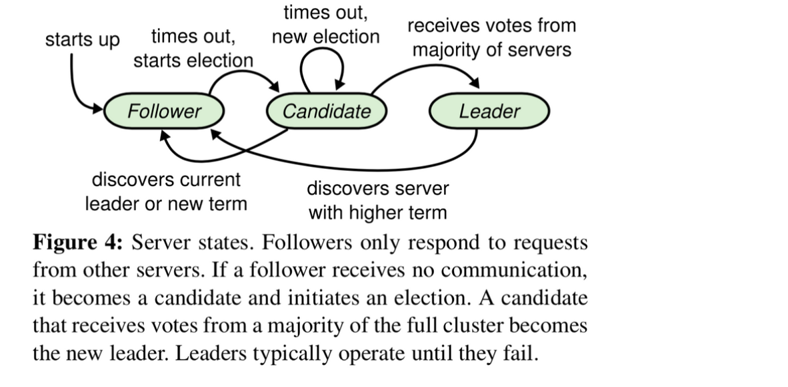
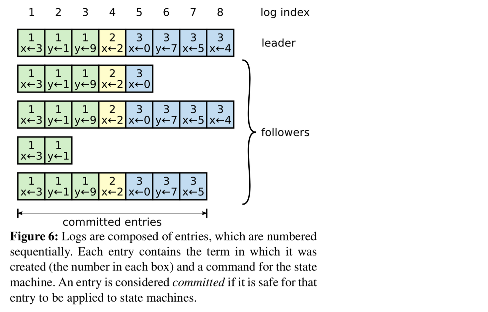
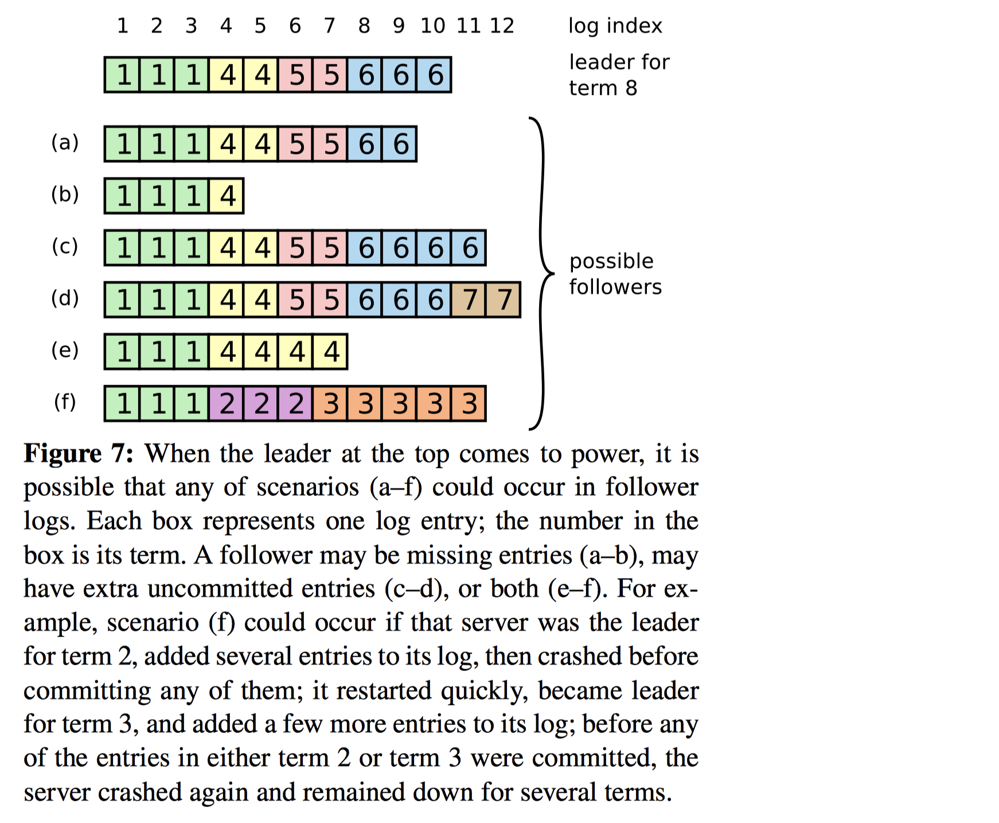
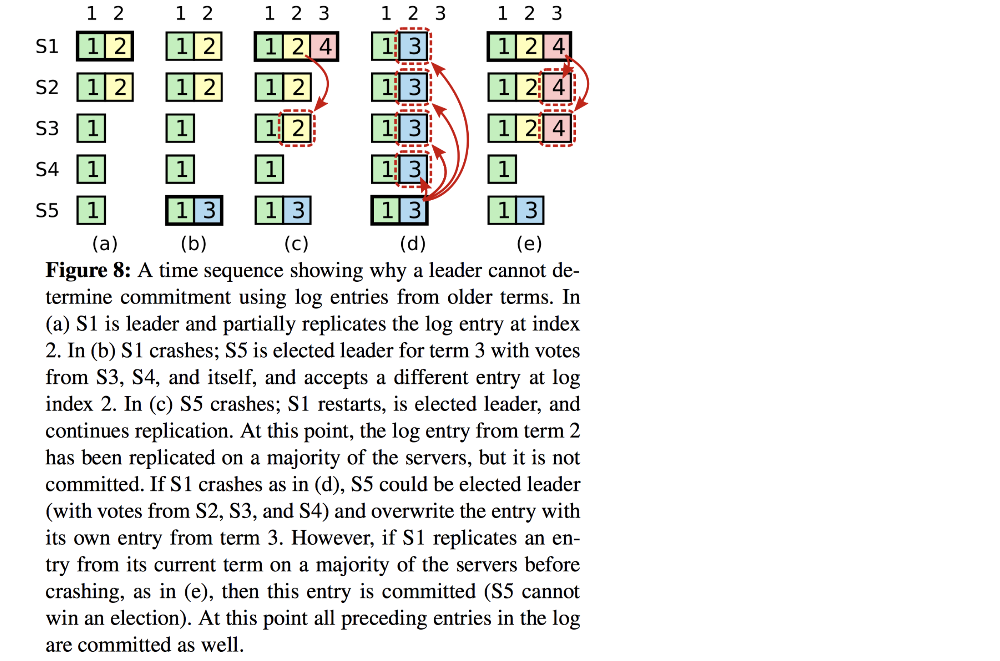
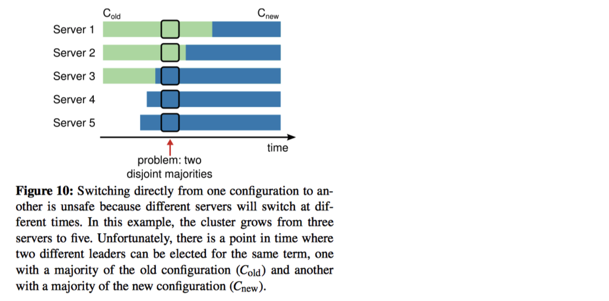
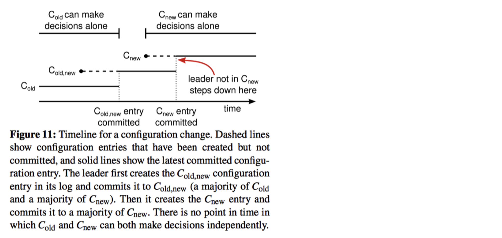
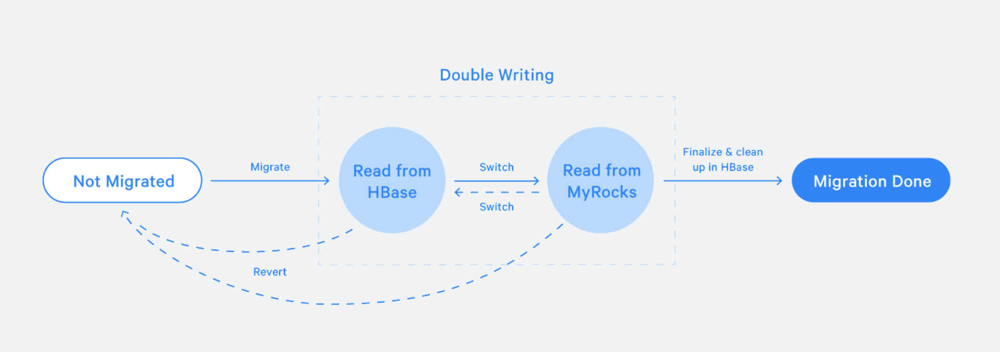
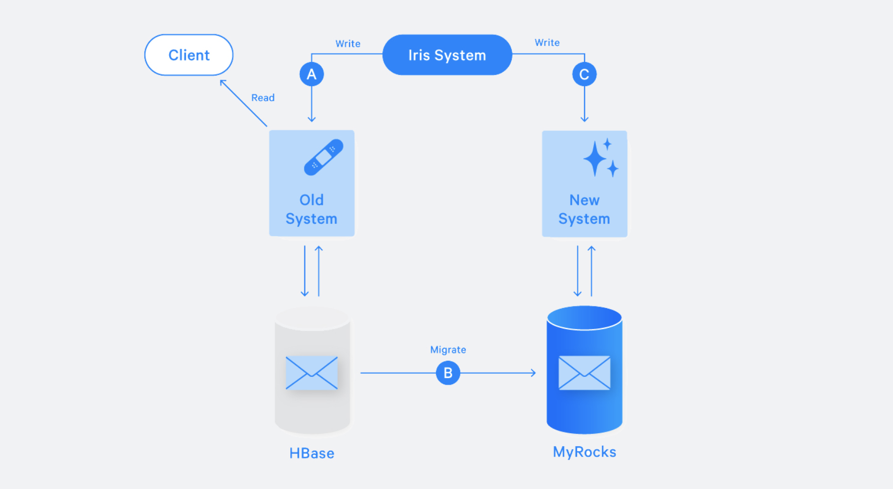

## Week 30 ARTS

### [A] - LC 297, 560, 67, 238, 121, 122, 123, 188, 659, 678
---

```java
package leetcode;

import java.util.Arrays;
import java.util.LinkedList;
import java.util.Queue;

/**
 * 297. Serialize and Deserialize Binary Tree
 *
 * Serialization is the process of converting a data structure or object into a sequence of bits so that
 * it can be stored in a file or memory buffer, or transmitted across a network connection link to be
 * reconstructed later in the same or another computer environment.
 *
 * Design an algorithm to serialize and deserialize a binary tree. There is no restriction on how your
 * serialization/deserialization algorithm should work. You just need to ensure that a binary tree can
 * be serialized to a string and this string can be deserialized to the original tree structure.
 *
 * Example:
 *
 * You may serialize the following tree:
 *
 *     1
 *    / \
 *   2   3
 *      / \
 *     4   5
 *
 * as "[1,2,3,null,null,4,5]"
 * Clarification: The above format is the same as how LeetCode serializes a binary tree. You do not
 * necessarily need to follow this format, so please be creative and come up with different approaches yourself.
 *
 * Note: Do not use class member/global/static variables to store states. Your serialize and deserialize
 * algorithms should be stateless.
 */
public class SerializationDeserializationBT297 {
  private final String NIL = "null";
  private final String SPLITER = ",";

  class TreeNode {
    int val;
    TreeNode left;
    TreeNode right;

    public TreeNode(int val) {
      this.val = val;
    }
  }

  /**
   * solution: build a string from a tree, preorder (root -> left node -> right node) to traverse tree,
   * and save into string including null (leave nodes).
   * build a tree from list of string, dfs, if null string, return null, then create a node with current value,
   * here using Queue to keep all the string list data. Queue poll first value, O(1).
   * Recursively to keep building left and right tree, and form into a root.
   *
   * TC: O(n) - n is the number of nodes in the tree
   * SC: O(n) - keep a tree, and recursive keep into stack
   */
  // Encodes a tree to a single string.
  public String serialize(TreeNode root) {
    if (root == null) return "";
    StringBuilder sb = new StringBuilder();
    buildStringFromBT(TreeNode root, sb);
    return sb.toString();
  }

  private void buildStringFromBT(TreeNode node, StringBuilder sb) {
    if (node == null) {
      sb.append(NIL).append(SPLITER);
    } else {
      sb.append(node.val).append(SPLITER);
      buildStringFromBT(node.left, sb);
      buildStringFromBT(node.right, sb);
    }
  }

  // Decodes your encoded data to tree.
  public TreeNode deserialize(String data) {
    if (data == null || data.length() == 0) return null;
    Queue<String> queue = new LinkedList<>();
    queue.addAll(Arrays.asList(data.split(SPLITER)));
    return buildTree(queue);
  }

  private TreeNode buildTree(Queue<String> queue) {
    String currStr = queue.poll();
    if (currStr.equals(NIL)) {
      return null;
    } else {
      int currVal = Integer.valueOf(currStr);
      TreeNode node = new TreeNode(currVal);
      node.left = buildTree(queue);
      node.right = buildTree(queue);
      return node;
    }
  }
}
```
```java
package leetcode;

import java.util.HashMap;
import java.util.Map;

/**
 * Created by xwan on 4/29/17.
 */

/**
 * 560. Subarray Sum Equals K
 * <p>
 * Given an array of integers and an integer k, you need to find the total number of continuous subarrays whose sum equals to k.
 * <p>
 * Example 1:
 * Input:nums = [1,1,1], k = 2
 * Output: 2
 * Note:
 * The length of the array is in range [1, 20,000].
 * The range of numbers in the array is [-1000, 1000] and the range of the integer k is [-1e7, 1e7].
 */
public class SubarraySumEqualK560 {
  /**
   * Solution: 1. Calculate Presum. from current preSum, compare with previous preSum, is currSum - preSum = k
   * or currSum = k, then count++, otherwise continue.
   *
   * for example: [1,2,3], 3
   * preSum: [1,3,6]
   * 3 == 3, count++,
   * 6 - 1 > 3, continue, 6 - 3 == 3, count++
   * count = 2
   *
   * TC: O(n^2) - n is the length of the input array
   * SC: O(n) - extra preSum array
   */
  public static int subarraySum_1(int[] nums, int k) {
    if (nums == null || nums.length == 0) return 0;
    int len = nums.length;
    int[] preSum = new int[len];
    preSum[0] = nums[0];
    for (int i = 1; i < len; i++) {
      preSum[i] = preSum[i - 1] + nums[i];
    }
    int count = 0;
    for (int i = 0; i < preSum.length; i++) {
      for (int j = 0; j < i; j++) {
        if ((preSum[i] - preSum[j] == k) || (preSum[i] == k)) {
          count++;
        }
      }
    }
    return count;
  }

  /**
   * Solution 2. based on solution 1, we can do better by remember previous sum. Map is good data structure to memorize
   * previous state. for each preSum, check (presSum - k) is already in map or not,
   * if it is in map, then count + frequency, otherwise, add into map
   *
   * TC: O(n) - n is the length of nums
   * SC: O(n) - the elements in map
   */
  public static int subarraySum(int[] nums, int k) {
    if (nums == null || nums.length == 0) return 0;
    int n = nums.length;
    int count = 0;
    Map<Integer, Integer> map = new HashMap<>();
    map.put(0, 1);
    int sum = 0;
    for (int i = 0; i < n; i++) {
      sum += nums[i];
      if (map.containsKey(sum - k)) {
        count += map.get(sum - k);
      }
      map.put(sum, map.getOrDefault(sum, 0) + 1);
    }
    return count;
  }
}
```
```java
package leetcode;

/**
 * 67. Add Binary
 *
 * Given two binary strings, return their sum (also a binary string).
 *
 * The input strings are both non-empty and contains only characters 1 or 0.
 *
 * Example 1:
 *
 * Input: a = "11", b = "1"
 * Output: "100"
 * Example 2:
 *
 * Input: a = "1010", b = "1011"
 * Output: "10101"
 */
public class AddBinary67 {
  /**
   * Solution: first make two strings have the same length, add '0' to front of short string
   * from last index to add, if it is 2, then add into carry, and continue scan from right -> let
   *
   * TC: O(n) - n is the length of longer string
   * SC: O(1)
   */
  public String addBinary(String a, String b) {
    if (a == null || a.length() == 0) return b;
    if (b == null || b.length() == 0) return a;
    if (a.length() < b.length()) {
      a = makeEqualStrs(a, b.length());
    } else if (b.length() < a.length()) {
      b = makeEqualStrs(b, a.length());
    }
    String res = "";
    int idx = a.length() - 1;
    int carry = 0;
    while (idx >= 0) {
      char currA = a.charAt(idx);
      char currB = b.charAt(idx);
      int currSum = currA - '0' + currB - '0' + carry;
      if (currSum >= 2) {
        res = currSum % 2 + res;
        carry = 1;
      } else {
        res = currSum + res;
        carry = 0;
      }
      idx--;
    }
    res = carry > 0 ? (carry + res) : res;
    return res;
  }
  private String makeEqualStrs(String b, int len) {
    StringBuilder sb = new StringBuilder();
    while (len-- > b.length()) {
      sb.append('0');
    }
    return sb.append(b).toString();
  }
}
```
```java
package leetcode;

/**
 * 238. Product of Array Except Self
 *
 * Given an array nums of n integers where n > 1,  return an array output such that
 * output[i] is equal to the product of all the elements of nums except nums[i].
 *
 * Example:
 *
 * Input:  [1,2,3,4]
 * Output: [24,12,8,6]
 * Note: Please solve it without division and in O(n).
 *
 * Follow up:
 * Could you solve it with constant space complexity? (The output array does not count
 * as extra space for the purpose of sp
 */
public class ProductofArrayExceptSelf238 {
  // solution: straitforward
  // use extra array to keep multiply next values
  // back multiply numbers
  public int[] productExceptSelf(int[] nums) {
    int[] res = new int[nums.length];
    res[0] = 1;
    for (int i = 1; i < nums.length; i++) {
      res[i] = res[i - 1] * nums[i - 1];
    }
    int right = nums[nums.length - 1];
    for (int i = nums.length - 2; i >= 0; i--) {
      res[i] *= right;
      right *= nums[i];
    }
    return res;
  }
}
```
```java
package leetcode;

/**
 * Created by xwan on 4/27/17.
 */

/**
 * 121. Best Time to Buy and Sell Stock
 * <p>
 * Say you have an array for which the ith element is the price of a given stock on day i.
 * <p>
 * If you were only permitted to complete at most one transaction (ie, buy one and sell one share of the stock), design an algorithm to find the maximum profit.
 * <p>
 * Example 1:
 * Input: [7, 1, 5, 3, 6, 4]
 * Output: 5
 * <p>
 * max. difference = 6-1 = 5 (not 7-1 = 6, as selling price needs to be larger than buying price)
 * Example 2:
 * Input: [7, 6, 4, 3, 1]
 * Output: 0
 * <p>
 * In this case, no transaction is done, i.e. max profit = 0.
 */
public class BestBuySellStore121 {
  /**
   * Solution: Brute force solution, loop inside loop, for ith every item, compare all items from [i+1, n]
   * n is the length of the prices.
   *
   * TC: O(n^2) - n is the length of the prices.
   * SC: O(1)
   *
   * Solution 2. we can do better, since we want the max profit, so we record the min item from left. for each item > min
   * we calculate current profit, and compare with maxProfit, keep track of maxProfit and leftMin value
   * one scan, get maxProfit.
   *
   * TC: O(n)
   * SC: O(1)
   */
  public static int maxProfit(int[] prices) {
    if (prices == null || prices.length == 0) {
      return 0;
    }
    int min = Integer.MAX_VALUE;
    int profit = 0;
    for (int i : prices) {
      min = i < min ? i : min;
      profit = (i - min) > profit ? i - min : profit;
    }
    return profit;
  }
}
```
```java
package leetcode;

/**
 * 122. Best Time to Buy and Sell Stock II
 *
 * Say you have an array for which the ith element is the price of a given stock on day i.
 *
 * Design an algorithm to find the maximum profit. You may complete as many transactions as you like
 * (i.e., buy one and sell one share of the stock multiple times).
 *
 * Note: You may not engage in multiple transactions at the same time
 * (i.e., you must sell the stock before you buy again).
 *
 * Example 1:
 *
 * Input: [7,1,5,3,6,4]
 * Output: 7
 * Explanation: Buy on day 2 (price = 1) and sell on day 3 (price = 5), profit = 5-1 = 4.
 *              Then buy on day 4 (price = 3) and sell on day 5 (price = 6), profit = 6-3 = 3.
 * Example 2:
 *
 * Input: [1,2,3,4,5]
 * Output: 4
 * Explanation: Buy on day 1 (price = 1) and sell on day 5 (price = 5), profit = 5-1 = 4.
 *              Note that you cannot buy on day 1, buy on day 2 and sell them later, as you are
 *              engaging multiple transactions at the same time. You must sell before buying again.
 * Example 3:
 *
 * Input: [7,6,4,3,1]
 * Output: 0
 * Explanation: In this case, no transaction is done, i.e. max profit = 0.
 */
public class BestBuySellStorck122 {
  /**
   * Solution: 1. brute force, will be calculate all possible solution, and compare with the max profit.
   *
   * TC: O(n^n)
   * LC: O(n)
   *
   * 2. how to optimize this problem, max profit will be all possible profits > 0, meaning, low buy, high sell.
   * one scan, if you see valley item ith and peak item jth, where j > i, calculate profit, prices[j] - prices[i],
   * adding all the diff (peak and valley) profit, will be the maximum.
   *
   * TC: O(n) - n is the length of prices
   * SC: O(1)
   */
  public int maxProfit(int[] prices) {
    if (prices == null || prices.length < 2) return 0;
    int maxProfit = 0;
    int valley = prices[0];
    int peak = prices[0];
    int idx = 0;
    int len = prices.length;
    while (idx < len - 1) {
      while (idx < len - 1 && prices[idx] >= prices[idx + 1]) {
        idx++;
      }
      valley = prices[idx];
      while (idx < len - 1 && prices[idx] <= prices[idx + 1]) {
        idx++;
      }
      peak = prices[idx];
      maxProfit += (peak - valley);
    }
    return maxProfit;
  }
}
```
```java
package leetcode;

/**
 * 123. Best Time to Buy and Sell Stock III
 * Say you have an array for which the ith element is the price of a given stock on day i.
 *
 * Design an algorithm to find the maximum profit. You may complete at most two transactions.
 *
 * Note: You may not engage in multiple transactions at the same time (i.e., you must sell the stock before you buy again).
 *
 * Example 1:
 *
 * Input: [3,3,5,0,0,3,1,4]
 * Output: 6
 * Explanation: Buy on day 4 (price = 0) and sell on day 6 (price = 3), profit = 3-0 = 3.
 *              Then buy on day 7 (price = 1) and sell on day 8 (price = 4), profit = 4-1 = 3.
 * Example 2:
 *
 * Input: [1,2,3,4,5]
 * Output: 4
 * Explanation: Buy on day 1 (price = 1) and sell on day 5 (price = 5), profit = 5-1 = 4.
 *              Note that you cannot buy on day 1, buy on day 2 and sell them later, as you are
 *              engaging multiple transactions at the same time. You must sell before buying again.
 * Example 3:
 *
 * Input: [7,6,4,3,1]
 * Output: 0
 * Explanation: In this case, no transaction is done, i.e. max profit = 0.
 */
public class BestBuySellStock123 {
  private final static int T = 2;
  /**
   * Solution: DP problem, reference to solution on LC discussion:
   * https://leetcode.com/problems/best-time-to-buy-and-sell-stock-iv/discuss/54114/Easy-understanding-and-can-be-easily-modified-to-different-situations-Java-Solution
   *
   * TC: O(n*t) - n is the length of prices, t is the number of transactions can be done,
   * for transaction is 2, TC: O(n)
   * SC: O(n*t)
   */
  public int maxProfit(int[] prices) {
    if (prices == null || prices.length < 2) return 0;
    int n = prices.length;
    int[][] hold = new int[n][T + 1];
    int[][] unhold = new int[n][T + 1];
    // first day, only holding the first day price, holding (buying), so set the value -prices[0]
    for (int t = 0; t <= T; t++) {
      hold[0][t] = -prices[0];
    }
    // 0 transaction, hold the smallest price
    for (int i = 1; i < n; i++) {
      hold[i][0] = Math.max(hold[i - 1][0], -prices[0]);
    }
    // at i-th day, with t-th transaction,
    // hold[i[t] and unhold[i][t] will have 2 states, hold the value or unhold the value
    for (int i = 1; i < n; i++) {
      for (int t = 1; t <= T; t++) {
        hold[i][t] = Math.max(hold[i - 1][t], unhold[i - 1][t] - prices[i]);
        unhold[i][t] = Math.max(hold[i - 1][t - 1] + prices[i], unhold[i - 1][t]);
      }
    }
    return Math.max(hold[n][T], unhold[n][T]);
  }
}
```
```java
package leetcode;

/**
 * 188. Best Time to Buy and Sell Stock IV
 *
 * Say you have an array for which the ith element is the price of a given stock on day i.
 *
 * Design an algorithm to find the maximum profit. You may complete at most k transactions.
 *
 * Note:
 * You may not engage in multiple transactions at the same time (ie, you must sell the stock before you buy again).
 *
 * Example 1:
 *
 * Input: [2,4,1], k = 2
 * Output: 2
 * Explanation: Buy on day 1 (price = 2) and sell on day 2 (price = 4), profit = 4-2 = 2.
 * Example 2:
 *
 * Input: [3,2,6,5,0,3], k = 2
 * Output: 7
 * Explanation: Buy on day 2 (price = 2) and sell on day 3 (price = 6), profit = 6-2 = 4.
 *              Then buy on day 5 (price = 0) and sell on day 6 (price = 3), profit = 3-0 = 3.
 */
public class BestSellBuyStock188 {
  /**
   * Solution: Similar solution to LC 122, additional concern of memory exceed limit issue,
   * we can be smarter to handler when transaction times is greater than half of the days.
   *
   * TC: O(n*k) - n is the number of days, k is the number of transactions.
   * SC: O(n*k)
   */
  public int maxProfit(int[] prices, int k) {
    if (prices == null || prices.length < 2 || k == 0) return 0;
    int n = prices.length;
    // to handle mameory exceed limit, we can be smarter about the transactions times.
    // if transactions is more than half the length, then we can add all the transactions (peak - valley)
    if (k >= n / 2) {
      int result = 0;
      for (int i = 1; i < n; i++) {
        if (prices[i] > prices[ i - 1]) {
          result += prices[i] - prices[i - 1];
        }
      }
      return result;
    }
    int[][] hold = new int[n][k + 1];
    int[][] unhold = new int[n][k + 1];
    // first day, only can buy
    for (int t = 0; t <= k; t++) {
      hold[0][t] = -prices[0]; // it is buying, so spending money
    }
    // 0 transaction, keep smallest price
    for (int i = 1; i < n; i++) {
      hold[i][0] = Math.max(hold[i - 1][0], -prices[i]);
    }

    for (int i = 1; i < n; i++) {
      for (int t = 1; t <= k; t++) {
        hold[i][t] = Math.max(hold[i - 1][t], unhold[i - 1][t] - prices[i]);
        unhold[i][t] = Math.max(unhold[i - 1][t], hold[i - 1][t - 1] + prices[i]);
      }
    }
    return Math.max(hold[n - 1][k], unhold[n - 1][k]);
  }
}
```
```java
package leetcode;

import java.util.HashMap;
import java.util.Map;

/**
 * 659. Split Array into Consecutive Subsequences
 *
 * You are given an integer array sorted in ascending order (may contain duplicates),
 * you need to split them into several subsequences, where each subsequences consist of at least 3 consecutive integers.
 * Return whether you can make such a split.
 *
 * Example 1:
 *
 * Input: [1,2,3,3,4,5]
 * Output: True
 * Explanation:
 * You can split them into two consecutive subsequences :
 * 1, 2, 3
 * 3, 4, 5
 * Example 2:
 *
 * Input: [1,2,3,3,4,4,5,5]
 * Output: True
 * Explanation:
 * You can split them into two consecutive subsequences :
 * 1, 2, 3, 4, 5
 * 3, 4, 5
 * Example 3:
 *
 * Input: [1,2,3,4,4,5]
 * Output: False
 * Note:
 *
 * The length of the input is in range of [1, 10000]
 */
public class SplitArrayIntoConsecutiveSubsequences659 {
  /**
   * Solution: When first see this problem, Intuitive thought is scan the whole array, record each item's frequency in a map
   * when see duplicate element in array, mark it as newStart and keep scan array, for each start item ith, we check whether
   * i + 1, and i + 2 item is in map or not, if it is in map, then we can add it into start, if not, we check current i,
   * whether i can append to existing starter.
   * so We first scan array and use one map to record frequency, use another map to record future append value.
   * second scan array, to check current number is in freq or not
   * if we find freq.get(current) == 0,then we continue.
   * otherwise, we check from append map, if append map has it, meaning current value can be appended into existing start
   * and current freq in append map should -1. and append next one into append (meaning, next one is able to be appened)
   * if not in append map, then we check current item, current+1, current+2 item are in freq map or not, if they appear in
   * freq map, then current+1, current+2 freq should -1. add current+3 to append map
   * otherwise, return false
   * remember to descrease current freq in freq map.
   * after iterate the whole array, return true.
   *
   * for example: [1,2,3,3,4,5]
   * freq: [1:1, 2:1, 3:2, 4:1, 5:1]
   * append:
   * current = 1, freq.get(current) = 1 != 0
   * not in append, check 2, 3 in freq, freq.get(2), freq.get(3) > 0, always decrease current freq
   * freq: [1:0, 2:0, 3:1, 4:1, 5:1], append: [4:1]
   * current = 2, freq.get(2)=0, continue
   * current = 3, freq.get(3) = 1 > 0
   * not in append, check 4, 5, in freq, freq.get(4), freq(5) > 0,
   * freq: [1:0, 2:0, 3:0, 4:0, 5:0], append: [4:1, 6:1]
   * current = 4, freq.get(4) == 0
   * current = 5, freq.get(5) == 0
   * end loop, return true.
   *
   *
   * TC: O(n) - n is the number of items in input array
   * SC: O(n) - worst case, n is the number of items in input array
   *
   * Reference: https://leetcode.com/problems/split-array-into-consecutive-subsequences/discuss/106496/Java-O(n)-Time-O(n)-Space
   */
  public boolean isPossible(int[] nums) {
    if (nums == null || nums.length < 3) return false;
    Map<Integer, Integer> freq = new HashMap<>();
    Map<Integer, Integer> append = new HashMap<>();
    for (int num : nums) {
      freq.put(num, freq.getOrDefault(num, 0) + 1);
    }
    for (int num : nums) {
      if (freq.get(num) == 0) continue;
      if (append.getOrDefault(num, 0) > 0) {
        append.put(num, append.get(num) - 1);
        append.put(num + 1, append.getOrDefault(num + 1, 0) + 1);
      } else if (freq.getOrDefault(num + 1, 0 ) > 0
          && freq.getOrDefault(num + 2, 0) > 0) {
        freq.put(num + 1, freq.get(num + 1) - 1);
        freq.put(num + 2, freq.get(num + 2) - 1);
        append.put(num + 3, append.getOrDefault(num + 3, 0) + 1);
      } else {
        return false;
      }
      freq.put(num, freq.get(num) - 1);
    }
    return true;
  }
```
```java
package leetcode;

/**
 * Created by xwan on 9/17/17.
 */

/**
 * 678. Valid Parenthesis String
 * <p>
 * Given a string containing only three types of characters: '(', ')' and '*',
 * write a function to check whether this string is valid. We define the validity of a string by these rules:
 * <p>
 * Any left parenthesis '(' must have a corresponding right parenthesis ')'.
 * Any right parenthesis ')' must have a corresponding left parenthesis '('.
 * Left parenthesis '(' must go before the corresponding right parenthesis ')'.
 * '*' could be treated as a single right parenthesis ')' or a single left parenthesis '(' or an empty string.
 * An empty string is also valid.
 * Example 1:
 * Input: "()"
 * Output: True
 * Example 2:
 * Input: "(*)"
 * Output: True
 * Example 3:
 * Input: "(*))"
 * Output: True
 * Note:
 * The string size will be in the range [1, 100].
 */
public class ValidParenthesisString678 {
  /**
   * Solution: Check valid (), we can keep tracking count, when encounter '(', count++, when encounter ')' count--.
   * when encounter '*', '*' has 3 possible ways, then can be treated
   * as empty count do nothing, '(' count++, ')' count--, when count < 0,
   * no matter next char, it will be invalid parenthesis.
   * so using recursive, keep tracking count.
   *
   * TC: O(3 ^ n) - worse case when string are all '*'
   * TC: O(3 ^ n)
   */
  public boolean checkValidString(String s) {
    if (s == null || s.length() == 0) return true;
    return checkHelper(s, 0, 0);
  }

  private boolean checkHelper(String s, int pos, int count) {
    if (pos == s.length()) return count == 0;
    if (count < 0) return false;
    char curr = s.charAt(pos);
    if (curr == '(') return checkHelper(s, pos + 1, count + 1);
    else if (curr == ')') return checkHelper(s, pos + 1, count - 1);
    else if (curr == '*')
      return checkHelper(s, pos + 1, count)  // '*' as empty
          || checkHelper(s, pos + 1, count + 1) // '*' as '('
          || checkHelper(s, pos + 1, count - 1); // '*' as ')'

    return count == 0;
  }


  /**
   * Solution 2:
   * Keep tracking of count, '(' count++, ')' count--, '*', count has three states: (count, count--, count++).
   * to avoid keep tracking all the count when '*', we can find a pattern from an example:
   *
   * for example: "(**))"
   * steps, scan string from left to right. initial count = 0
   * idx = 0, ch == '(', count: 1
   * idx = 1, ch == '*', count has three states: count: [0, 1, 2]
   * idx = 2, ch == '*', for each prev count, has three counts,
   *  count=0, count: [-1,0,1]
   *  count=1, count: [0,1,2],
   *  count=2, count: [1,2,3]
   * summarize, count can be [-1,0,1,2,3], and when count < 0, meaning has more ')', will be invalid, we can stop early,
   * so final count will be [0,1,2,3]
   *
   * idx = 3, ch == ')', count: [-1,0,1,2], again, count < 0, we end early. count: [0,1,2]
   * idx = 4, ch == ')', count [-1, 0, 1], count < 0, we end early, count: [0,1]
   *
   * in the end, it has count be 0, meaning it can be valid string.
   * and from the count values, we can see the count values are consecutive, so we do not need to keep track of all count values,
   * instead, we will only check the low, and high value.
   *
   * if we find high value < 0, meaning no valid '()' can be formed, we can end early, return false in this case.
   *
   * TC: O(n) - n is the length of input String
   * SC: O(1) - no extra data structure used
   *
   * Reference: https://leetcode.com/problems/valid-parenthesis-string/discuss/107577/Short-Java-O(n)-time-O(1)-space-one-pass
   */
  public boolean checkValidString_Greedy(String s) {
    if (s == null || s.length() == 0) return true;
    int low = 0;
    int high = 0;
    for (char ch : s.toCharArray()) {
      if (ch == '(') {
        low++;
        high++;
      } else if (ch == ')') {
        if (low > 0) low--;
        high--;
      } else {
        if (low > 0) low--;
        high--;
      }
      if (high < 0) return false;
    }
    return low == 0;
   }
}
```

### [R] -  [Raft](https://raft.github.io/raft.pdf)
---
## What is Raft? What problem is raft trying to solve?

raft is a consensus algorithm which solves the same consensus problem Paxos trying to solve but with a much simpler understandbility

## How Raft solved this consensus problem?

Raft decomposes the consensus problem into three relatively independent subproblems

- **Leader election:** a new leader must be chosen when an existing leader fails
- **Log replication:** the leader must accept log entries from clients and replicate them across the cluster, forcing the other logs to agree with its own
- **Safety**: if any server has applied a particular log entry to its state machine, then no other server may apply a different command for the same log index.

    Safety Property:

    - **Election Safety**: at most one leader can be elected in a given term.
    - **Leader Append-Only**: a leader never overwrites or deletes entries in its log; it only appends new entries.
    - **Log Matching**: if two logs contain an entry with the same index and term, then the logs are identical in all entries up through the given index.
    - **Leader Completeness:** if a log entry is committed in a given term, then that entry will be present in the logs of the leaders for all higher-numbered terms.
    - **State Machine Safety**: if a server has applied a log entry at a given index to its state machine, no other server will ever apply a different log entry for the same index.

## Details of Raft algorithm:

### Basics:

At any given time each server is in one of three states: *leader*, *follower*, or *candidate*



### Leader election:

- Raft uses a heartbeat mechanism to trigger leader election.
    1. Leaders send periodic heartbeats to all followers in order to maintain their authority. If a follower receives no communication over a period of time called the election timeout, then it assumes there is no viable leader and begins an election to choose a new leader.
    2. To begin an election, a follower increments its current term and transitions to candidate state. It then votes for itself and issues RequestVote RPCs in parallel to each of the other servers in the cluster until one of below three happens.

        (a) It wins the election. Raft used simple first-come-first-served election mechanism

        (b) Another server establishes itself as leader. If Term(leader) ≥ Term(candidate), accept; else, reject.

        (c) Timeout without winner. If many followers become candidates at the same time, votes could be split so that no candidate obtains a majority. To prevent split votes in the first place, election timeouts are chosen randomly from a fixed interval (e.g., 150–300ms).

### **Log Replication:**

**Once leader elected, leader will take over all requests from client and send replicated log to followers. If follower crashed, leader will retry indefinitely.**



Logs are organized as the picture above. Each log entry stores a state machine command along with the term number when the entry was received by the leader. The term numbers in log entries are used to detect inconsistencies between logs and to ensure some of the properties in ***Safety Property*** Each log entry also has an integer index identifying its position in the log.

A log entry is `committed` once the leader that created the entry has replicated it on a majority of the servers (e.g., entry 7 in Figure 6).

Raft maintains the following properties, which together constitute the **Log Matching Property**:

- If two entries in different logs have the same index and term, then they store the same command.

    *This property follows from the fact that a leader creates at most one entry with a given log index in a given term, and log entries never change their position in the log.*

- If two entries in different logs have the same index and term, then the logs are identical in all preceding entries.

    *This property is guaranteed by a simple consistency check performed by AppendEntries.*

Example of followers’ logs may differ from that of a new leader. A follower may be missing entries that are present on the leader, it may have extra entries that are not present on the leader, or both. Missing and extraneous entries in a log may span multiple terms.



- In Raft, the leader handles inconsistencies by forcing the followers’ logs to duplicate its own. This means that conflicting entries in follower logs will be overwritten with entries from the leader’s log.
- To bring a follower’s log into consistency with its own, the leader must find the latest log entry where the two logs agree, delete any entries in the follower’s log after that point, and send the follower all of the leader’s entries after that point.
- When a leader first comes to power, it initializes all nextIndex values to the index just after the last one in its log (11 in Figure 7). If follower's log is inconsistent with leader's, leader will keep send decremented nextIndex until find a match and doing consistence sync with above action.

### Safety

**Election restriction:**

- Raft guarantees that all the committed entries from previous terms are present on each new leader from the moment of its election, without the need to transfer those entries to the leader. This means that log entries only flow in one direction, from leaders to followers, and leaders never overwrite existing entries in their logs.
- Raft uses the voting process to prevent a candidate from winning an election unless its log contains all committed entries. The RequestVote RPC implements this restriction: the RPC includes information about the candidate’s log, and the voter denies its vote if its own log is more up-to-date than that of the candidate.
- Raft determines which of two logs is more up-to-date by comparing the index and term of the last entries in the logs. If the logs have last entries with different terms, then the log with the later term is more up-to-date. If the logs end with the same term, then whichever log is longer is more up-to-date.

**Committing entries from previous terms:**

Figure 8 illustrates a situation where an old log entry is stored on a majority of servers, yet can still be overwritten by a future leader.



Committing entries from previous terms:

- To eliminate problems like the one in Figure 8, Raft never commits log entries from previous terms by counting replicas.
- Only log entries from the leader’s current term are committed by counting replicas; once an entry from the current term has been committed in this way, then all prior entries are committed indirectly because of the Log Matching Property.

## Cluster membership changes

It isn’t possible to atomically switch all of the servers at once, so the cluster can potentially split into two independent majorities during the transition.


In Raft the cluster first switches to a transitional configuration we call *joint consensus*; once the joint consensus has been committed, the system then transitions to the new configuration. The joint consensus combines both the old and new configurations:

- Log entries are replicated to all servers in both configurations.
- Any server from either configuration may serve as leader.
- Agreement (for elections and entry commitment) requires separate majorities from both the old and new configurations.

The joint consensus allows individual servers to transition between configurations at different times without compromising safety. Furthermore, joint consensus allows the cluster to continue servicing client requests throughout the configuration change.

- When the leader receives a request to change the configuration from C old to C new , it stores the configuration for joint consensus (C old,new in the figure) as a log entry and replicates that entry using the mechanisms described previously.
- Once a given server adds the new configuration entry to its log, it uses that configuration for all future decisions (a server always uses the latest configuration in its log, regardless of whether the entry is committed).
- This means that the leader will use the rules of C old,new to determine when the log entry for C old,new is committed. If the leader crashes, a new leader may be chosen under either C old or C old,new , depending on whether the winning candidate has received C old,new . In any case, C new cannot make unilateral decisions during this period.
- Once C old,new has been committed, neitherC old norC new can make decisions without approval of the other, and the Leader Completeness Property ensures that only servers with the C old,new log entry can be elected as leader.
- It is now safe for the leader to create a log entry describing C new and replicate it to the cluster.
- When the new configuration has been committed under the rules of C new , the old configuration is irrelevant and servers not in the new configuration can be shut down.



Three more issues need to address:

1. Raft will let new servers join the cluster as non-voting members to make sure new members have enough time to catch up
2. Old leader may not included in new configuration. So there will be a period of time (while it is committing C new ) when the leader is managing a cluster that does not include itself; it replicates log entries but does not count itself in majorities until all C new goes in effect.
3. Removed servers may keep sending request votes with new term numbers. To prevent this problem, servers disregard RequestVote RPCs when they believe a current leader exists.

### [T] - [Procreate ios app](https://itunes.apple.com/us/app/procreate/id425073498?mt=8)
---
If you like drawing, arts, **Procreate** definitely must have.

### [S] - [Migrating Messenger storage to optimize performance](https://code.fb.com/core-data/migrating-messenger-storage-to-optimize-performance/)
---
To improve Facebook Messager to be faster, more efficient, more reliable, and easier to upgrage with new features, major changes include:
1. redisign and simplify data schema, created a new source-of-truth index from existing data, and made consistent invariants to ensure that all data is formatted correctly.
2. We moved from HBase, an open source distributed key-value store based on HDFS, to [MyRocks](https://code.fb.com/core-data/myrocks-a-space-and-write-optimized-mysql-database/)
3. We moved from storing the database on spinning disks to flash on our new [Lightning Server SKU](https://code.fb.com/data-center-engineering/introducing-lightning-a-flexible-nvme-jbof/).

To make sure migrate with zero downtime, migrate workflow:


### Normal Migration flow


### Buffer Migration flow


### Benefits
Compared with HBase, MyRocks at Facebook has more mature and more automated features to handle disaster recovery. In cases where we need to completely switch to another data center, we no longer need to involve human supervisors and perform manual operations. Automation makes switching data centers orders of magnitude faster than with the old system.

MyRocks is optimized in both reading and writing, and by leveraging Lightning with flash storage, we realized latency wins, in part because we are no longer bound on I/O in HBase. Read latency is now 50 times lower than in the previous system. People using Messenger can see that it is now much faster to scroll back though old messages. MyRocks is also more resilient.
