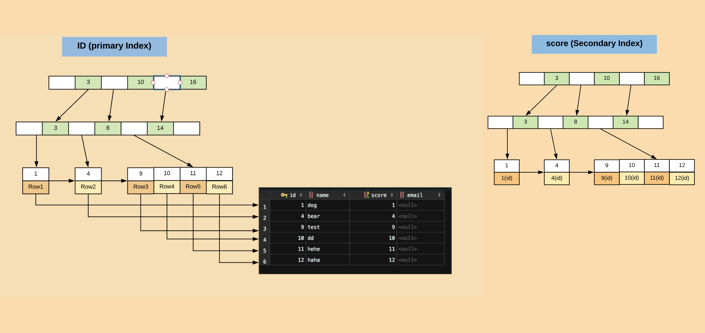

## Week 42 ARTS

### [A] - [LC 516](https://github.com/snowan/interviews/blob/master/java/src/leetcode/dp/LC516LongestPalindromeSubsequence.java)
---
[LC 516 solution](https://github.com/snowan/interviews/blob/master/java/src/leetcode/dp/LC516LongestPalindromeSubsequence.md)
```
public class LC516LongestPalindromeSubsequence {
  /**
   * Solution: DP + sliding window, start from len = 2, and keep (right(j) - left(i) + 1 = len), moving from left to right.
   * for s.charAt(i) == s.charAt(j), dp[i][j] = dp[i + 1][j - 1] + 2 (when len = 2, dp[i][j] = 2)
   * otherwise dp[i][j] = Math.max(dp[i + 1][j], dp[i][j - 1]).
   *
   * TC: O(n ^ 2) - n is the length of input string
   * SC: O(n ^ 2)
   */
  public static int longestPalindromeSubseq(String s) {
    if (s == null) return 0;
    int n = s.length();
    if (n < 2) return n;
    int[][] dp = new int[n][n];
    for (int i = 0; i < n; i++) dp[i][i] = 1;
    for (int len = 2; len <= n; len++) {
      for (int i = 0; i < n - len + 1; i++) {
        int j = i + len - 1;
        if (s.charAt(i) == s.charAt(j)) {
          if (len == 2) dp[i][j] = 2;
          else dp[i][j] = dp[i + 1][j - 1] + 2;
        } else {
          dp[i][j] = Math.max(dp[i + 1][j], dp[i][j - 1]);
        }
      }
    }
    return dp[0][n - 1];
  }
}
```

[R] - [MySQL InnoDB Clustered and Secondary Index](https://dev.mysql.com/doc/refman/5.7/en/innodb-index-types.html)
---
We all know MySql index, still remembered one production incident, we did normal weekly release, after release, we saw spikes on MySql connections. So DBA analyzied some slow queries, turned out newly added query didn't add index. So we rolled back, and add index, problem solved. :-)

What is Index? why we need add index?

>Indexes are used to find rows with specific column values quickly. Without an index, MySQL must begin with the first row and then read through the entire table to find the relevant rows. The larger the table, the more this costs. If the table has an index for the columns in question, MySQL can quickly determine the position to seek to in the middle of the data file without having to look at all the data. This is much faster than reading every row sequentially.

In this article, we will talk more about InnoDB engine index, and how index work.

MySQL InnoDB engine use B+ tree to build index tree, and have **Clustered Index** and **Secondary Index**
- **Clustered Index**: is build with **Primary key**, in this structure, all leaf node store the whole Row data.
- **Secondary Index**: build with non primary key, in this structure, all leaf node store primary key value. 

So the difference using Clustered Index and Secondary Index are:
- when query with primary key, say id, only need to query id index tree
- when query with non primary key, say name, you need to query name index tree, and get id, query id index tree. (two index tree query), this will be slower then only query with primay key.

For exmaple: 
```
create table user (
  id int primary key auto_increment,
  name varchar(16) not null,
  score int,
  email varchar(16),
  index (score)) engine=InnoDB;

```

primary (id) index tree and secondary (name) index tree as below:



Now think of two queries: 
- if `select * from user where id=1;`, then the query is primary key query, only need to query from id(primary key index tree).
- if `select * from user where score=2;`, this is non primary key query, check table, create score secondary index tree, so will query from score index tree, get primary key (id = 2), then query from primary key index tree, get data. (this will need query two index tree).
  
Now we understand what is **Clustered Index** and **Secondary Index**. and index can speed up queries. 

**How the Clustered Index Speeds Up Queries**

From above pic, ID (primary key index tree), accessing a row through the clustered index is fast because the index search leads directly to the page with all the row data. If a table is large, the clustered index architecture often saves a disk I/O operation when compared to storage organizations that store row data using a different page from the index record.

So, How MySql InnoDB mantian Index, and what scenarios we need to create index, and what scenarios are not good to create index? I will discuss more in next article. 

[T] - [Mac color picker](https://support.apple.com/guide/digital-color-meter/welcome/mac)
---
If you need to write some CSS, and sometimes need to pick some colors from other websites, then you will find Mac color picker is really helpful, just open Mac color picker, pointer to any pixel, you can pick any color you want, and use it anywhere you want, woo-hoo, yes, it is just this simple and easy, why don't you try it now! :-)  

[S] - [Scaling Slack's Job Queue](https://slack.engineering/scaling-slacks-job-queue-687222e9d100)
---
This is a very good article on how Slack scale their job queue. What I got out from this article:
1. Learn how they analyze and detect their problems/issues.
2. Learn how slack proposal different approaches to solve this issue with different trade off. 
3. With different trade offs, how to choose the best approach fit your project/application.
4. How to test your new approach, and have data metrics, get benchmarks, comparison with old system and new system. 
5. Roll out on production test without downtime, slowly roll out to production, and build up dashboard on monitoring all the data metrics.
6. Future plans on advanced improvement... 

The whole process on how to detect issues, and come up with new approach to fix the issue, build metrics, and compare with different trade offs to roll out to production, and what is the goal, non goal, lessons learned etc. Not only learned from technical perspective, also soft skills.
