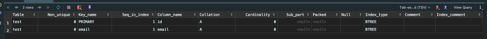
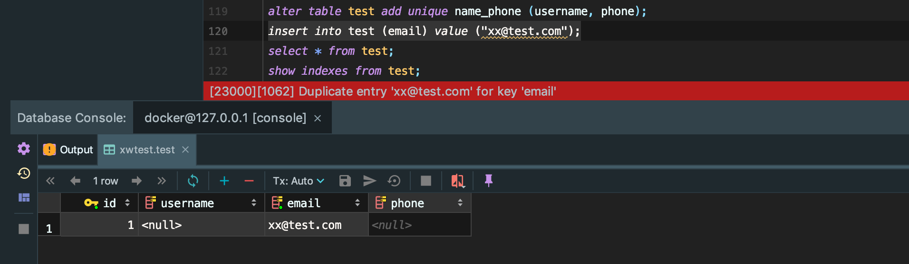

## Week 43 ARTS

### [A] - [LC 688](https://github.com/snowan/interviews/blob/master/java/src/leetcode/dpgreedy/LC688/LC688KnightProbInChess.java)
---
```java
public class LC688KnightProbInChess {
  private static final int[][] dirs = {{1, 2}, {2, 1}, {2, -1}, {1, -2}, {-1, -2}, {-2, -1}, {-2, 1}, {-1, 2}};

  /**
   * Solution: #1. DP
   * dp[s][i][j] - probability of in cell (i, j) in step s. (remains on the board)
   * init: dp[0][r][c] = 1, start from cell (r, c), 0 step, no move, 1
   * transition:
   * when new cell (nr, nc) is out of board, continue
   * dp[s][i][j] += dp[s-1][nr][nc] / 8; (each cell has 8 directions to move, current probability from previous cell (nr, nc) / 8)
   *
   * result: in step K, sum of all probability which on board
   *
   * TC: O(N*N*K)
   * SC: (N*N*K)
   */
  public double knightProbability(int N, int K, int r, int c) {
    if (K == 0) return 1;
    double[][][] dp = new double[K + 1][N][N];
    dp[0][r][c] = 1;
    for (int step = 1; step <= K; step++) {
      for (int i = 0; i < N; i++) {
        for (int j = 0; j < N; j++) {
          for (int[] d : dirs) {
            int nr = i + d[0];
            int nc = j + d[1];
            if (nr >= 0 && nr < N && nc >= 0 && nc < N) {
              dp[step][i][j] += dp[step - 1][nr][nc] / 8;
            }
          }
        }
      }
    }
    return Arrays.stream(dp[K]).flatMapToDouble(Arrays::stream).sum();
  }

  /**
   * Solution: #2. recursive + memorization
   *
   */
  public double knightProbabilityRec(int N, int K, int r, int c) {
    if (K == 0) return 1;
    double[][][] dp = new double[K + 1][N][N];
    return helper(N, K, r, c, dp) / Math.pow(8.0, K);
  }

  private double helper(int N, int K, int r, int c, double[][][] dp) {
    if (r < 0 || r >= N || c < 0 || c >= N) return 0;
    if (K == 0) return 1.0;
    if (dp[K][r][c] != 0) return dp[K][r][c];
    for (int[] d : dirs) {
      int nr = r + d[0];
      int nc = c + d[1];
      dp[K][r][c] += helper(N, K - 1, nr, nc, dp);
    }
    return dp[K][r][c];
  }
}
```

### [R] - [MySQL index: Unique Index](http://www.mysqltutorial.org/mysql-unique/)
---

1. What is Unique Index?

In MySql, if we want to enfore uniqueness column or keys, we usually use [Primary Key](https://dev.mysql.com/doc/refman/5.6/en/primary-key-optimization.html) constraints, but one table only can have one PK. Luckily, in MySQL, it allowed to add multiple unique columns using `UNIQUE ()`, for example:
```
CREATE TABLE user(
  id int NOT NULL AUTO PRIMAEY KEY,
  name varchar(50),
  username varchar(50),
  phone varchar(50) NOT NULL,
  email varchar(100) NOT NULL,
  UNIQUE (email)
);
```
If you already created a table, and can use `ALTER` create `UNIQUE` key.
```
ALTER TABLE user
ADD UNIQUE (email);
```
You can check index use `show indexes from user;`

If you want a combination of UNIQUE key, use constraint, for example, 
we want user name and phone be unique, add combination of name and phone as unique key. 

Before we add combination Unique key, we need to check whether there is MySQL violations, if we want to add `username` and `phone` as combination unique, we need to check whether `username` and `phone` has duplications in DB, if yes, when add unique key, MySQL will prevent adding the new constraint. In order to add new constraint, remove duplicates. 
```
alter table test add unique name_phone (username, phone);
```
2. Why need Unique Index?

Now we know how to add `UNIQUE` constraints, what is the benefits adding them.

If without `UNIQUE` constraint, in MySQL table, we can have multiple duplicates values, which is not we wanted, so by adding `UNIQUE` indexes, it will help to prevent dup values. for example, above, we added `username` and `phone` as `UNIQUE` index, so if we add the same value twice, it will cause error, value already exists.

For example:

Let's insert one row with email `xx@test.com`
```
insert into user (email) value ("xx@test.com");
```
Now DB has one row, and let's insert the same email again into `user`, it will prevent us to add it. 



Now we know how to add Unique index (constraints), when to chose `UNIQUE index` vs `Non-UNIQUE index`?

In order to answer this question, we need to know how unique and non-unique index work when `select` or `update` happens.

We will learn how it works using examples. Say we have `user` table, and contains data and `Unique index (score)`:
```
mysql> select * from user;
+----+------+-------+-------+
| id | name | score | email |
+----+------+-------+-------+
|  1 | dog  |     1 | NULL  |
|  4 | bear |     4 | NULL  |
|  9 | test |     9 | NULL  |
| 10 | dd   |    10 | NULL  |
| 11 | hehe |    11 | NULL  |
| 12 | haha |    12 | NULL  |
+----+------+-------+-------+
6 rows in set (0.00 sec)


mysql> show indexes from user;
+-------+------------+----------+--------------+-------------+-----------+-------------+----------+--------+------+------------+---------+---------------+
| Table | Non_unique | Key_name | Seq_in_index | Column_name | Collation | Cardinality | Sub_part | Packed | Null | Index_type | Comment | Index_comment |
+-------+------------+----------+--------------+-------------+-----------+-------------+----------+--------+------+------------+---------+---------------+
| user  |          0 | PRIMARY  |            1 | id          | A         |           6 |     NULL | NULL   |      | BTREE      |         |               |
| user  |          1 | score    |            1 | score       | A         |           6 |     NULL | NULL   |      | BTREE      |         |               |
+-------+------------+----------+--------------+-------------+-----------+-------------+----------+--------+------+------------+---------+---------------+
2 rows in set (0.00 sec)
```

**Query**

now we want to find `ids` when `score=4`. 

```
select id from user where score=4;
```
For `Unique index`, when it find `score=4`, stop scan, return value, since `Unique index` no dup data in DB.

For `Non-Unique index`, when it find `score=4`, it will continue scan next value until it find `score != 4`, because `non-unique index` allow duplicates data. 


### References
1. [High Performance MySQL Index](https://www.oreilly.com/library/view/high-performance-mysql/0596003064/ch04.html)
2. [How MySQL Uses Indexes](https://dev.mysql.com/doc/refman/5.6/en/mysql-indexes.html)
3. [All about MySQL index structure and performance](https://www.vertabelo.com/blog/technical-articles/all-about-indexes-part-2-mysql-index-structure-and-performance)
4. MySSQL 实战
   
### [T] -
---

### [S] - 
---
